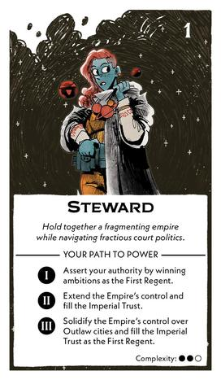

#

    
    

        <h1>Steward</h1>
        
<i>Hold together a fragmenting empire while navigating fractious court politics.</i>

        <ol>
          <li>Assert your authority by winning ambitions as the First Regent.</li>
          <li>Extend the Empire's control and fill the Imperial Trust.</li>
          <li>Solidify the Empire's control over Outlaw citizes and fill the Imperial Trust as the First Regent.</li>
        </ol>
    

## Act I

### Setup

Draw some cards

### Success

### Failure

## Act II

### Setup

### Success

### Failure

## Act III

### Setup