#Steward
## Overview
<figure markdown="span">
{ width="300" }
</figure>

## Act I

### Setup

{ width="300"}

1. Gain these cards:
   
    [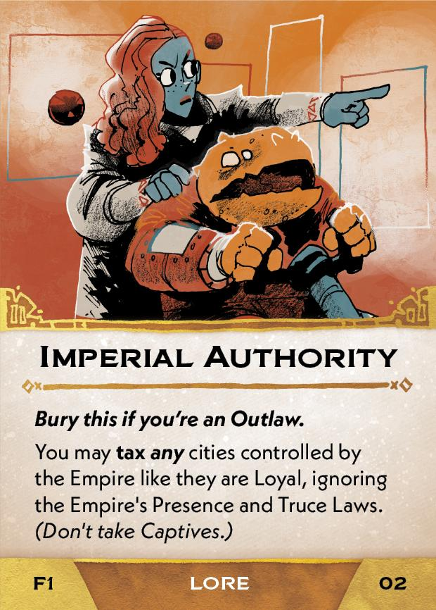{ width="150" }](1/piece_3_3.jpg){ data-lightbox="1" } [{ width="150" }](1/piece_3_2.jpg){ data-lightbox="1" }

2. Gain the First Regent tile.

### Objective
  { width="300" } 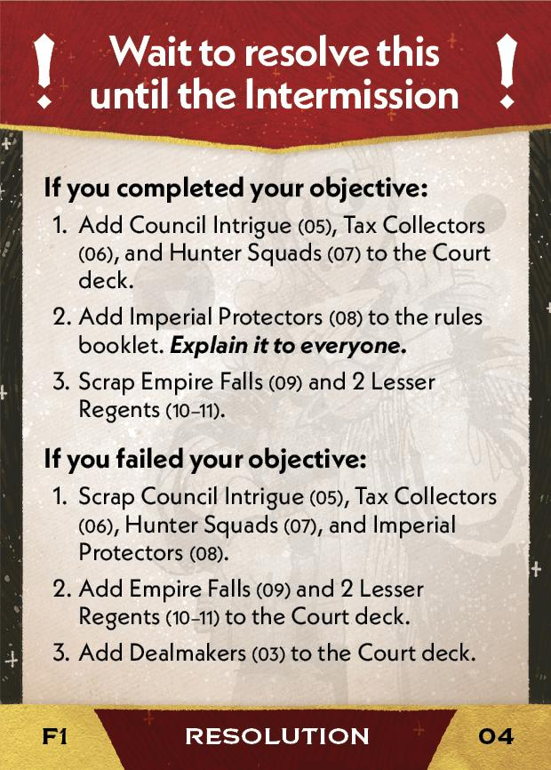{ width="300" }

#### If completed:
1. Add these cards to the Court deck:
   
    [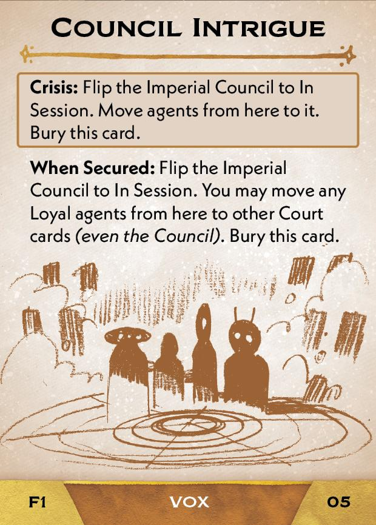{ width="150" }](1/piece_3_0.jpg){ data-lightbox="1" } [{ width="150" }](1/piece_2_6.jpg){ data-lightbox="1" } [{ width="150" }](1/piece_2_5.jpg){ data-lightbox="1" }

2. Add this card to the rules booklet:

    [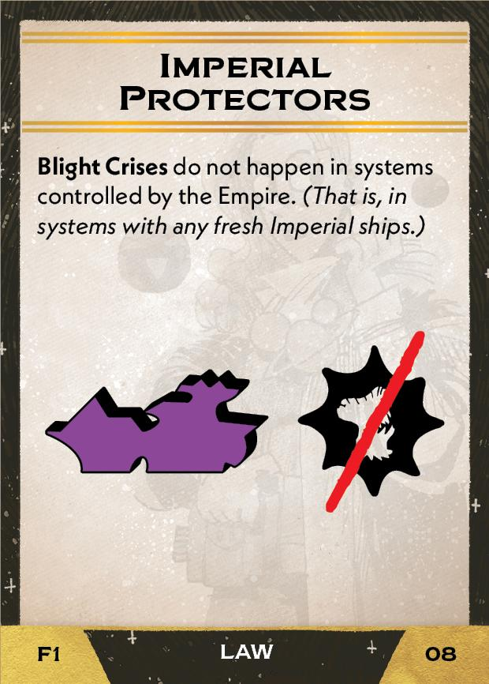{ width="150" }](1/piece_2_4.jpg){ data-lightbox="1" }

#### If failed:
1. Add these cards to the Court deck:
   
    [{ width="150" }](1/piece_2_3.jpg){ data-lightbox="1" } [{ width="150" }](1/piece_2_2.jpg){ data-lightbox="1" } [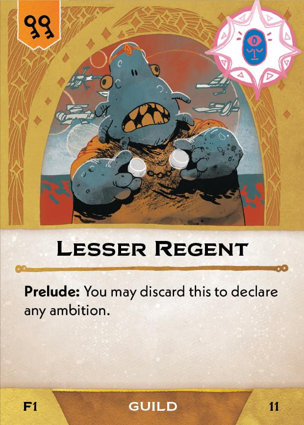{ width="150" }](1/piece_2_1.jpg){ data-lightbox="1" }

2. Add this card (from this Act's [Setup](#setup)) to the Court deck:
   
    [{ width="150" }](1/piece_3_2.jpg){ data-lightbox="1" }

## Act II

### Setup

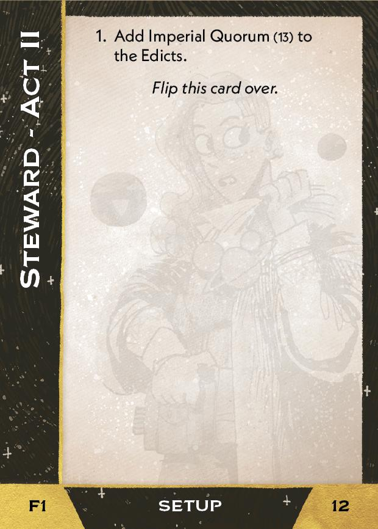{ width="300" }

1. Add this card to the Edicts:
   
    [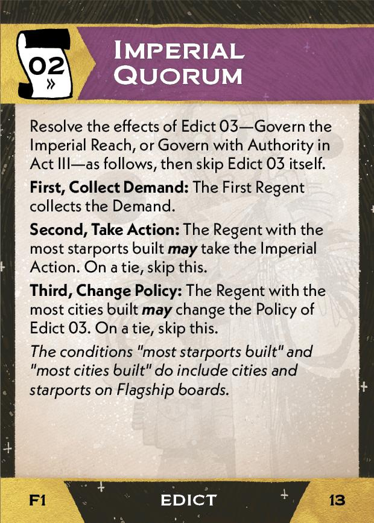{ width="150" }](1/piece_1_6.jpg){ data-lightbox="1" }

### Objective
{ width="300" } { width="300" }

#### If completed
1. Add these cards to the Court deck:
   
    [{ width="150" }](1/piece_1_4.jpg){ data-lightbox="1" } [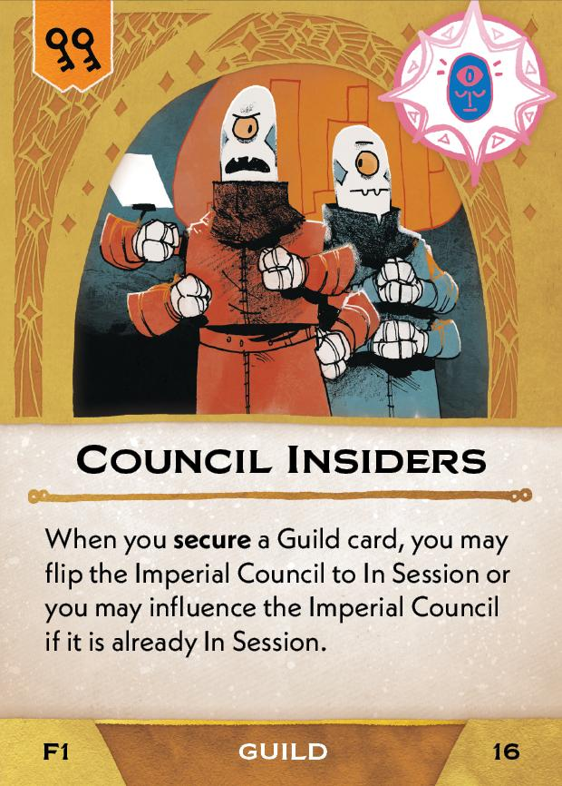{ width="150" }](1/piece_1_3.jpg){ data-lightbox="1" } [{ width="150" }](1/piece_1_2.jpg){ data-lightbox="1" }

#### If failed

1. Add these cards to the Court deck:
   
    [{ width="150" }](1/piece_1_1.jpg){ data-lightbox="1" } [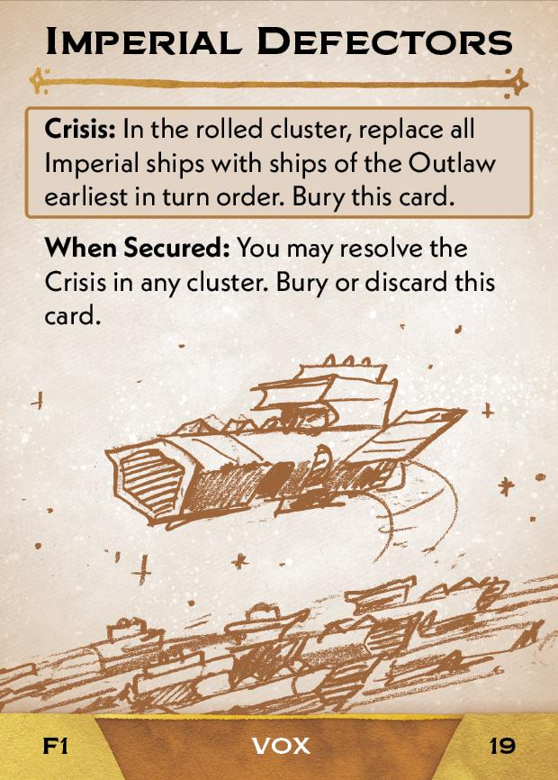{ width="150" }](1/piece_1_0.jpg){ data-lightbox="1" } [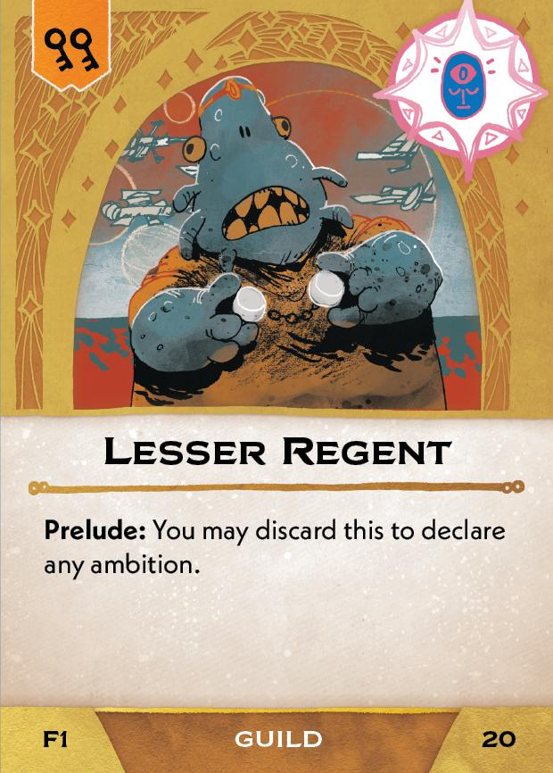{ width="150" }](1/piece_0_6.jpg){ data-lightbox="1" } [{ width="150" }](1/piece_0_5.jpg){ data-lightbox="1" }

## Act III

### Setup

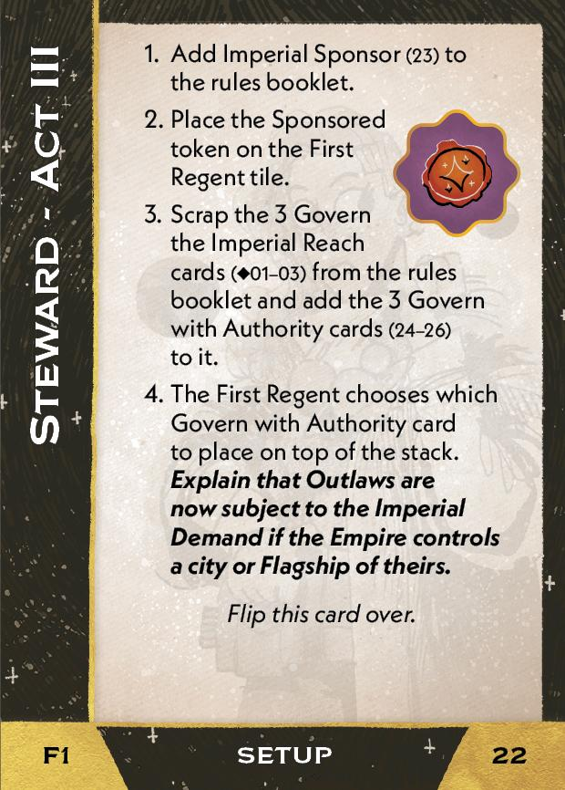{ width="300" }

1. Add this cards to the rules booklet:
   
    [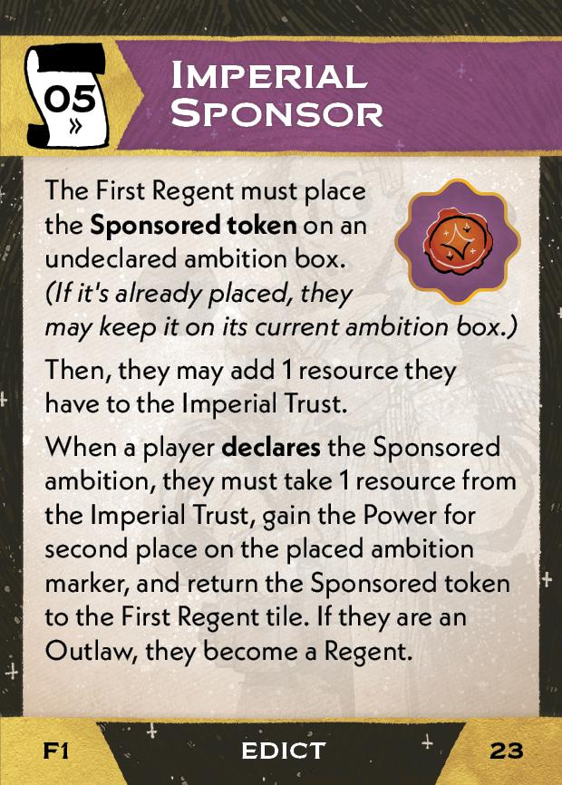{ width="150" }](1/piece_0_3.jpg){ data-lightbox="1" }

2. Place the Sponsored token on the First Regent tile.
3. Scrap the 3 Govern the Imperial Reach cards from the Edicts and add these cards to the Edicts:

    [{ width="150" }](1/piece_0_2.jpg){ data-lightbox="1" } [{ width="150" }](1/piece_0_1.jpg){ data-lightbox="1" } [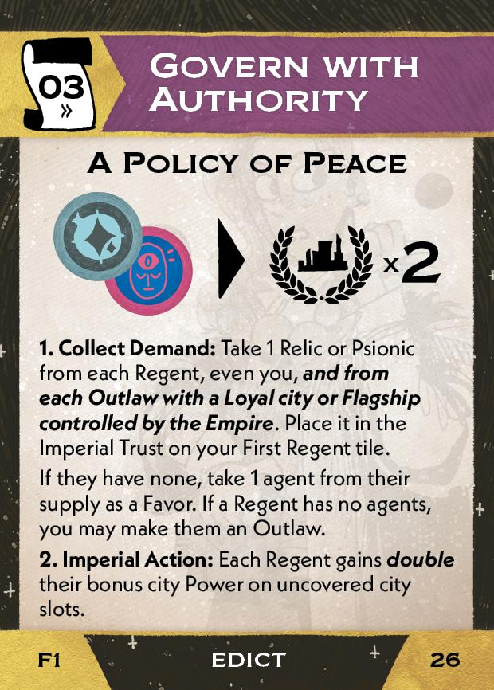{ width="150" }](1/piece_0_0.jpg){ data-lightbox="1" }

4. The First Regent chooses which Govern with Authority card to place on top of the stack.

### Objective (Grand Ambition)

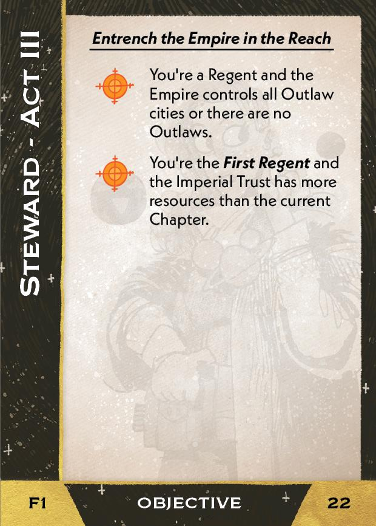{ width="300" }