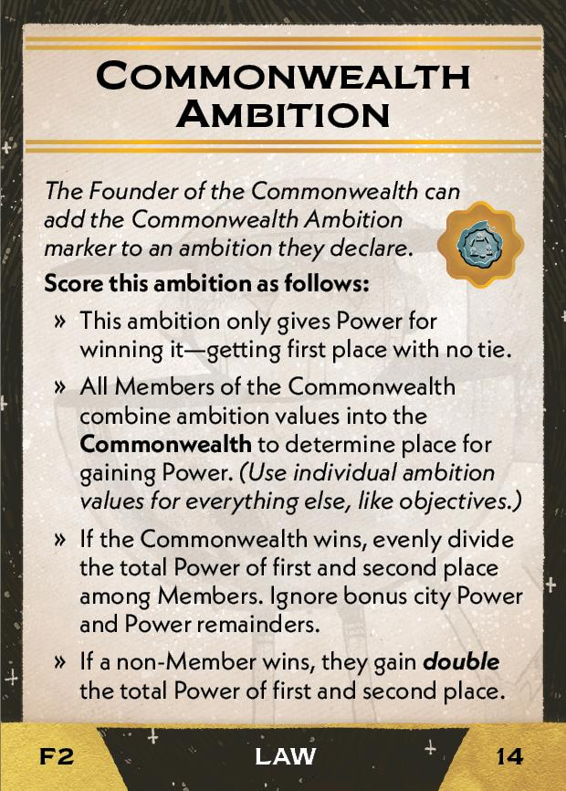
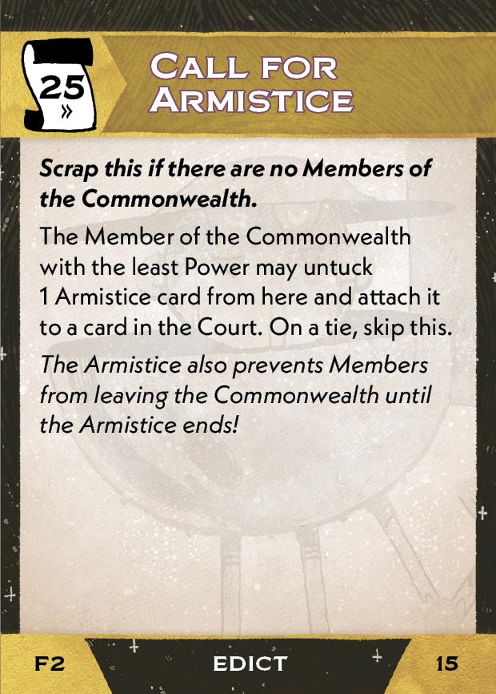
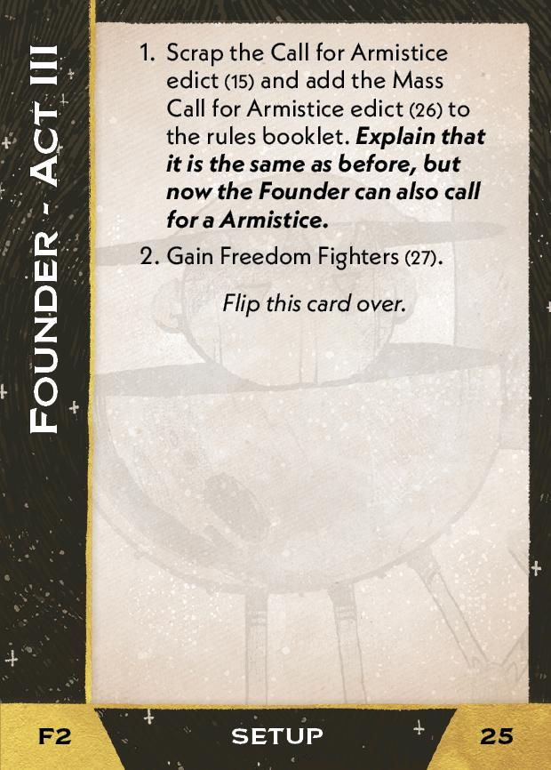

#Founder
## Overview
<figure markdown="span">
{ width="300" }
</figure>

## Act I

### Setup

{ width="300"}

1. Gain this card:
   
    [{ width="150" }](2/piece_3_4.jpg){ data-lightbox="1" }

### Objective

  { width="300" } { width="300" }

#### If completed:

1. Gain this card:
   
    [{ width="150" }](2/piece_3_2.jpg){ data-lightbox="1" }

2. Add these cards to the Court deck:
   
    [{ width="150" }](2/piece_3_1.jpg){ data-lightbox="1" } [{ width="150" }](2/piece_3_0.jpg){ data-lightbox="1" } [{ width="150" }](2/piece_2_6.jpg){ data-lightbox="1" }

#### If failed:

1. Add these cards to the Court deck:
   
    [{ width="150" }](2/piece_2_5.jpg){ data-lightbox="1" } [{ width="150" }](2/piece_2_4.jpg){ data-lightbox="1" } [{ width="150" }](2/piece_2_3.jpg){ data-lightbox="1" } [{ width="150" }](2/piece_2_2.jpg){ data-lightbox="1" } 

## Act II

### Setup

{ width="300" }

1. Gain this card:
   
    [{ width="150" }](2/piece_2_0.jpg){ data-lightbox="1" }

2. Place the Commonwealth Ambition marker on your Fate card.

3. Place these cards in the rules booklet:

    [{ width="150" }](2/piece_1_6.jpg){ data-lightbox="1" } [{ width="150" }](2/piece_1_5.jpg){ data-lightbox="1" } [{ width="150" }](2/piece_0_5.jpg){ data-lightbox="1" }

4. Tuck these cards under Call for Armistice:

    [{ width="150" }](2/piece_1_4.jpg){ data-lightbox="1" } [{ width="150" }](2/piece_1_3.jpg){ data-lightbox="1" }

5. Every player gains one of these:

    [{ width="150" }](2/piece_1_2.jpg){ data-lightbox="1" } [{ width="150" }](2/piece_1_1.jpg){ data-lightbox="1" } [{ width="150" }](2/piece_1_0.jpg){ data-lightbox="1" } [{ width="150" }](2/piece_0_6.jpg){ data-lightbox="1" }

### Objective
{ width="300" } { width="300" }

#### If completed
1. Gain this card:
   
    [{ width="150" }](2/piece_0_3.jpg){ data-lightbox="1" }

#### If failed

1. Scrap this card (from this Act's [Setup](#setup-1)) and the Commonwealth Ambition token:
   
    [{ width="150" }](2/piece_2_0.jpg){ data-lightbox="1" }

2. Add these cards to the Court deck:
   
    [{ width="150" }](2/piece_2_5.jpg){ data-lightbox="1" } [{ width="150" }](2/piece_2_4.jpg){ data-lightbox="1" } [{ width="150" }](2/piece_2_3.jpg){ data-lightbox="1" } [{ width="150" }](2/piece_2_2.jpg){ data-lightbox="1" } 

## Act III

### Setup

{ width="300" }

1. Remove Call for Armistice from the rules booklet and replace it with this card:
   
    [{ width="150" }](2/piece_0_1.jpg){ data-lightbox="1" }

2. Gain this card:

    [{ width="150" }](2/piece_0_0.jpg){ data-lightbox="1" }

### Objective (Grand Ambition)

{ width="300" }