# 3. Magnate

!!! warning "Under construction"

    Work in progress

## Overview
<figure markdown="span">
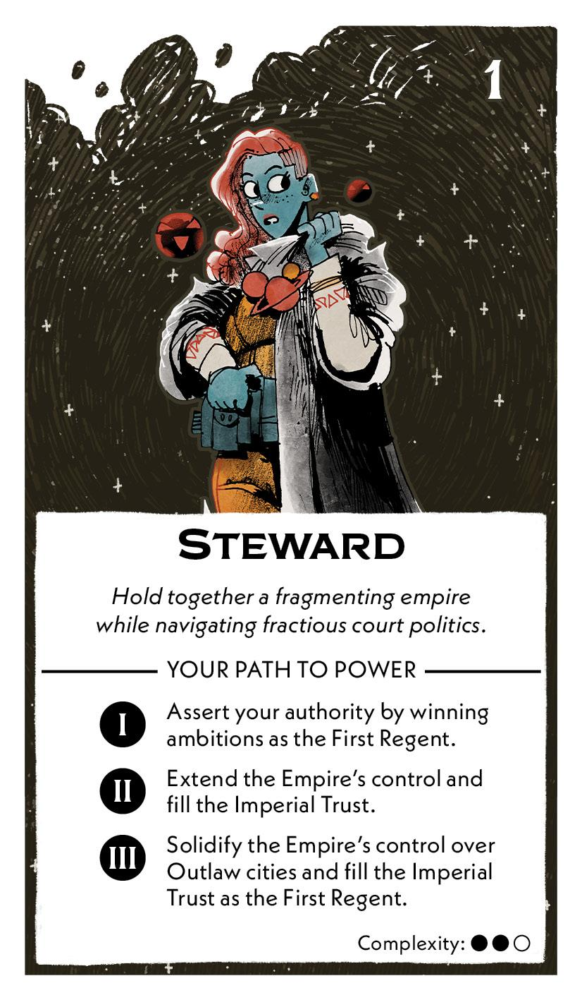
</figure>

## Act I

### Setup

1. Gain the following cards:
   
     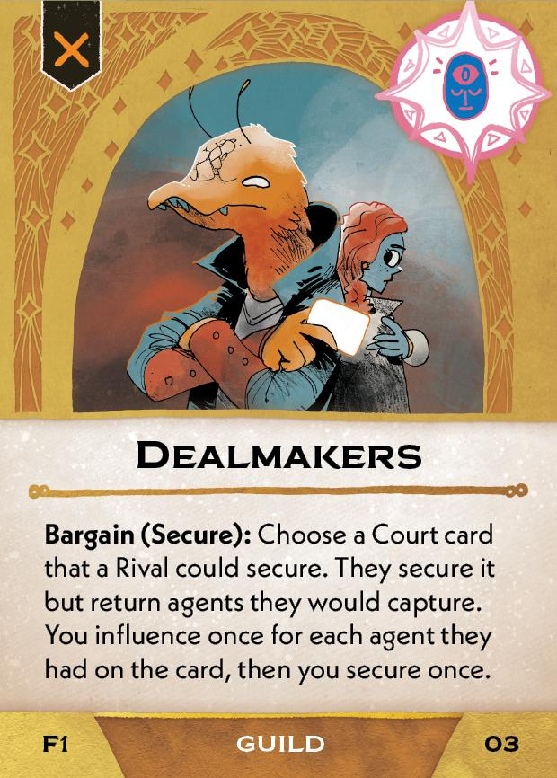

2. Gain the First Regent tile.

### Objective

|2 players|3 players|4 players|
|--|--|--|
|20|17|14|

**Consolidate Your Imperial Power**

Each time you win an ambition while you're the First Regent, **advance 1** for each Power you gain from it. 

#### If completed
1. Add these cards to the Court deck:
   
    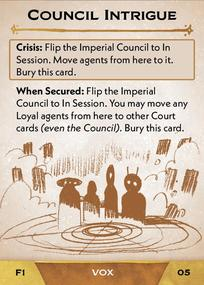  

2. Add this card to the rules booklet:

    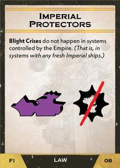

#### If failed
1. Add these cards to the Court deck:
   
    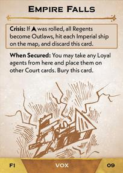 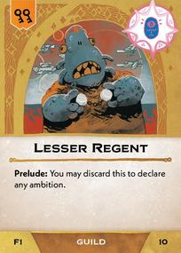 

2. Add this card (gained during [Setup](#setup)) to the Court deck:
   
    

## Act II

### Setup

1. Add this card to the Edicts:
   
    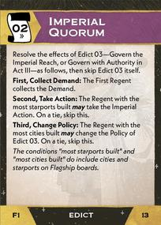

### Objective

|2 players|3 players|4 players|
|--|--|--|
|22|22|22|

**Expand the Empire**

At the end of each chapter, if you're the First Regent, **advance 1** for each cluster where the Empire controls any systems.

**Ensure the Emperor's Tribute**

At the end of each chapter, **advance 1** for each resource in the First Regent's Imperial Trust.

#### If completed
1. Add these cards to the Court deck:
   
    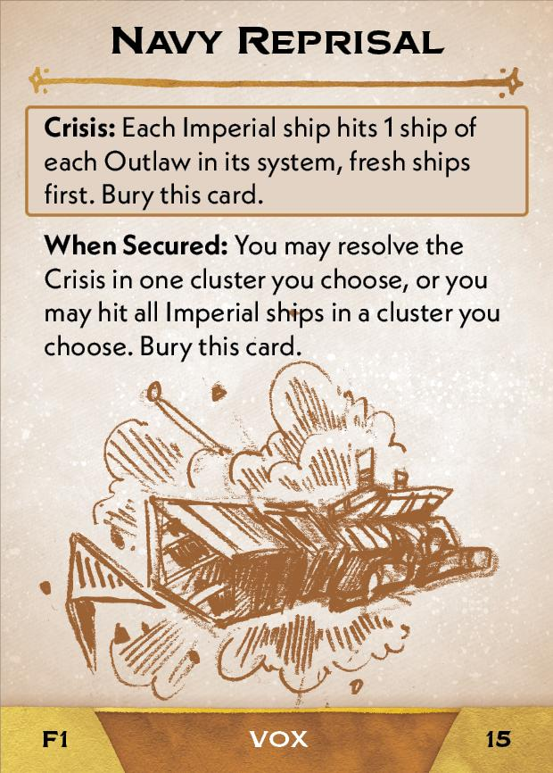 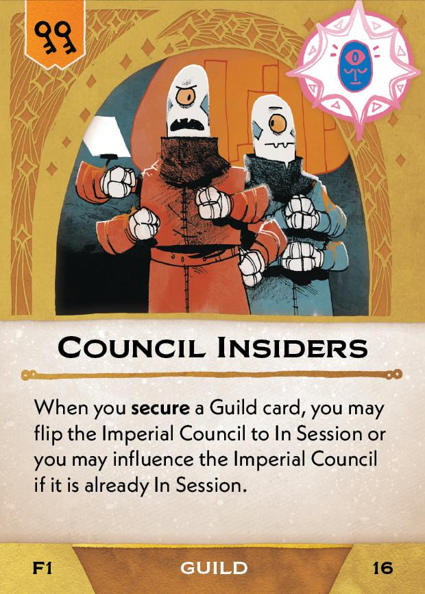 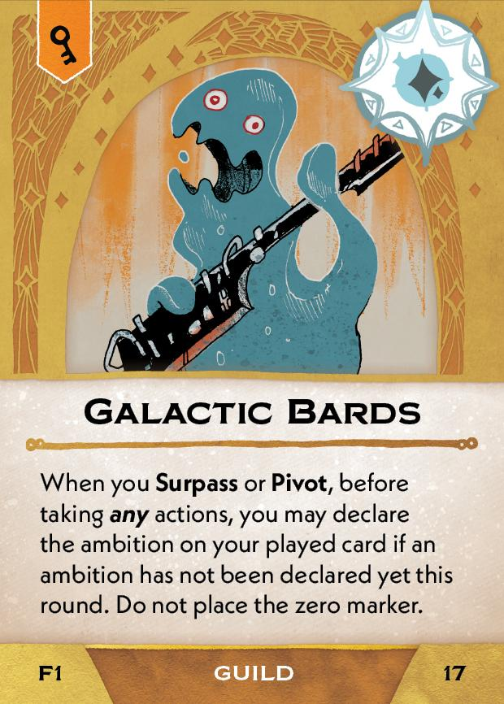

#### If failed

1. Add these cards to the Court deck:
   
    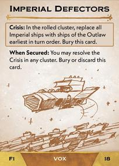 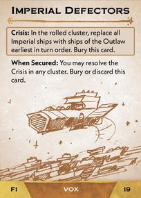  

## Act III

### Setup

1. Add this cards to the rules booklet:
   
    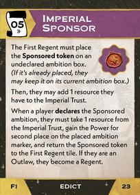

2. Place the Sponsored token on the First Regent tile.
3. Scrap the 3 Govern the Imperial Reach cards from the Edicts and add these 3 cards to it:

    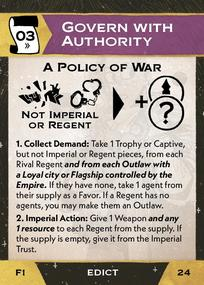 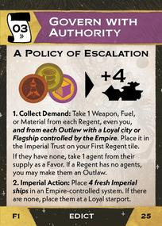 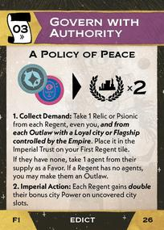

4. The First Regent chooses which Govern with Authority card to place on top of the stack.

### Objective (Grand Ambition)

**Entrench the Empire in the Reach**

- You're a Regent and the Empire controls all Outlaw cities or there are no Outlaws.
- You're the First Regent and the Imperial Trust has more resources than the current Chapter.