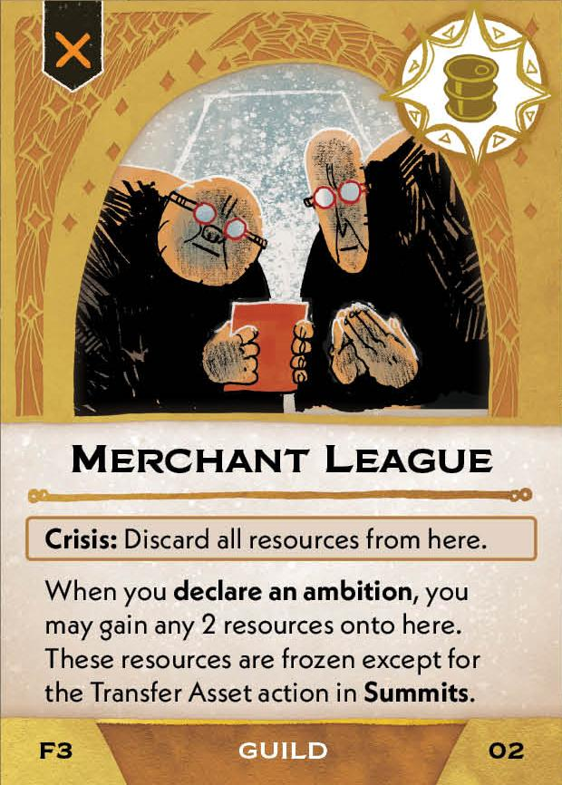
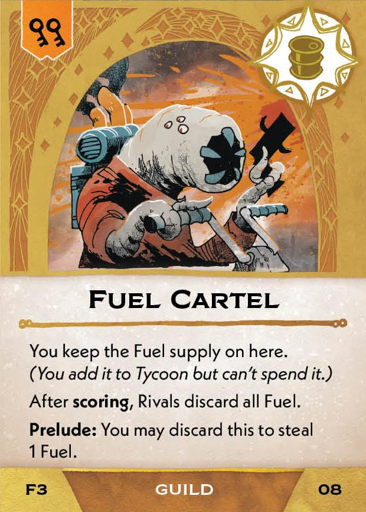
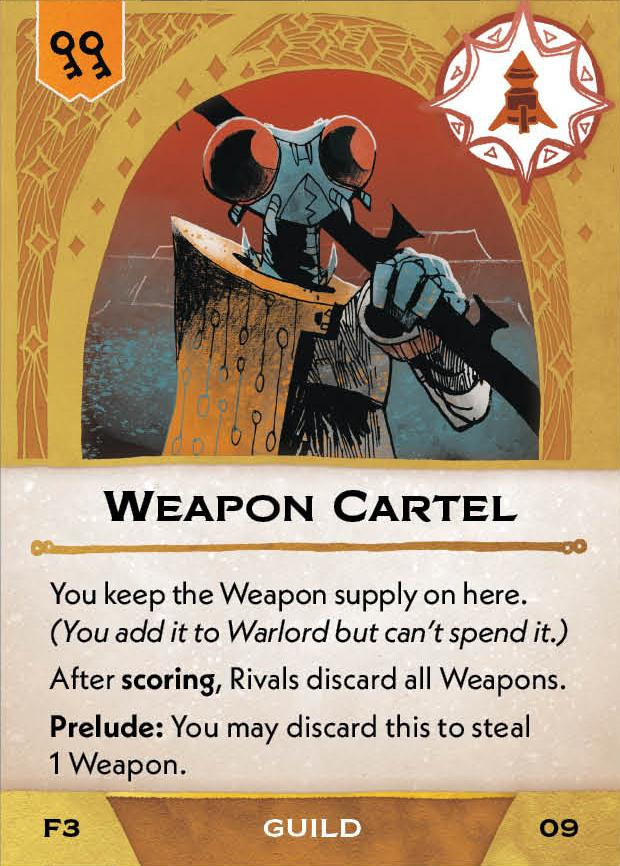
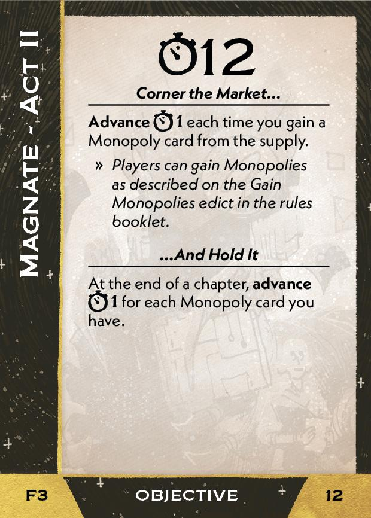
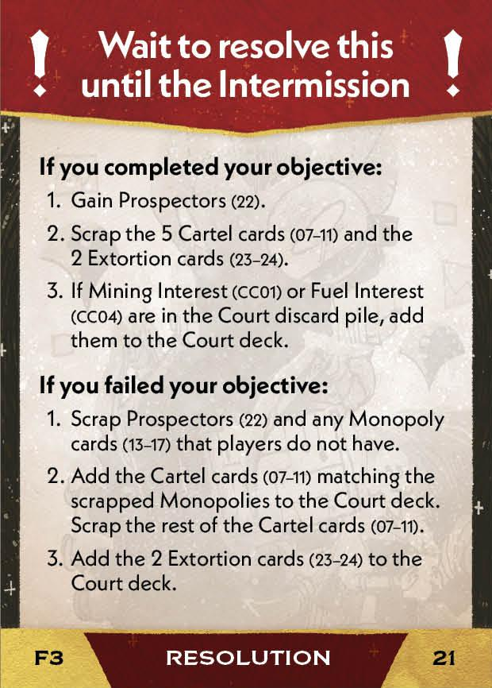
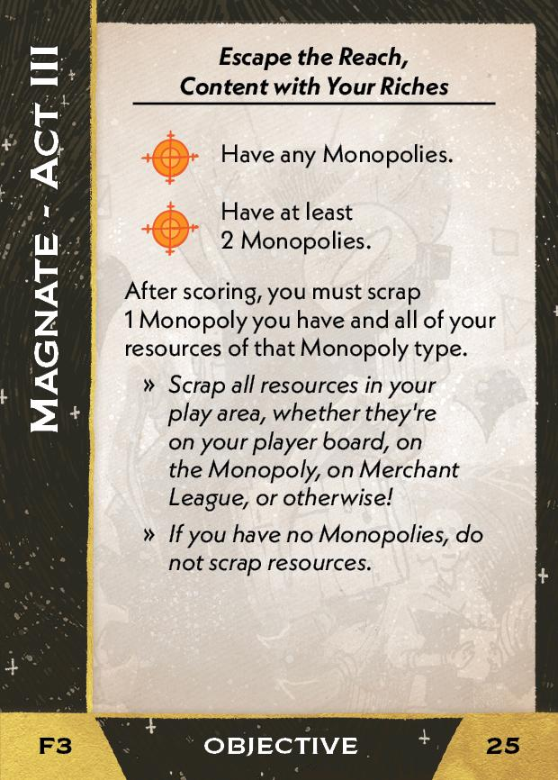

#Magnate
## Overview
<figure markdown="span">
{ width="300" }
</figure>

## Act I

[{ width="33%"}](3/piece_3_5.jpg){ data-lightbox="1" }[{ width="33%" }](3/back_3_5.jpg){ data-lightbox="1" }[{ width="33%" }](3/piece_3_3.jpg){ data-lightbox="1" }

??? info "Setup details"
     1. Gain this card:
    
         [{ width="150" }](3/piece_3_4.jpg){ data-lightbox="1" }

??? success "If successful"
    1. Add these cards to the court deck:
      
        [{ width="150" }](3/piece_3_2.jpg){ data-lightbox="1" } [{ width="150" }](3/piece_3_1.jpg){ data-lightbox="1" } [{ width="150" }](3/piece_3_0.jpg){ data-lightbox="1" }

    2. If Mining Interest or Shipping Interest are in the Court discard pile, add them to the Court deck.

??? failure "If failed"
    1. Add these cards to the Court deck:
      
        [{ width="150" }](3/piece_2_6.jpg){ data-lightbox="1" } [{ width="150" }](3/piece_2_5.jpg){ data-lightbox="1" } [{ width="150" }](3/piece_2_4.jpg){ data-lightbox="1" } [{ width="150" }](3/piece_2_3.jpg){ data-lightbox="1" } [{ width="150" }](3/piece_2_2.jpg){ data-lightbox="1" }

## Act II

[{ width="33%" }](3/piece_2_1.jpg){ data-lightbox="1" }[{ width="33%" }](3/back_2_1.jpg){ data-lightbox="1" }[{ width="33%px" }](3/piece_0_6.jpg){ data-lightbox="1" }

??? info "Setup details"
     1. Place these cards to the general supply. Place the resource supplies on their respective Monopoly cards.
    
        [{ width="150" }](3/piece_2_0.jpg){ data-lightbox="1" } [{ width="150" }](3/piece_1_6.jpg){ data-lightbox="1" } [{ width="150" }](3/piece_1_5.jpg){ data-lightbox="1" } [{ width="150" }](3/piece_1_4.jpg){ data-lightbox="1" } [{ width="150" }](3/piece_1_3.jpg){ data-lightbox="1" }

     2. Add these cards to the rules booklet:

        [{ width="150" }](3/piece_1_2.jpg){ data-lightbox="1" } [{ width="150" }](3/piece_1_1.jpg){ data-lightbox="1" } [{ width="150" }](3/piece_1_0.jpg){ data-lightbox="1" }

     3. Place the War Profiteer marker on the Warlord ambition box.

??? success "If successful"
    1. Gain this card:
      
        [{ width="150" }](3/piece_0_5.jpg){ data-lightbox="1" }

    2. If Mining Interest or Shipping Interest are in the Court discard pile, add them to the Court deck.

??? failure "If failed"
    1. Scrap any Monopoly cards that players do not have. For each scrapped Monopoly, add the corresponding card to the Court deck:

        [{ width="150" }](3/piece_2_6.jpg){ data-lightbox="1" } [{ width="150" }](3/piece_2_5.jpg){ data-lightbox="1" } [{ width="150" }](3/piece_2_4.jpg){ data-lightbox="1" } [{ width="150" }](3/piece_2_3.jpg){ data-lightbox="1" } [{ width="150" }](3/piece_2_2.jpg){ data-lightbox="1" }

    2. Add these cards to the Court deck:
      
        [{ width="150" }](3/piece_0_4.jpg){ data-lightbox="1" } [{ width="150" }](3/piece_0_3.jpg){ data-lightbox="1" }

## Act III

[{ width="33%" }](3/piece_0_2.jpg){ data-lightbox="1" }[{ width="33%" }](3/back_0_2.jpg){ data-lightbox="1" }

??? info "Setup details"
    1. Tuck this card under the card play area. If you're a Regent, place it Closed Economy side up. If you're an Outlaw, place it Open Economy side up.
    
        [{ width="150" }](3/piece_0_1.jpg){ data-lightbox="1" } [{ width="150" }](3/back_0_1.jpg){ data-lightbox="1" }

    2. Add this card to the rules booklet:

        [{ width="150" }](3/piece_0_0.jpg){ data-lightbox="1" }