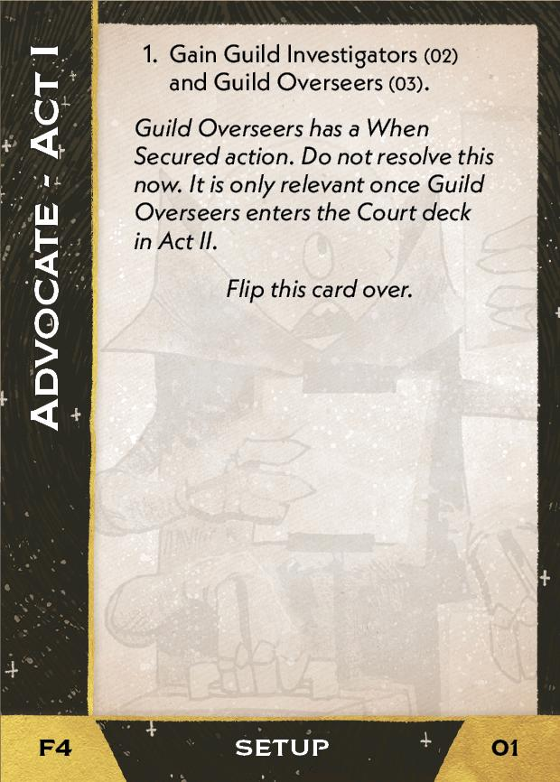
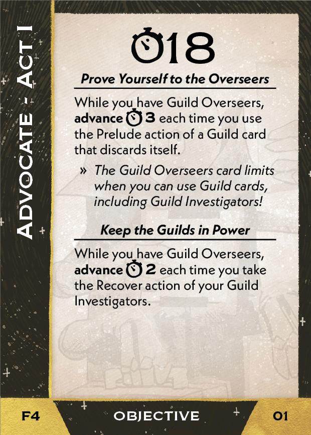
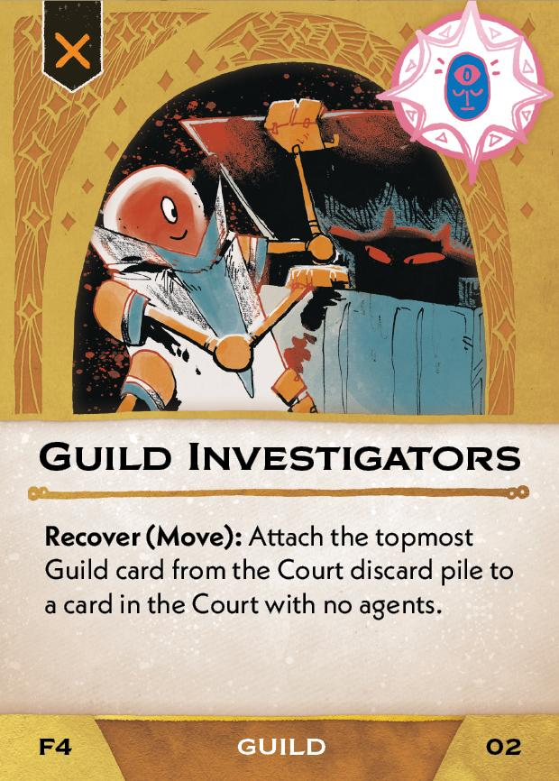
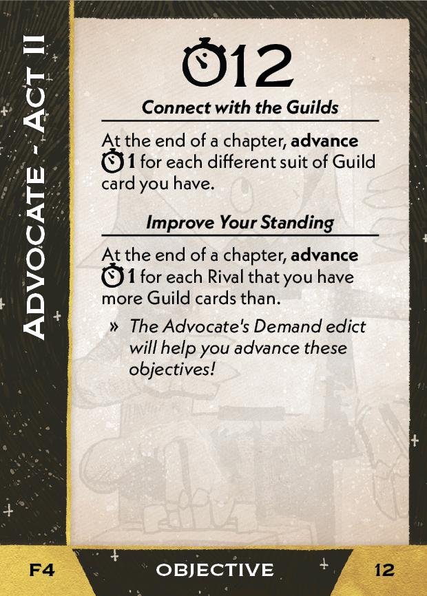
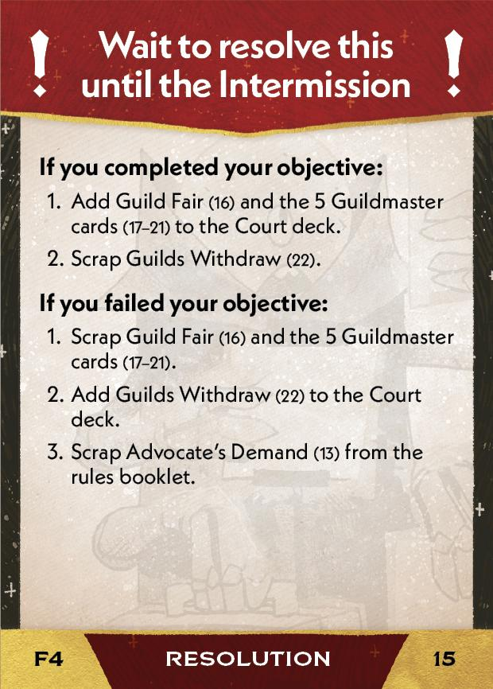
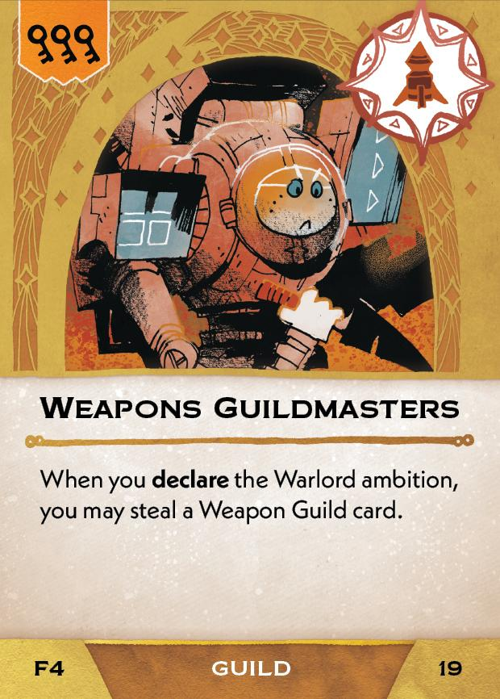
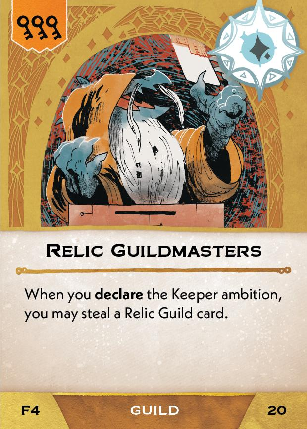
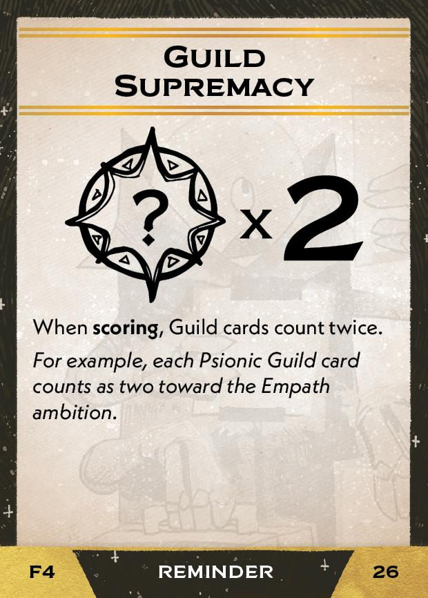

#Advocate
## Overview
<figure markdown="span">
{ width="300" }
</figure>

## Act I

[{ width="33%"}](4/piece_3_4.jpg){ data-lightbox="1" }[{ width="33%" }](4/back_3_4.jpg){ data-lightbox="1" }[{ width="33%" }](4/piece_3_1.jpg){ data-lightbox="1" }

??? info "Setup details"
     1. Gain these cards *(Do not resolved the When Secured effect)*:
    
         [{ width="150" }](4/piece_3_3.jpg){ data-lightbox="1" } [{ width="150" }](4/piece_3_2.jpg){ data-lightbox="1" }

??? success "If successful"
    1. Add these cards (one of which came from this Act's Setup) to the court deck :
      
        [{ width="150" }](4/piece_3_2.jpg){ data-lightbox="1" } [{ width="150" }](4/piece_3_0.jpg){ data-lightbox="1" } [{ width="150" }](4/piece_2_6.jpg){ data-lightbox="1" } [{ width="150" }](4/piece_2_5.jpg){ data-lightbox="1" } [{ width="150" }](4/piece_2_4.jpg){ data-lightbox="1" } [{ width="150" }](4/piece_2_3.jpg){ data-lightbox="1" } [{ width="150" }](4/piece_2_2.jpg){ data-lightbox="1" }

??? failure "If failed"
    1. Add these cards (one of which came from this Act's Setup) to the court deck :
      
        [{ width="150" }](4/piece_3_2.jpg){ data-lightbox="1" } [{ width="150" }](4/piece_2_1.jpg){ data-lightbox="1" }

    2. For each Guild card suit that you have more than each other Rival, add the corresponding card to the Court deck:
   
        [{ width="150" }](4/piece_3_0.jpg){ data-lightbox="1" } [{ width="150" }](4/piece_2_6.jpg){ data-lightbox="1" } [{ width="150" }](4/piece_2_5.jpg){ data-lightbox="1" } [{ width="150" }](4/piece_2_4.jpg){ data-lightbox="1" } [{ width="150" }](4/piece_2_3.jpg){ data-lightbox="1" }       

## Act II

[{ width="33%" }](4/piece_2_0.jpg){ data-lightbox="1" }[{ width="33%" }](4/back_2_0.jpg){ data-lightbox="1" }[{ width="33%px" }](4/piece_0_6.jpg){ data-lightbox="1" }

??? info "Setup details"
     1. Add these cards to the rules booklet:
    
        [{ width="150" }](4/piece_1_6.jpg){ data-lightbox="1" } [{ width="150" }](4/piece_1_5.jpg){ data-lightbox="1" }

??? success "If successful"
    1. Add these cards to the Court deck:
      
        [{ width="150" }](4/piece_1_3.jpg){ data-lightbox="1" } [{ width="150" }](4/piece_1_2.jpg){ data-lightbox="1" } [{ width="150" }](4/piece_1_1.jpg){ data-lightbox="1" } [{ width="150" }](4/piece_1_0.jpg){ data-lightbox="1" } [{ width="150" }](4/piece_0_6.jpg){ data-lightbox="1" } [{ width="150" }](4/piece_0_5.jpg){ data-lightbox="1" }

    2. If Mining Interest or Shipping Interest are in the Court discard pile, add them to the Court deck.

??? failure "If failed"
    1. Add this card to the Court deck:

        [{ width="150" }](4/piece_0_4.jpg){ data-lightbox="1" }

    2. Scrap this from the rules booklet.

        [{ width="150" }](4/piece_1_6.jpg){ data-lightbox="1" }

## Act III

[{ width="33%" }](4/piece_0_3.jpg){ data-lightbox="1" }[{ width="33%" }](4/back_0_3.jpg){ data-lightbox="1" }

??? info "Setup details"
    1. Gain this card:
    
        [{ width="150" }](4/piece_0_2.jpg){ data-lightbox="1" }

    2. Add this to the rules booklet and place the reminder card near the ambition boxes:

        [{ width="150" }](4/piece_0_1.jpg){ data-lightbox="1" } [{ width="150" }](4/piece_0_0.jpg){ data-lightbox="1" }