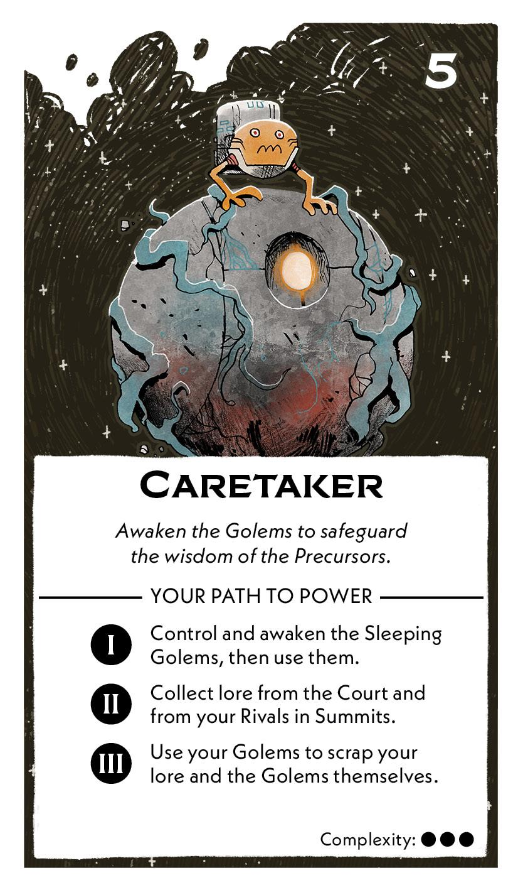
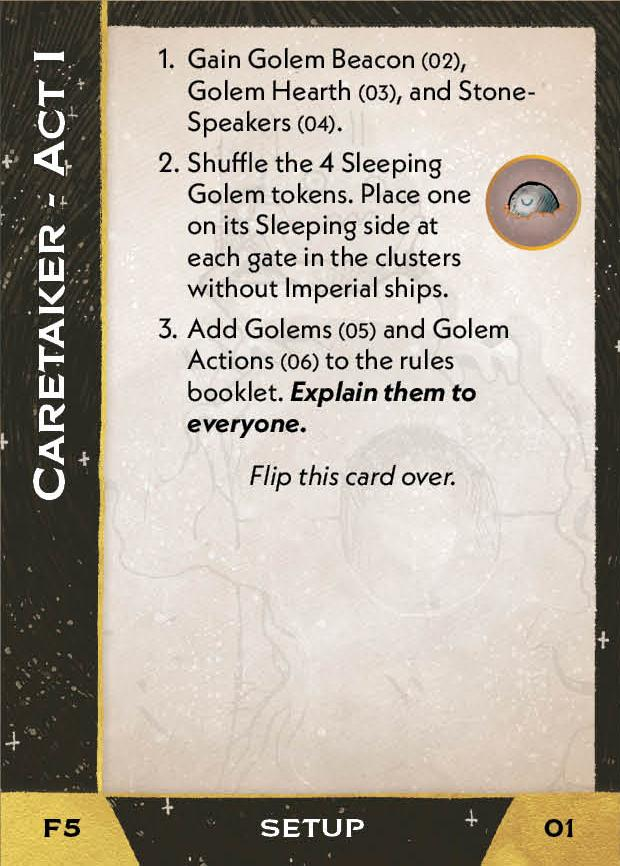
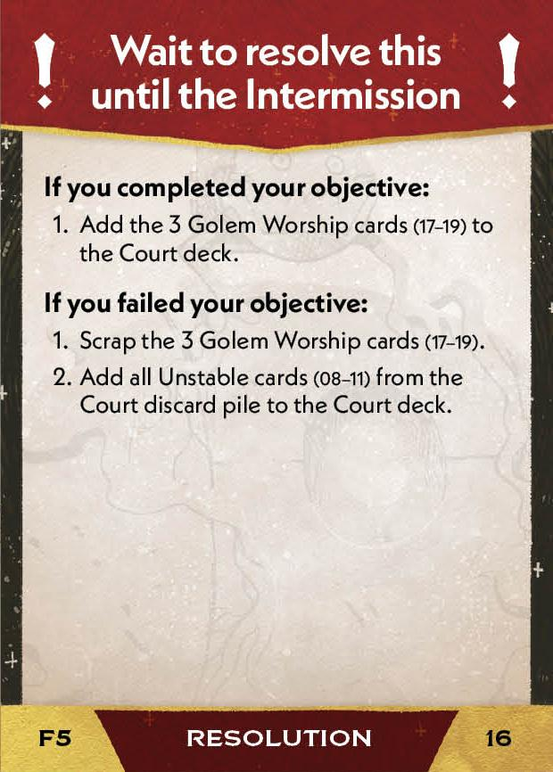
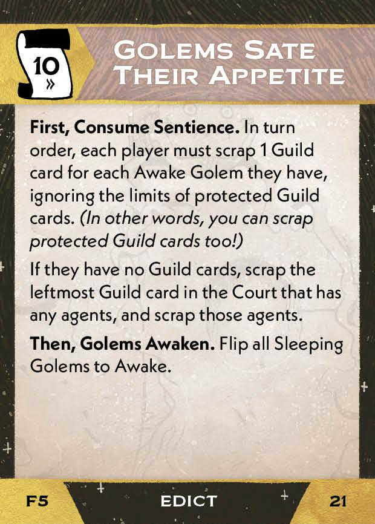

#Caretaker
## Overview
<figure markdown="span">
{ width="300" }
</figure>

## Act I

[{ width="33%"}](5/piece_2_6.jpg){ data-lightbox="1" }[{ width="33%" }](5/back_2_6.jpg){ data-lightbox="1" }[{ width="33%" }](5/piece_2_0.jpg){ data-lightbox="1" }

??? info "Setup details"
    1. Gain these cards:
    
        [{ width="150" }](5/piece_2_5.jpg){ data-lightbox="1" } [{ width="150" }](5/piece_2_4.jpg){ data-lightbox="1" } [{ width="150" }](5/piece_2_3.jpg){ data-lightbox="1" }

    2. Shuffle the 4 Sleeping Golem tokens. Place one on its Sleeping side at each gate in clusters without Imperial ships.
   
    3. Add these cards to the rules booklet:

        [{ width="150" }](5/piece_2_2.jpg){ data-lightbox="1" } [{ width="150" }](5/piece_2_1.jpg){ data-lightbox="1" }

??? success "If successful"
    1. Scrap this card (from this Act's Setup): 
      
        [{ width="150" }](5/piece_2_5.jpg){ data-lightbox="1" }

    2. Place all Golem tokens from the map onto your Golem Hearth.

    3. Add 1 random lore card per player to the Court Deck. 
   
    4. Add these cards to the court deck:

        [{ width="150" }](5/piece_1_6.jpg){ data-lightbox="1" } [{ width="150" }](5/piece_1_5.jpg){ data-lightbox="1" } [{ width="150" }](5/piece_1_4.jpg){ data-lightbox="1" } [{ width="150" }](5/piece_1_3.jpg){ data-lightbox="1" }

??? failure "If failed"
    1. Scrap this card (from this Act's Setup): 
      
        [{ width="150" }](5/piece_2_5.jpg){ data-lightbox="1" }
        
    2. Add this card (from this Act's Setup) to the court deck :
      
        [{ width="150" }](5/piece_2_3.jpg){ data-lightbox="1" }

    3. Scrap all Golem tokens on the map.

    4. For each Golem still in play, add the corresponding card to the court deck:
   
        [{ width="150" }](5/piece_1_6.jpg){ data-lightbox="1" } [{ width="150" }](5/piece_1_5.jpg){ data-lightbox="1" } [{ width="150" }](5/piece_1_4.jpg){ data-lightbox="1" } [{ width="150" }](5/piece_1_3.jpg){ data-lightbox="1" }  

## Act II

[{ width="33%" }](5/piece_1_2.jpg){ data-lightbox="1" }[{ width="33%" }](5/back_1_2.jpg){ data-lightbox="1" }[{ width="33%px" }](5/piece_0_5.jpg){ data-lightbox="1" }

??? info "Setup details"
    1. Gain this card:
    
        [{ width="150" }](5/piece_1_1.jpg){ data-lightbox="1" }

    2. Add this card to the rules booklet:
    
        [{ width="150" }](5/piece_1_0.jpg){ data-lightbox="1" }

    3. Shuffle this card into the action deck:
    
        [{ width="150" }](5/piece_0_6.jpg){ data-lightbox="1" }

    4. Flip all Sleeping Golems to awake.

??? success "If successful"
    1. Add these cards to the Court deck:
      
        [{ width="150" }](5/piece_0_4.jpg){ data-lightbox="1" } [{ width="150" }](5/piece_0_3.jpg){ data-lightbox="1" } [{ width="150" }](5/piece_0_2.jpg){ data-lightbox="1" }

??? failure "If failed"
    1. Add all Unstable cards from the Court discard pile to the Court deck.

## Act III

[{ width="33%" }](5/piece_0_1.jpg){ data-lightbox="1" }[{ width="33%" }](5/back_0_1.jpg){ data-lightbox="1" }

??? info "Setup details"
    1. Add this card to the rules booklet:
    
        [{ width="150" }](5/piece_0_0.jpg){ data-lightbox="1" }

    2. Flip all Sleeping Golems to Awake.