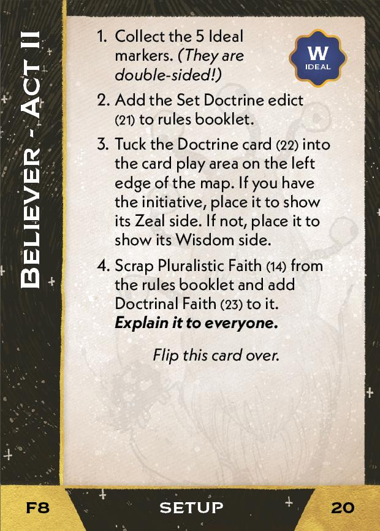
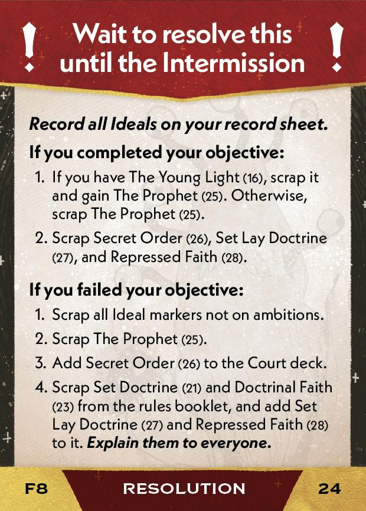

#Believer
## Overview
<figure markdown="span">
{ width="300" }
</figure>

## Act I

[{ width="33%"}](8/piece_4_2.jpg){ data-lightbox="1" }[{ width="33%" }](8/back_4_2.jpg){ data-lightbox="1" }[{ width="33%" }](8/piece_2_2.jpg){ data-lightbox="1" }

??? info "Setup details"
    1. Gain Faithful Disciples (02) and Spreading the Faith (03).
    
        [{ width="33%"}](8/piece_4_1.jpg){ data-lightbox="1" } [{ width="33%"}](8/piece_4_0.jpg){ data-lightbox="1" }
    
    2. Stack the 9 Faithful action cards (04-12) in number order so the "1" card is on the bottom and the "9" card is on the top. *(These cards don't list their card numbers.)*
    
        [{ width="33%"}](8/piece_3_6.jpg){ data-lightbox="1" } [{ width="33%"}](8/piece_3_5.jpg){ data-lightbox="1" } [{ width="33%"}](8/piece_3_4.jpg){ data-lightbox="1" } [{ width="33%"}](8/piece_3_3.jpg){ data-lightbox="1" } [{ width="33%"}](8/piece_3_2.jpg){ data-lightbox="1" } [{ width="33%"}](8/piece_3_1.jpg){ data-lightbox="1" } [{ width="33%"}](8/piece_3_0.jpg){ data-lightbox="1" } [{ width="33%"}](8/piece_2_6.jpg){ data-lightbox="1" } [{ width="33%"}](8/piece_2_5.jpg){ data-lightbox="1" }
    
    3. Add Faithful Cards (13) and Pluralistic Faith (14) to the rules booklet. **Explain them to everyone.** 

        [{ width="33%"}](8/piece_2_4.jpg){ data-lightbox="1" } [{ width="33%"}](8/piece_2_3.jpg){ data-lightbox="1" }

??? success "If successful"
    1. Gain The Young Light (16).
    
        [{ width="33%"}](8/piece_2_1.jpg){ data-lightbox="1" }
    
    2. Add Plot to Kidnap (17) to the Court deck.
    
        [{ width="33%"}](8/piece_2_0.jpg){ data-lightbox="1" }
    
    3. Scrap your Spreading the Faith (03), The Prodigal One (18), and Secret Order (19).

??? failure "If failed"
    1. Scrap your Spreading the Faith (03), The Young Light (16), and Plot to Kidnap (17).
    
    2. Add The Prodigal One (18) and Secret Order (19) to the Court deck.
    
        [{ width="33%"}](8/piece_1_6.jpg){ data-lightbox="1" } [{ width="33%"}](8/piece_1_5.jpg){ data-lightbox="1" }
    
    3. Add all Faithful action cards left in their stack to the Court deck.

## Act II

[{ width="33%" }](8/piece_1_4.jpg){ data-lightbox="1" }[{ width="33%" }](8/back_1_4.jpg){ data-lightbox="1" }[{ width="33%px" }](8/piece_1_0.jpg){ data-lightbox="1" }

??? info "Setup details"
    1. Collect the 5 Ideal markers. *(They are double-sided!)*
    
    2. Add the Set Doctrine edict (21) to rules booklet.
    
        [{ width="33%"}](8/piece_1_3.jpg){ data-lightbox="1" }
    
    3. Tuck the Doctrine card (22) into the card play area on the left edge of the map. If you have the initiative, place it to show its Zeal side. If not, place it to show its Wisdom side.
    
        [{ width="33%"}](8/piece_1_2.jpg){ data-lightbox="1" } [{ width="33%"}](8/back_1_2.jpg){ data-lightbox="1" }
    
    4. Scrap Pluralistic Faith (14) from the rules booklet and add Doctrinal Faith (23) to it. **Explain it to everyone.**

        [{ width="33%"}](8/piece_1_1.jpg){ data-lightbox="1" }

??? success "If successful"
    1. If you have The Young Light (16), scrap it and gain The Prophet (25). Otherwise, scrap The Prophet (25).
    
        [{ width="33%"}](8/piece_0_6.jpg){ data-lightbox="1" }
    
    2. Scrap Secret Order (26), Set Lay Doctrine (27), and Repressed Faith (28).

??? failure "If failed"
    1. Scrap all Ideal markers not on ambitions.
    
    2. Scrap The Prophet (25).
    
    3. Add Secret Order (26) to the Court deck.
    
        [{ width="33%"}](8/piece_0_5.jpg){ data-lightbox="1" }
    
    4. Scrap Set Doctrine (21) and Doctrinal Faith (23) from the rules booklet, and add Set Lay Doctrine (27) and Repressed Faith (28) to it. **Explain them to everyone.**

        [{ width="33%"}](8/piece_0_4.jpg){ data-lightbox="1" } [{ width="33%"}](8/piece_0_3.jpg){ data-lightbox="1" }

## Act III

[{ width="33%" }](8/piece_0_2.jpg){ data-lightbox="1" }[{ width="33%" }](8/back_0_2.jpg){ data-lightbox="1" }

??? info "Setup details"
    1. Tuck Dominant Faith (30) in front of Doctrinal Faith (23) in the rules booklet. **Explain Dominant Faith to everyone.**
    
        [{ width="33%"}](8/piece_0_1.jpg){ data-lightbox="1" }
    
    2. Add Breaking the Faith (31) to the rules booklet. **Explain it to everyone.**
    
        [{ width="33%"}](8/piece_0_0.jpg){ data-lightbox="1" }
    
    3. Flip the Doctrine (22) to match the Ideal with more markers on ambition boxes. On a tie, flip it to its Wisdom side.