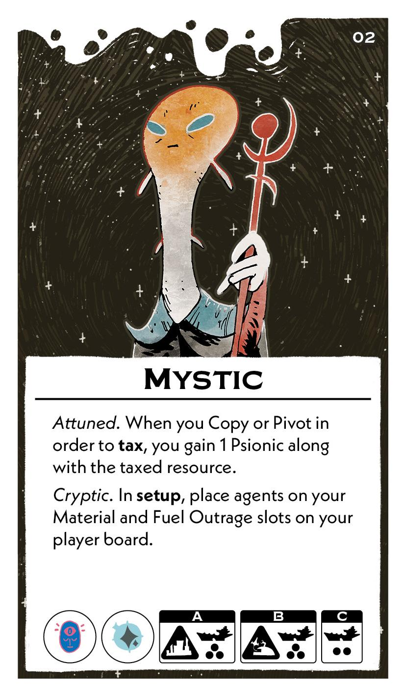
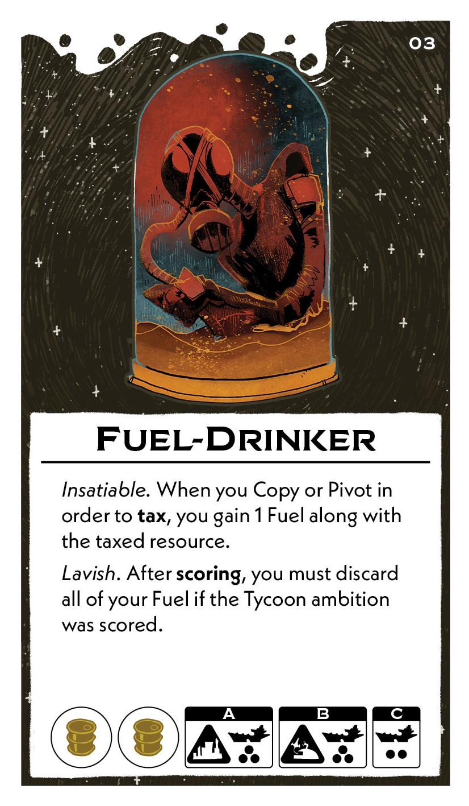
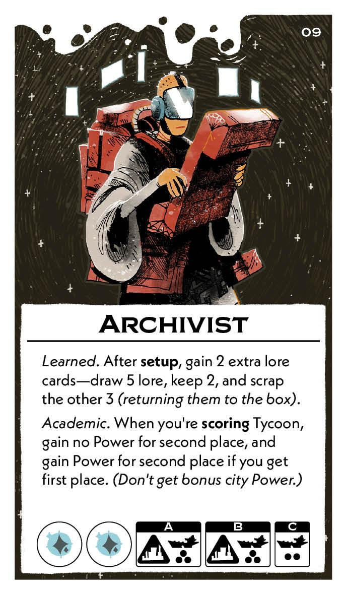
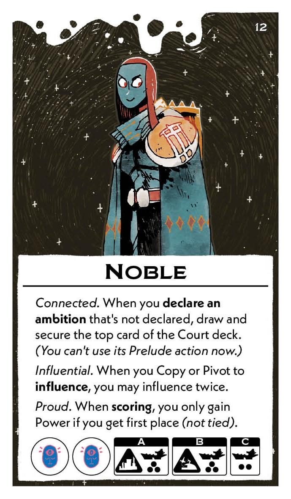
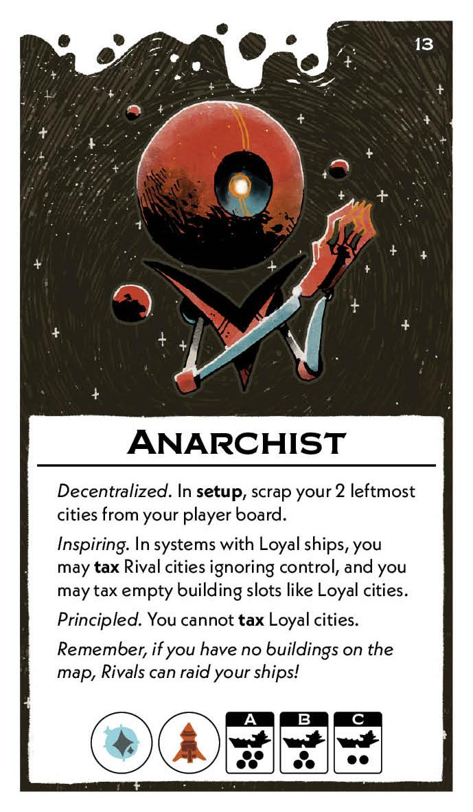

#Leader cards
##Base game
[{ width="150" }](0/b/piece_0_0.jpg){ data-lightbox="1" } 
[{ width="150" }](0/b/piece_0_1.jpg){ data-lightbox="1" } 
[{ width="150" }](0/b/piece_0_2.jpg){ data-lightbox="1" } 
[{ width="150" }](0/b/piece_0_3.jpg){ data-lightbox="1" } 
[{ width="150" }](0/b/piece_1_0.jpg){ data-lightbox="1" } 
[{ width="150" }](0/b/piece_1_1.jpg){ data-lightbox="1" } 
[{ width="150" }](0/b/piece_1_2.jpg){ data-lightbox="1" } 
[{ width="150" }](0/b/piece_1_3.jpg){ data-lightbox="1" } 
##Leader and Lore pack
[{ width="150" }](0/x/piece_0_0.jpg){ data-lightbox="1" } 
[{ width="150" }](0/x/piece_0_1.jpg){ data-lightbox="1" } 
[{ width="150" }](0/x/piece_0_2.jpg){ data-lightbox="1" } 
[{ width="150" }](0/x/piece_0_3.jpg){ data-lightbox="1" } 
[{ width="150" }](0/x/piece_1_0.jpg){ data-lightbox="1" } 
[{ width="150" }](0/x/piece_1_1.jpg){ data-lightbox="1" } 
[{ width="150" }](0/x/piece_1_2.jpg){ data-lightbox="1" } 
[{ width="150" }](0/x/piece_1_3.jpg){ data-lightbox="1" } 

## FAQ / Errata

??? question "Mystic / Fuel-Drinker - Do I still gain the additional resoruce when taxing, if the taxing did not provide a resource?"
    Yes. The "along with the taxed resource" phrasing is only to clarify that the resource granted by the ability does not replace the normal effect of taxing. It is not meant to limit the ability.

??? question "Upstart/Anarchist - Do the restrictions of taxing Loyal cities apply to non-Loyal cities if they are taxed "like" Loyal cities?"
    No. The effects apply only to cities that are actually Loyal. Treating a city "like it is Loyal" means it uses the rules associated with Loyal cities, but is still non-Loyal for other card effects.
    
    However, these limits are in place for Loyal cities even if another card such as Empath's Bond would give you permission to tax them.

??? question "Warrior/Feastbringer/Noble - When granted an additional action from the Copy or Pivot ability, can I trigger a New Action on a Guild or Lore card?"
    Yes. These effects grant you another action which can be used in any way as if you had gotten that action from a card pip.

??? question "Demagogue - Can the influence effect granted by this be used for a New Action?"
    No. Because this effect specifically tells you what to influence and how, it is not an influence action. It follows the rules for influencing, but it is not considered an influence action for other card effects.

??? question "Overseer - Does triggering Ruthless require that I have and spend another such action in the same turn?"
    No. This allows you to repeat the effects of the action you just took, without "spending" another action. The only cost is the damage to the building.

    
??? question "Corsair - Can I reroll dice one at at time, and how does this work with other reroll abilities?"
    Each reroll ability is triggered one at a time, but all rerolls granted by a reroll ability must be done simultaneously.