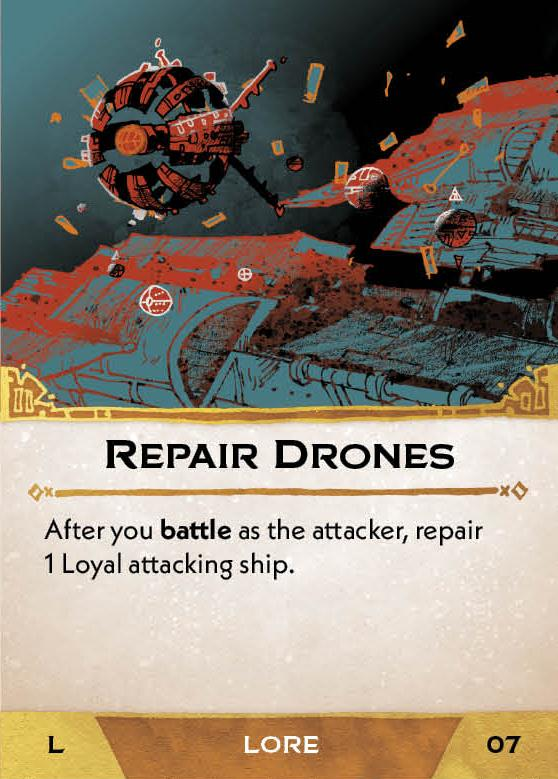
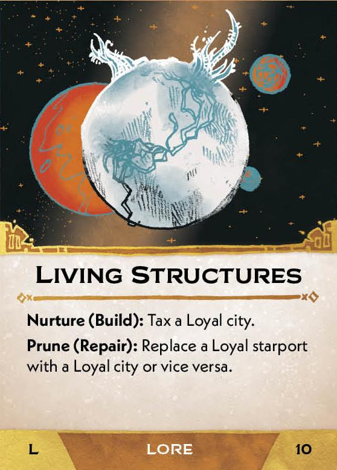
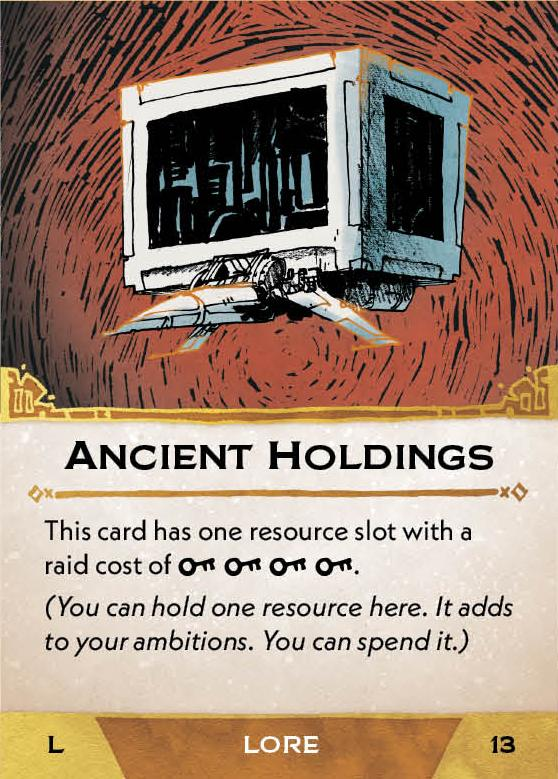
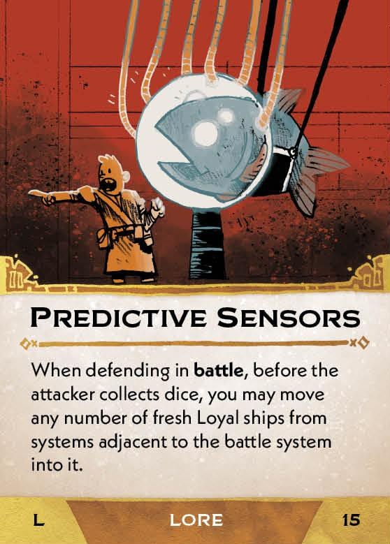
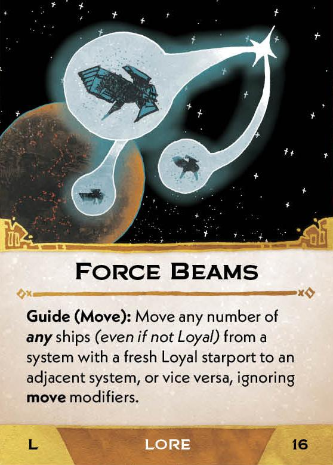
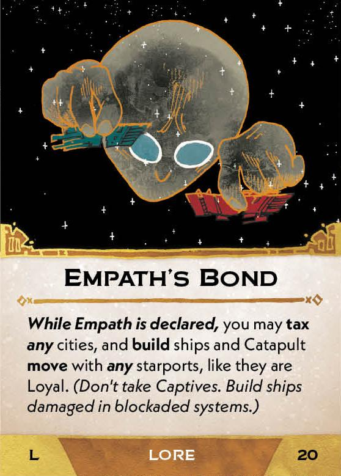
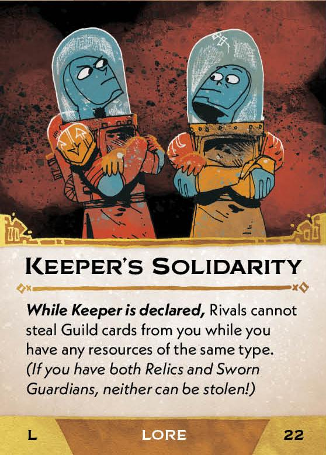

#Lore cards
##Base game
[{ width="150" }](1/b/piece_0_0.jpg){ data-lightbox="1" } 
[{ width="150" }](1/b/piece_0_1.jpg){ data-lightbox="1" } 
[{ width="150" }](1/b/piece_0_2.jpg){ data-lightbox="1" } 
[{ width="150" }](1/b/piece_0_3.jpg){ data-lightbox="1" } 
[{ width="150" }](1/b/piece_0_4.jpg){ data-lightbox="1" } 
[{ width="150" }](1/b/piece_0_5.jpg){ data-lightbox="1" } 
[{ width="150" }](1/b/piece_0_6.jpg){ data-lightbox="1" } 
[{ width="150" }](1/b/piece_1_0.jpg){ data-lightbox="1" } 
[{ width="150" }](1/b/piece_1_1.jpg){ data-lightbox="1" } 
[{ width="150" }](1/b/piece_1_2.jpg){ data-lightbox="1" } 
[{ width="150" }](1/b/piece_1_3.jpg){ data-lightbox="1" } 
[{ width="150" }](1/b/piece_1_4.jpg){ data-lightbox="1" } 
[{ width="150" }](1/b/piece_1_5.jpg){ data-lightbox="1" } 
[{ width="150" }](1/b/piece_1_6.jpg){ data-lightbox="1" } 
##Leader and Lore pack
[{ width="150" }](1/x/piece_0_0.jpg){ data-lightbox="1" } 
[{ width="150" }](1/x/piece_0_1.jpg){ data-lightbox="1" } 
[{ width="150" }](1/x/piece_0_2.jpg){ data-lightbox="1" } 
[{ width="150" }](1/x/piece_0_3.jpg){ data-lightbox="1" } 
[{ width="150" }](1/x/piece_0_4.jpg){ data-lightbox="1" } 
[{ width="150" }](1/x/piece_0_5.jpg){ data-lightbox="1" } 
[{ width="150" }](1/x/piece_0_6.jpg){ data-lightbox="1" } 
[{ width="150" }](1/x/piece_1_0.jpg){ data-lightbox="1" } 
[{ width="150" }](1/x/piece_1_1.jpg){ data-lightbox="1" } 
[{ width="150" }](1/x/piece_1_2.jpg){ data-lightbox="1" } 
[{ width="150" }](1/x/piece_1_3.jpg){ data-lightbox="1" } 
[{ width="150" }](1/x/piece_1_4.jpg){ data-lightbox="1" } 
[{ width="150" }](1/x/piece_1_5.jpg){ data-lightbox="1" } 
[{ width="150" }](1/x/piece_1_6.jpg){ data-lightbox="1" } 

## FAQ / Errata

??? question "Sprinter Drives - Does this effect trigger itself?"
    No, this card should say "When you move fresh Loyal ships, except using Splinter Drives..."

??? question "Sprinter Drives - Do all of the ships moved by Sprinter Drives have to move together?"
    No, the ships may each be moved independently to different systems, including any ships that were dropped off during a Catapult movement.

??? question "Gate Ports - What happens if the card is transfered or leaves play (result of some campaign effects)?"
    Existing starports remain on gates and continue to function. Only the owner of the card is allowed to build new starports on gates or to capture agents with its effect. If the card leaves play, nobody can trigger these effects.

??? question "Gate Stations - What happens if the card is transfered or leaves play (result of some campaign effects)?"
    Existing cities remain on the board. As long as the card remains in play, *all* gate cities function as described on the card. If the card leaves play, the cities remain but no longer have any resource types (they do not Provoke Outrage and they do not provide resources when Taxed, but can still be Taxed for a Captive.)

??? question "Empath's Bond - What does "blockaded" mean?"
    Blockaded is a deprecated term. This should say "Build ships damaged in systems Controlled by Rivals." (Basically, the normal rule for Building).

??? question "Tycoon's Ambition - Can I resolve the effect if I have no Material or Fuel, or if some of my Material/Fuel is frozen, on a Cartel, or on a Monopoly?"
    This card's effect can be triggered regardless of what resources you have. You do not discard resources which are frozen or which are the equivalent of in the supply. You can declare an ambition even if no Material or Fuel was discarded. 