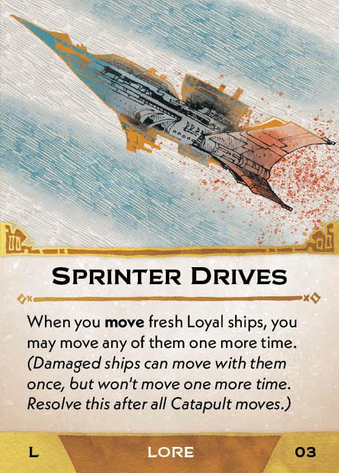
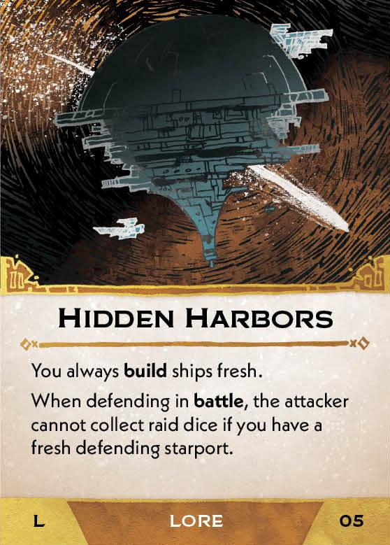
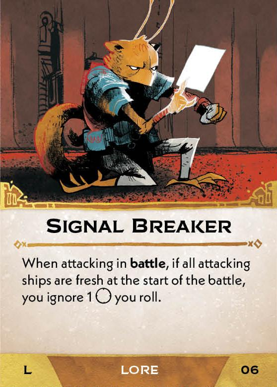
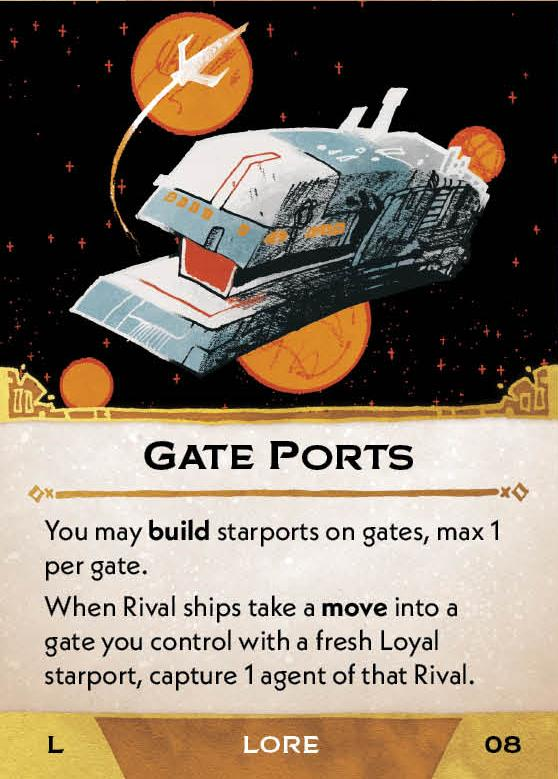
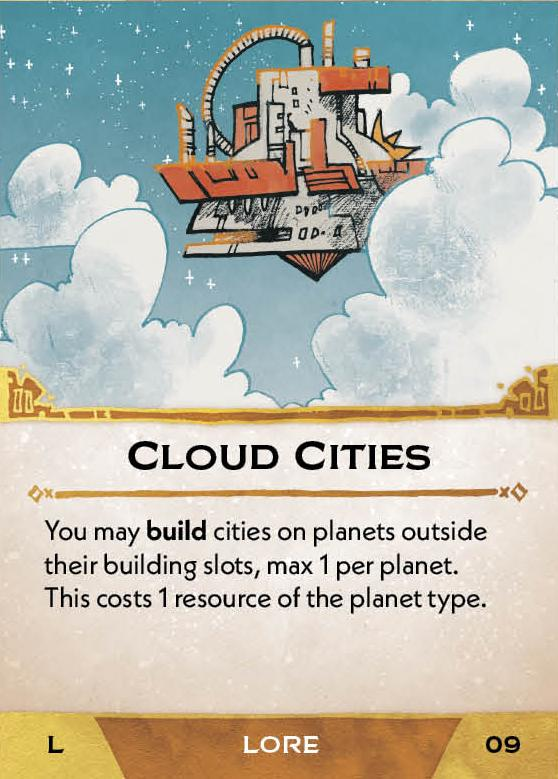
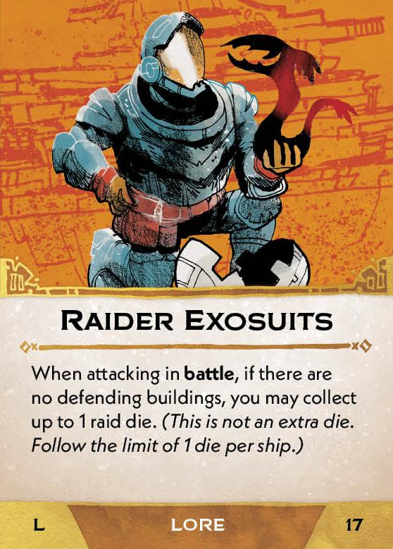
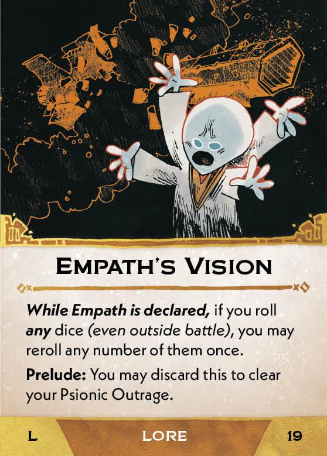
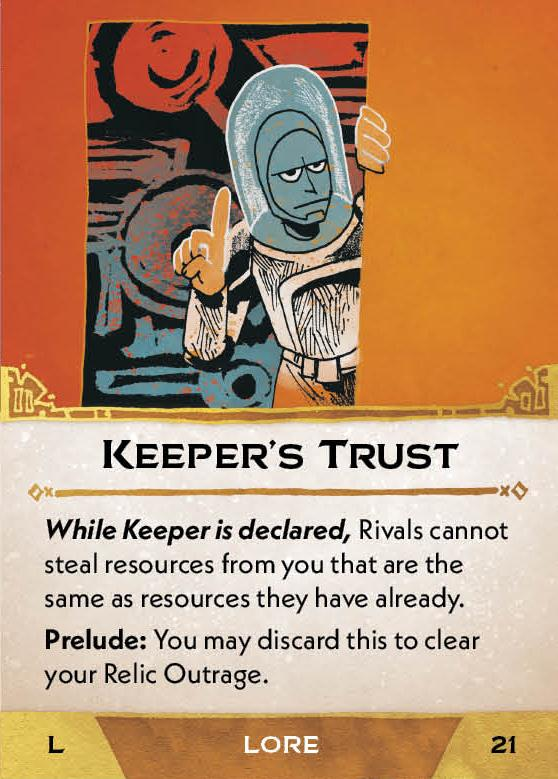
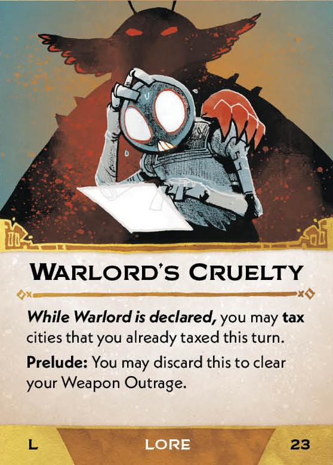
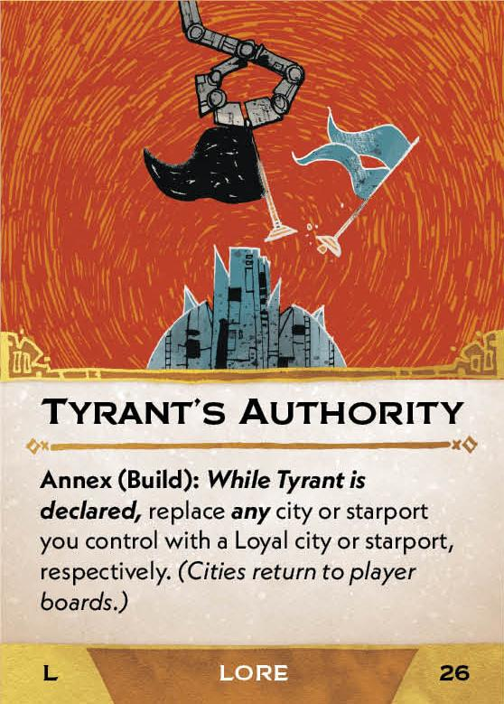

#Lore cards
##Base game
[{ width="150" }](1/b/piece_0_0.jpg){ data-lightbox="1" } 
[{ width="150" }](1/b/piece_0_1.jpg){ data-lightbox="1" } 
[{ width="150" }](1/b/piece_0_2.jpg){ data-lightbox="1" } 
[{ width="150" }](1/b/piece_0_3.jpg){ data-lightbox="1" } 
[{ width="150" }](1/b/piece_0_4.jpg){ data-lightbox="1" } 
[{ width="150" }](1/b/piece_0_5.jpg){ data-lightbox="1" } 
[{ width="150" }](1/b/piece_0_6.jpg){ data-lightbox="1" } 
[{ width="150" }](1/b/piece_1_0.jpg){ data-lightbox="1" } 
[{ width="150" }](1/b/piece_1_1.jpg){ data-lightbox="1" } 
[{ width="150" }](1/b/piece_1_2.jpg){ data-lightbox="1" } 
[{ width="150" }](1/b/piece_1_3.jpg){ data-lightbox="1" } 
[{ width="150" }](1/b/piece_1_4.jpg){ data-lightbox="1" } 
[{ width="150" }](1/b/piece_1_5.jpg){ data-lightbox="1" } 
[{ width="150" }](1/b/piece_1_6.jpg){ data-lightbox="1" } 
##Leader and Lore pack
[{ width="150" }](1/x/piece_0_0.jpg){ data-lightbox="1" } 
[{ width="150" }](1/x/piece_0_1.jpg){ data-lightbox="1" } 
[{ width="150" }](1/x/piece_0_2.jpg){ data-lightbox="1" } 
[{ width="150" }](1/x/piece_0_3.jpg){ data-lightbox="1" } 
[{ width="150" }](1/x/piece_0_4.jpg){ data-lightbox="1" } 
[{ width="150" }](1/x/piece_0_5.jpg){ data-lightbox="1" } 
[{ width="150" }](1/x/piece_0_6.jpg){ data-lightbox="1" } 
[{ width="150" }](1/x/piece_1_0.jpg){ data-lightbox="1" } 
[{ width="150" }](1/x/piece_1_1.jpg){ data-lightbox="1" } 
[{ width="150" }](1/x/piece_1_2.jpg){ data-lightbox="1" } 
[{ width="150" }](1/x/piece_1_3.jpg){ data-lightbox="1" } 
[{ width="150" }](1/x/piece_1_4.jpg){ data-lightbox="1" } 
[{ width="150" }](1/x/piece_1_5.jpg){ data-lightbox="1" } 
[{ width="150" }](1/x/piece_1_6.jpg){ data-lightbox="1" } 

## FAQ / Errata

??? question "Galactic Rifles - Is this effect considered a Battle and do Battle modifiers apply?"
    No, the text "Like in a Battle" means that this effect follows the rules of a Battle, but it is not a Battle as far as any other card is concerned. This means effects which would trigger when defending in Battle also do not trigger.

??? question "Sprinter Drives - Does this effect trigger itself?"
    No, this card should say "When you move fresh Loyal ships, except using Splinter Drives..."

??? question "Sprinter Drives - Do all of the ships moved by Sprinter Drives have to move together?"
    No, the ships may each be moved independently to different systems, including any ships that were dropped off during a Catapult movement.

??? question "Gate Ports / Gate Stations / Cloud Cities - What happens if the card is transfered or leaves play (result of some campaign effects)?"
    The buildings remain on the board. However, the additional effect of Gate Ports only applies for the owner of the card. The additional affect of Cloud Cities applies to all gate cities, regardless of owner, as long as the card is in play.

??? question "Gate Ports / Gate Stations / Cloud Cities - What happens if a building is placed in a gate or outside of a slot via some other effect, such as Living Structures?"
    Starports in gates which belong to the owner of Gate Stations will benefit from its effect.

    All cities corresponding to Gate Ports will be modified by its effect, no matter who owns Gate Ports, as long as it is in play.

    The "max 1" limit on these cards means you cannot build using these cards if there is already building of the corresponding type. This limit does not apply to buildings placed through effects other than these cards.

??? question "Living Structures - Can I use Prune to remove a building if I am unable to place the corresponding building in its place?"
    No. Replacement effects must be able to remove and place all of the mentioned pieces, or no part of the effect can resolve.

??? question "Seeker Torpedoes / Empath's Vision - Can I reroll dice one at at time, and how does this work with other reroll abilities?"
    Each reroll ability is triggered one at a time, but all rerolls granted by a reroll ability must be done simultaneously.

??? question "Empath's Bond - What does "like they are Loyal" mean"?"
    It means that the effect is resolved according to the rules of taxing or building with Loyal buildings. The building is not treated Loyal for any other purpose. For example, Anarchist is not prohibited from taxing such buildings (but is still prohibited from taxing buildings that are actually Loyal)

??? question "Empath's Bond - What does "blockaded" mean?"
    Blockaded is a deprecated term. This should say "Build ships damaged in systems Controlled by Rivals." (Basically, the normal rule for Building).

??? question "Tycoon's Ambition - Can I resolve the effect if I have no Material or Fuel, or if some of my Material/Fuel is frozen, on a Cartel, or on a Monopoly?"
    This card's effect can be triggered regardless of what resources you have. You do not discard resources which are frozen or which are the equivalent of in the supply. You can declare an ambition even if no Material or Fuel was discarded. 
