#Court cards
[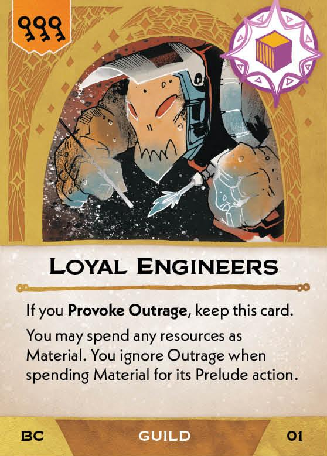{ width="150" }](2/piece_0_0.jpg){ data-lightbox="1" } 
[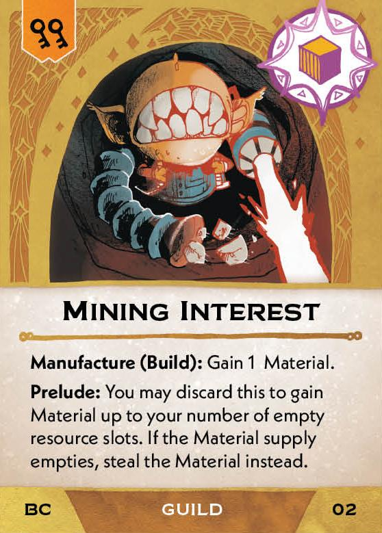{ width="150" }](2/piece_0_1.jpg){ data-lightbox="1" } 
[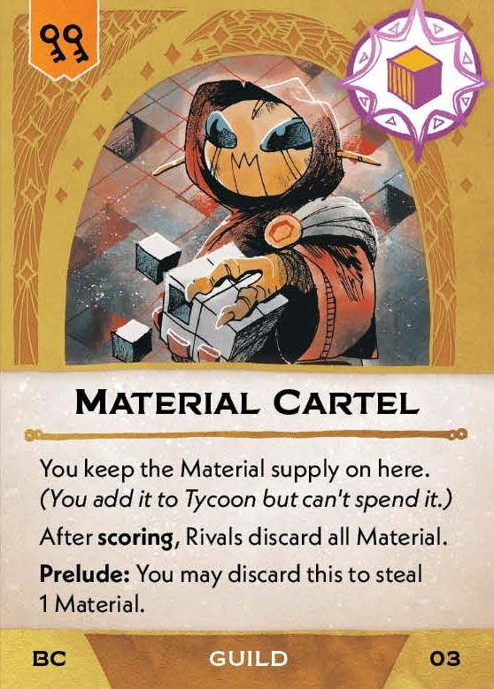{ width="150" }](2/piece_0_2.jpg){ data-lightbox="1" } 
[{ width="150" }](2/piece_0_3.jpg){ data-lightbox="1" } 
[{ width="150" }](2/piece_0_4.jpg){ data-lightbox="1" } 
[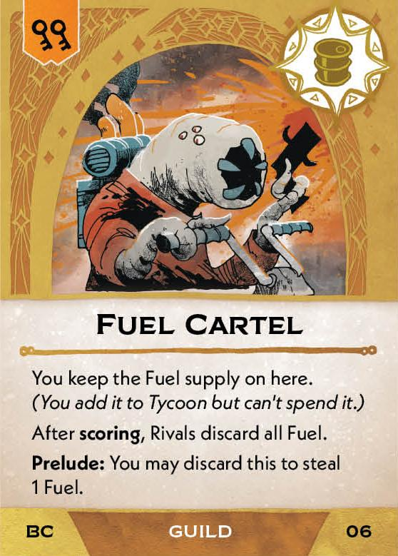{ width="150" }](2/piece_0_5.jpg){ data-lightbox="1" } 
[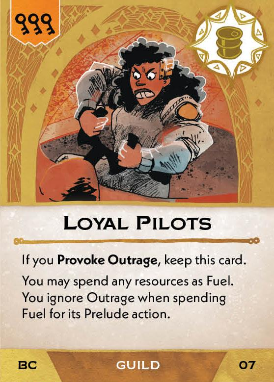{ width="150" }](2/piece_0_6.jpg){ data-lightbox="1" } 
[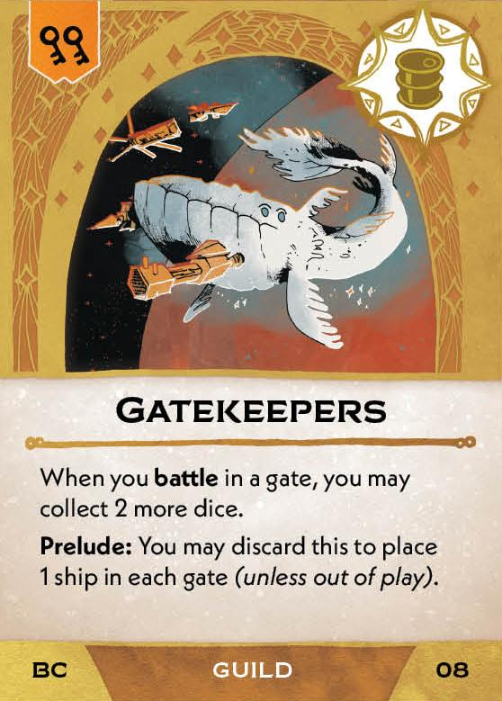{ width="150" }](2/piece_1_0.jpg){ data-lightbox="1" } 
[{ width="150" }](2/piece_1_1.jpg){ data-lightbox="1" } 
[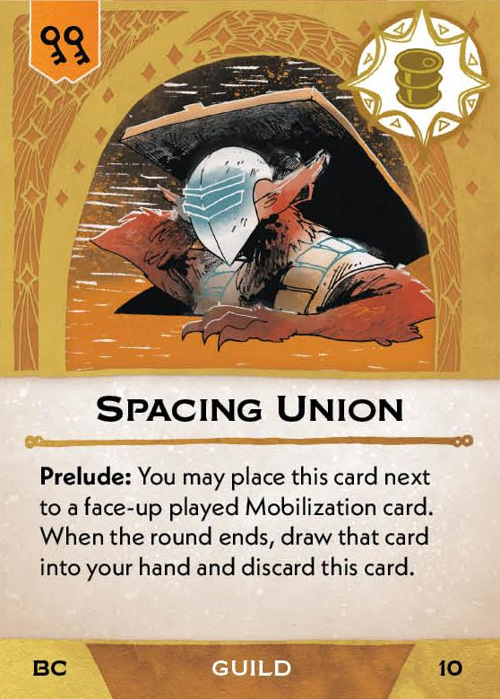{ width="150" }](2/piece_1_2.jpg){ data-lightbox="1" }
[{ width="150" }](2/piece_1_3.jpg){ data-lightbox="1" } 
[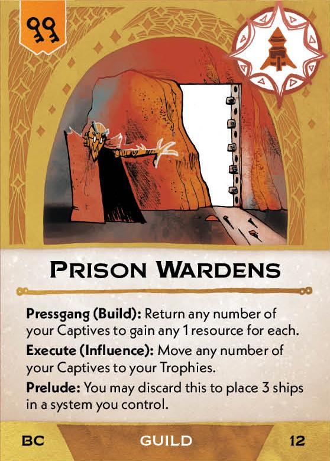{ width="150" }](2/piece_1_4.jpg){ data-lightbox="1" } 
[{ width="150" }](2/piece_1_5.jpg){ data-lightbox="1" } 
[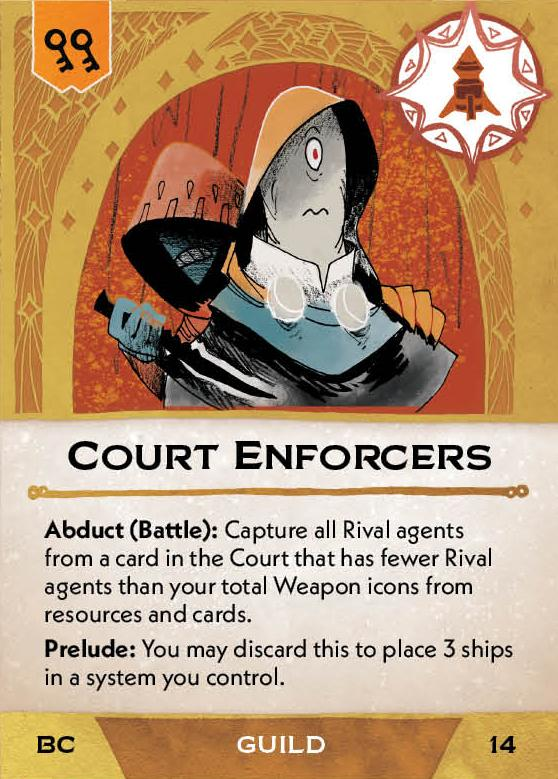{ width="150" }](2/piece_1_6.jpg){ data-lightbox="1" } 
[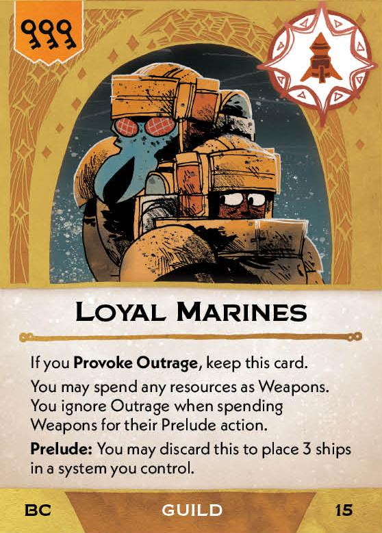{ width="150" }](2/piece_2_0.jpg){ data-lightbox="1" } 
[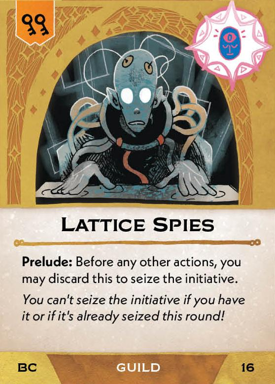{ width="150" }](2/piece_2_1.jpg){ data-lightbox="1" } 
[{ width="150" }](2/piece_2_2.jpg){ data-lightbox="1" } 
[{ width="150" }](2/piece_2_3.jpg){ data-lightbox="1" } 
[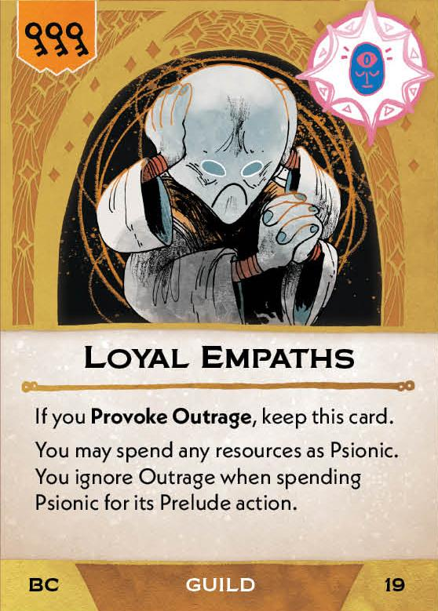{ width="150" }](2/piece_2_4.jpg){ data-lightbox="1" } 
[{ width="150" }](2/piece_2_5.jpg){ data-lightbox="1" } 
[{ width="150" }](2/piece_2_6.jpg){ data-lightbox="1" } 
[{ width="150" }](2/piece_3_0.jpg){ data-lightbox="1" } 
[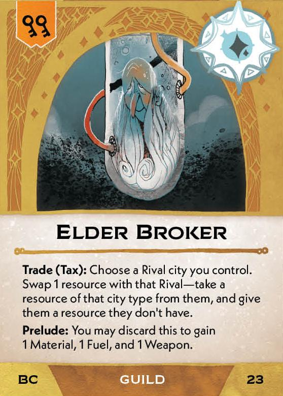{ width="150" }](2/piece_3_1.jpg){ data-lightbox="1" } 
[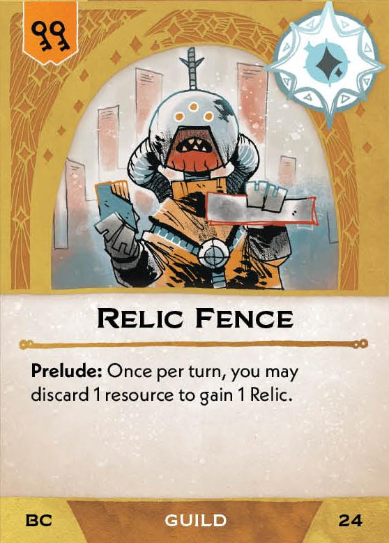{ width="150" }](2/piece_3_2.jpg){ data-lightbox="1" } 
[{ width="150" }](2/piece_3_3.jpg){ data-lightbox="1" } 
[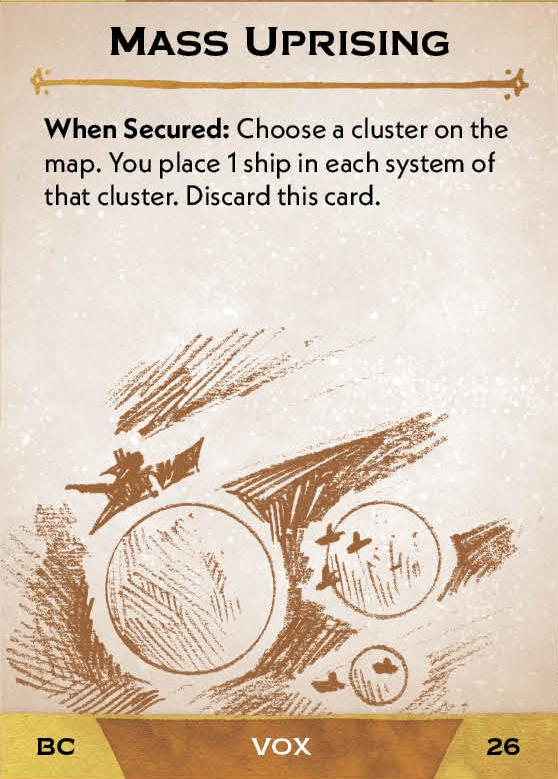{ width="150" }](2/piece_3_4.jpg){ data-lightbox="1" } 
[{ width="150" }](2/piece_3_5.jpg){ data-lightbox="1" } 
[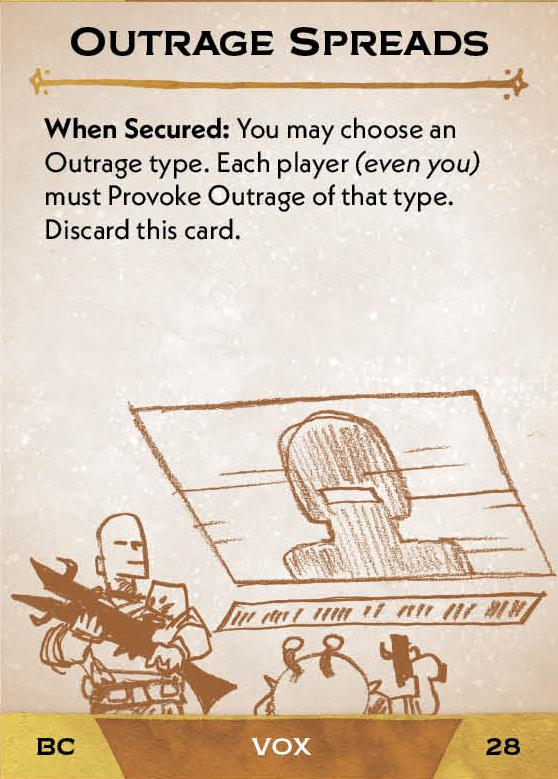{ width="150" }](2/piece_3_6.jpg){ data-lightbox="1" } 
[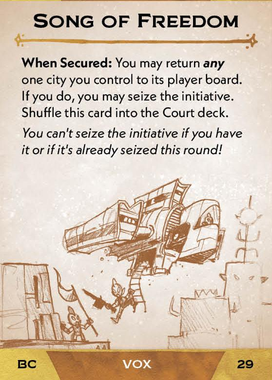{ width="150" }](2/piece_4_0.jpg){ data-lightbox="1" } 
[{ width="150" }](2/piece_4_1.jpg){ data-lightbox="1" } 
[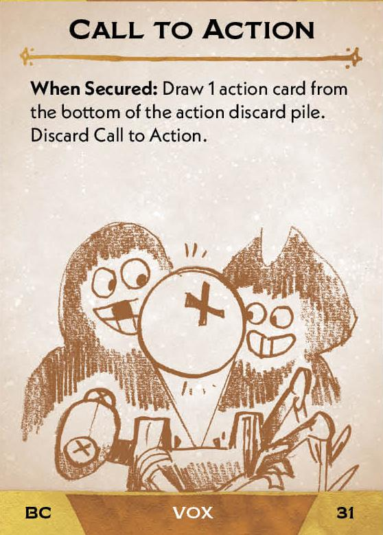{ width="150" }](2/piece_4_2.jpg){ data-lightbox="1" } 

## FAQ / Errata

??? question "Loyal cards - How exactly do these effects interact with other cards?"
    The ability to spend any resource as another resource means that you can use the Prelude action of the specified resource. For the purpose of card effects, you are considered to have spent the resource as its original type, not as the type specified on the Loyal card. For example, spending a Psionic as a Fuel will advance Pacifists's Act II objective, but spending a Fuel as a Psionic will not.

    You can spend another resource as the resource type listed on the Loyal card, even if the original resource type is outraged.

??? question "Material Cartel / Fuel Cartel - How exactly do resources on these cards interact with other effects?"
    Any effect that considers the number or type of resources currently in your possession will include the resources on your Cartels.

    Effects that would move a resource in any way will only move resources to or from a Cartel as if it were the supply. An effect that would move a resource in your possession cannot be used on a resource in your Cartel.

    Effects that trigger when resources are gained or lost do not consider the resources on Cartel to be in possession of the Cartel's owner. This means that transfering the Cartel card does not cause either party to gain/lose resources. Another player collecting a resource from a Cartel you own does not cause you to lose a resource. Another player spending or returning a resource such that it ends up on your Cartel does not cause you to gain a resource.

    However, if you move a resource from your Cartel to elsewhere in your play area, you are considered to have gained it, and if you move a card from anywhere else in your play area to your Cartel, you are considered to have lost it.

??? question "Skirmishers - Can I reroll dice one at at time, and how does this work with other reroll abilities?"
    Each reroll ability is triggered one at a time, but all rerolls granted by a reroll ability must be done simultaneously.

??? question "Elder Broker - Is the Trade effect considered Stealing? Can it be blocked by Sworn Guardian?"
    No. This effect is not considered stealing.

