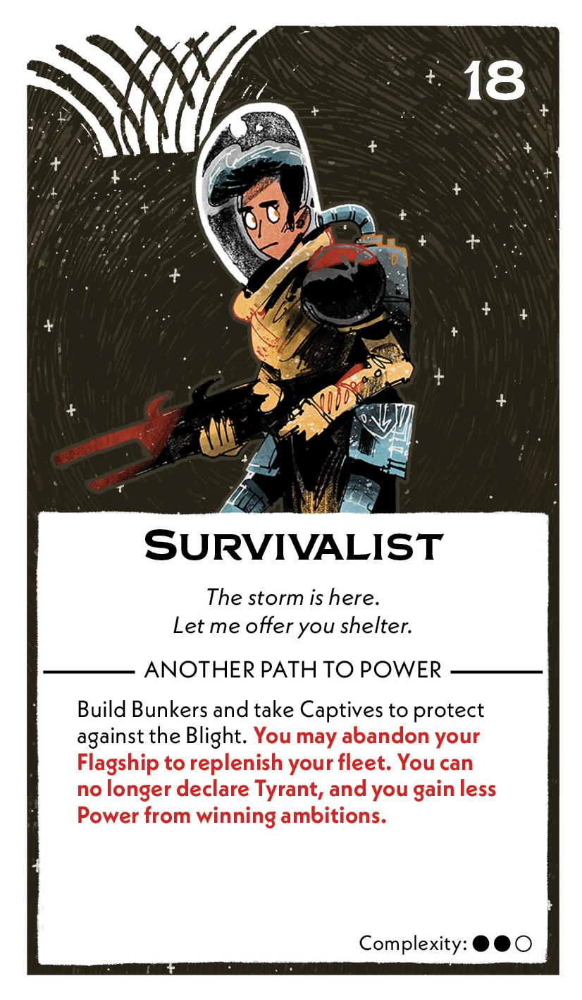
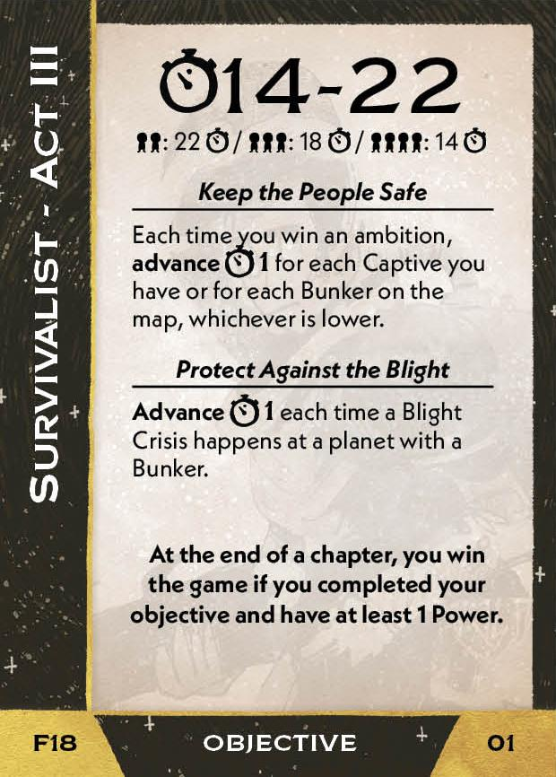
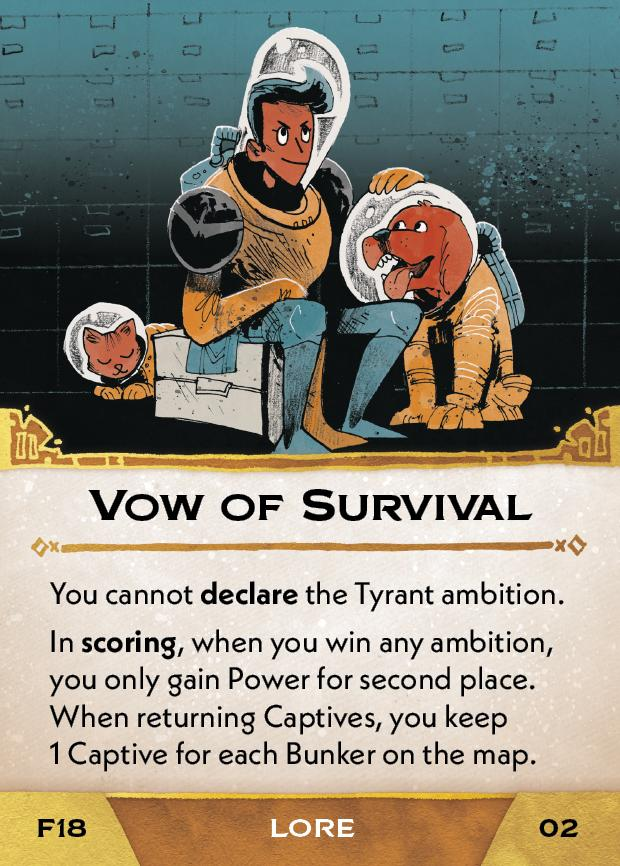
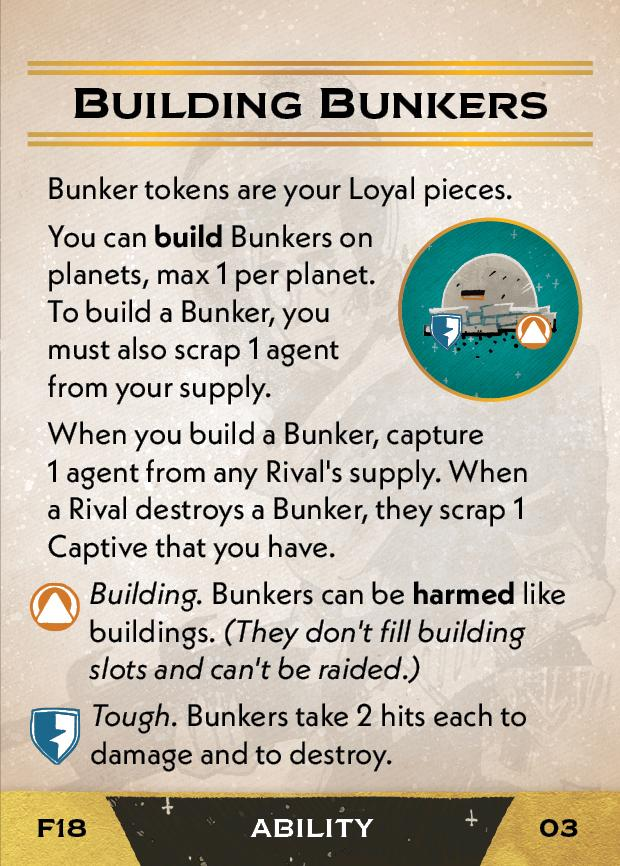
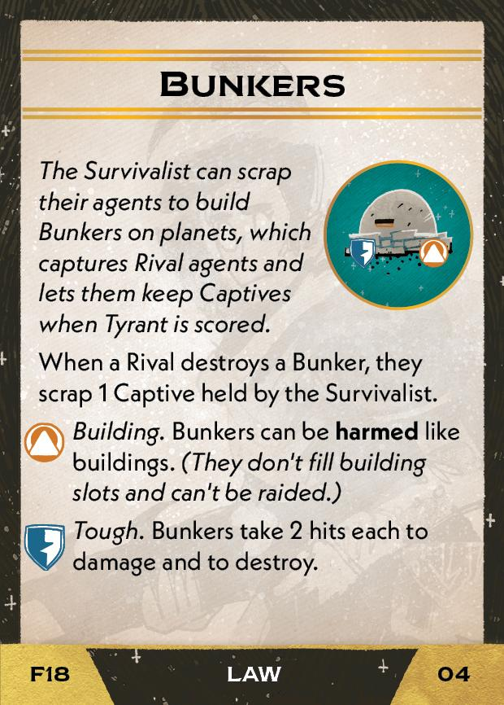
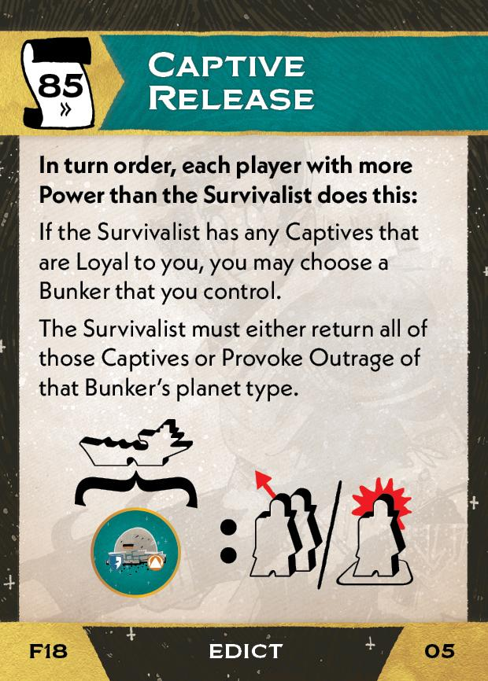

#Survivalist
## Overview
<figure markdown="span">
{ width="300" }
</figure>

## Act III

[{ width="33%" }](18/piece_1_0.jpg){ data-lightbox="1" }[{ width="33%" }](18/back_1_0.jpg){ data-lightbox="1" }

??? info "Setup details"
    1. **If you have a Flagship, you may Resettle** - as describe on the back of the Flagship board.
    
    2. Gain Vow of Survival (02).
    
        [{ width="33%" }](18/piece_0_3.jpg){ data-lightbox="1" }
    
    3. Gain the Building Bunkers card (03) and collect the 9 Bunker tokens on it.
    
        [{ width="33%" }](18/piece_0_2.jpg){ data-lightbox="1" }
    
    4. Add the Bunkers (04) and Captive Release cards (05) to the rules booklet. **Explain them to everyone.**

        [{ width="33%" }](18/piece_0_1.jpg){ data-lightbox="1" } [{ width="33%" }](18/piece_0_0.jpg){ data-lightbox="1" }