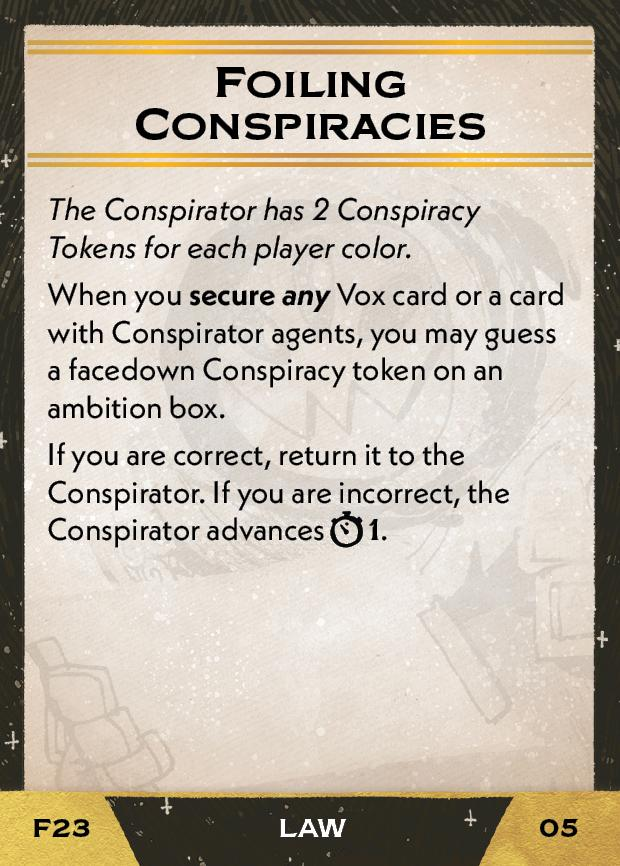

#Conspirator
## Overview
<figure markdown="span">
{ width="300" }
</figure>

## Act III

[{ width="33%" }](23/piece_1_0.jpg){ data-lightbox="1" }[{ width="33%" }](23/back_1_0.jpg){ data-lightbox="1" }

??? info "Setup details"
    1. **If you have a Flagship, you may Resettle** - as describe on the back of the Flagship board.
    
    2. Gain Farseers (02).
    
        [{ width="33%" }](23/piece_0_3.jpg){ data-lightbox="1" }
    
    3. Collect the 8 Conspiracy tokens - 2 per player color. *(Even if you don't have all 4 players!)*
    
    4. Gain the Conspiracies card (03). **Explain it to everyone.**
    
        [{ width="33%" }](23/piece_0_2.jpg){ data-lightbox="1" }
    
    5. Add Scoring Conspiracies (04) and Foiling Conspiracies (05) to the rules booklet. **Explain it to everyone.**

        [{ width="33%" }](23/piece_0_1.jpg){ data-lightbox="1" } [{ width="33%" }](23/piece_0_0.jpg){ data-lightbox="1" }