##Edicts & Event
[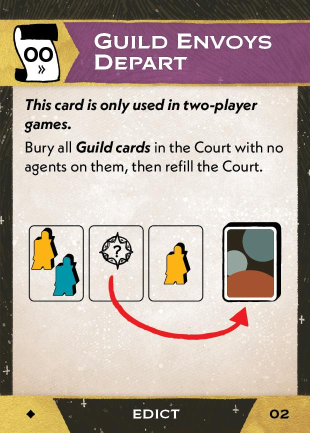{ width="150" }](other/piece_0_1.jpg){ data-lightbox="1" } 
[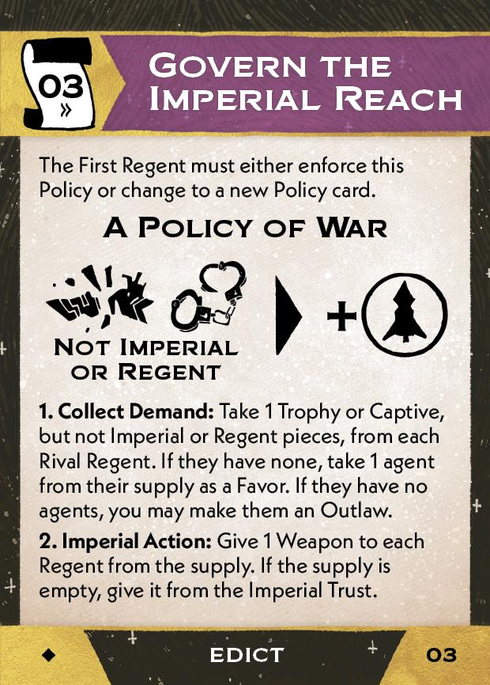{ width="150" }](other/piece_0_2.jpg){ data-lightbox="1" } 
[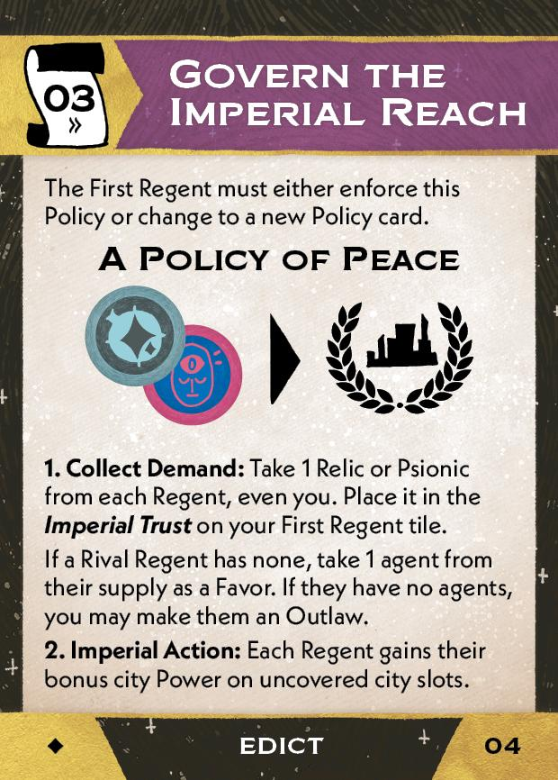{ width="150" }](other/piece_0_3.jpg){ data-lightbox="1" } 
[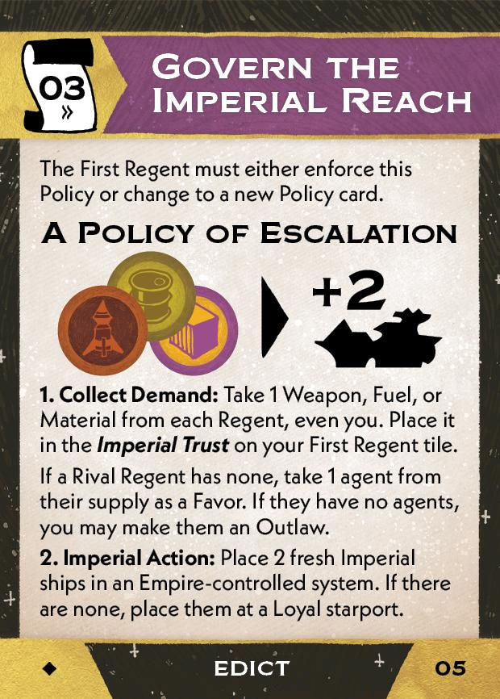{ width="150" }](other/piece_1_0.jpg){ data-lightbox="1" } 
[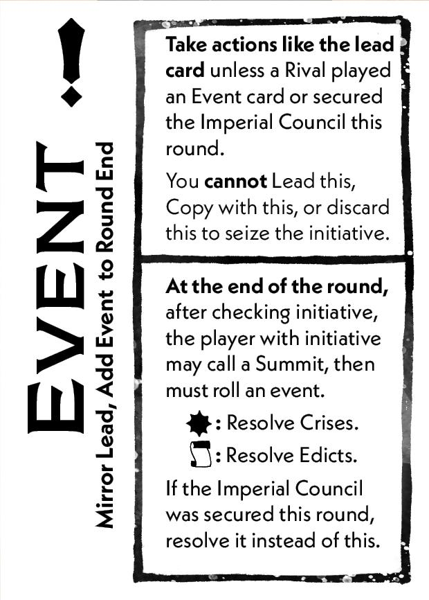{ width="150" }](other/piece_3_1.jpg){ data-lightbox="1" } 
##Double-sided cards
[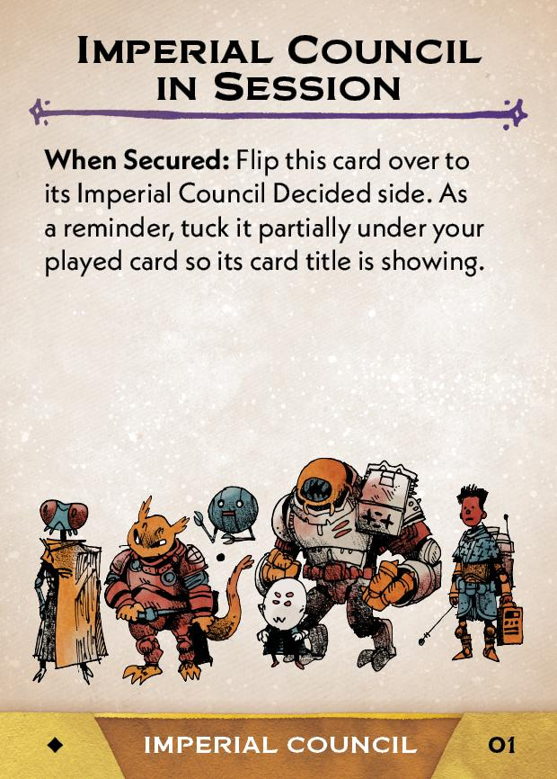{ width="150" }](other/piece_0_0.jpg){ data-lightbox="1" } 
[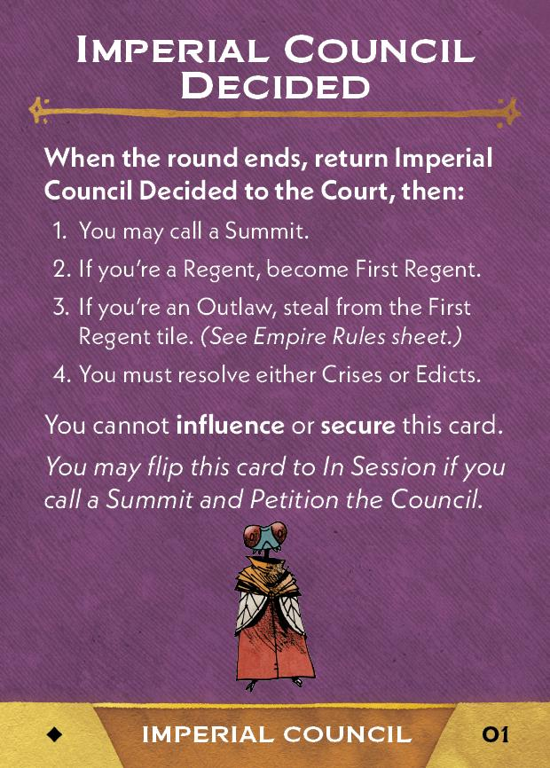{ width="150" }](other/back_0_0.jpg){ data-lightbox="1" } 
[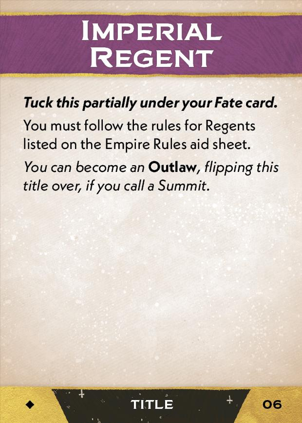{ width="150" }](other/piece_1_1.jpg){ data-lightbox="1" } 
[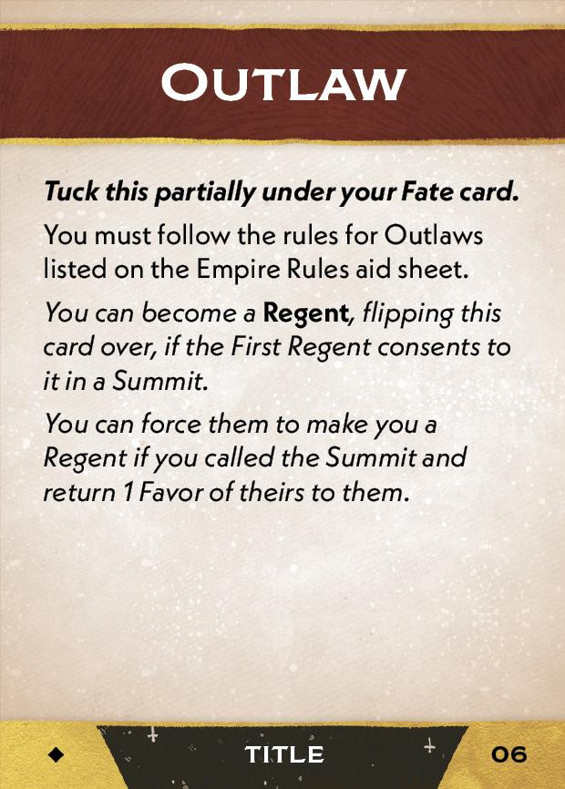{ width="150" }](other/back_1_1.jpg){ data-lightbox="1" } 
[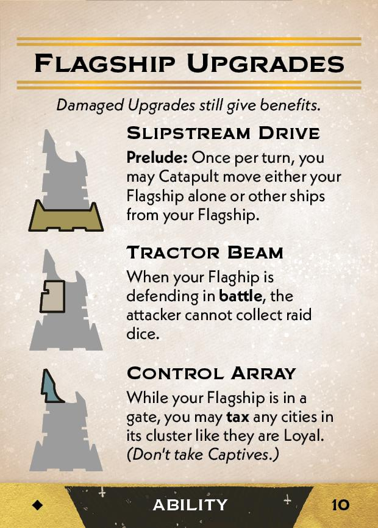{ width="150" }](other/piece_2_1.jpg){ data-lightbox="1" } 
[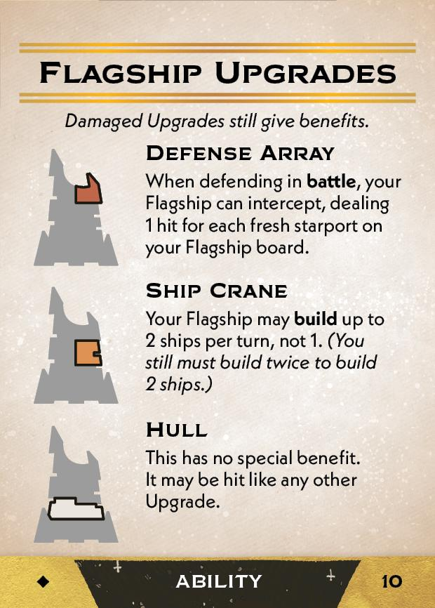{ width="150" }](other/back_2_1.jpg){ data-lightbox="1" } 
##Flagship
[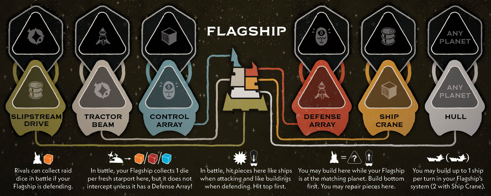{ width="300" }](other/Flagship.jpg){ data-lightbox="1" } 
[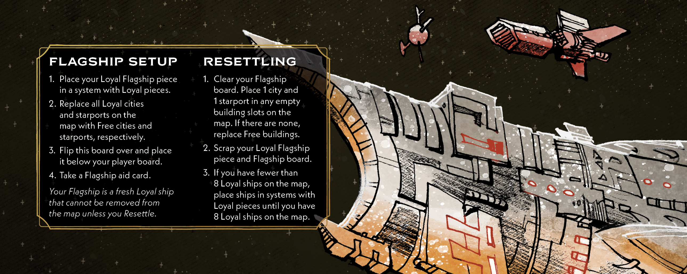{ width="300" }](other/Flagship-Back.jpg){ data-lightbox="1" } 
