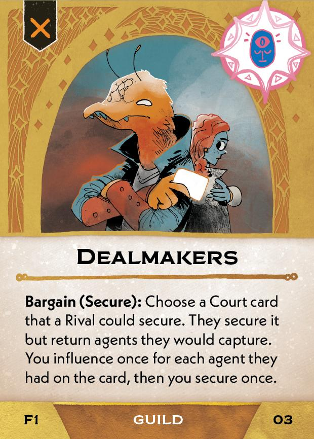

#Steward
## Overview
<figure markdown="span">
{ width="300" }
</figure>

## Act I

[{ width="33%"}](1/piece_3_4.jpg){ data-lightbox="1" }[{ width="33%" }](1/back_3_4.jpg){ data-lightbox="1" }[{ width="33%" }](1/piece_3_1.jpg){ data-lightbox="1" }

??? info "Setup details"
    1. Gain Imperial Authority (02) and Dealmakers (03)
    
        [{ width="150" }](1/piece_3_3.jpg){ data-lightbox="1" } [{ width="150" }](1/piece_3_2.jpg){ data-lightbox="1" }

    2. Gain the First Regent tile.

??? success "If successful"
    1. Add Council Intrigue (05), Tax Collectors (06), and Hunter Squads (07) to the Court deck.
      
        [{ width="150" }](1/piece_3_0.jpg){ data-lightbox="1" } [{ width="150" }](1/piece_2_6.jpg){ data-lightbox="1" } [{ width="150" }](1/piece_2_5.jpg){ data-lightbox="1" }

    2. Add Imperial Protectors (08) to the rules booklet. **Explain it to everyone.**

        [{ width="150" }](1/piece_2_4.jpg){ data-lightbox="1" }

    3. Scrap Empire Falls (09) and 2 Lesser Regents (10-11).

??? failure "If failed"
    1. Scrap Council Intrigue (09), Tax Collectors (06), Hunter Squards (07), and Imperial Protectors (08).
    
    2. Add Empire Falls (09) and 2 Lesser Regents (10-11) to the Court deck:
      
        [{ width="150" }](1/piece_2_3.jpg){ data-lightbox="1" } [{ width="150" }](1/piece_2_2.jpg){ data-lightbox="1" } [{ width="150" }](1/piece_2_1.jpg){ data-lightbox="1" }

    3. Add Dealmakers (03) to the Court deck.

## Act II

[{ width="33%" }](1/piece_2_0.jpg){ data-lightbox="1" }[{ width="33%" }](1/back_2_0.jpg){ data-lightbox="1" }[{ width="33%" }](1/piece_1_5.jpg){ data-lightbox="1" }

??? info "Setup details"
    1. Add Imperial Quorum (12) to the Edicts.
    
        [{ width="150" }](1/piece_1_6.jpg){ data-lightbox="1" }

??? success "If successful"
    1. Add Navy Reprisal (15), Council Insiders (16), and Galactic Bards (17) to the Court deck.
      
        [{ width="150" }](1/piece_1_4.jpg){ data-lightbox="1" } [{ width="150" }](1/piece_1_3.jpg){ data-lightbox="1" } [{ width="150" }](1/piece_1_2.jpg){ data-lightbox="1" }

    2. Scrap the 2 Imperial Defectors (18-19) and 2 Lesser Regents (20-22).

??? failure "If failed"
    1. Scrap Navy Reprisal (15), Council Insiders (16), and Galactic Bards (17)
    
    2. Add the 2 Imperial Defectors (18-19) and 2 Lesser Regents (20-22) to the Court deck:
      
        [{ width="150" }](1/piece_1_1.jpg){ data-lightbox="1" } [{ width="150" }](1/piece_1_0.jpg){ data-lightbox="1" } [{ width="150" }](1/piece_0_6.jpg){ data-lightbox="1" } [{ width="150" }](1/piece_0_5.jpg){ data-lightbox="1" }

## Act III

[{ width="33%" }](1/piece_0_4.jpg){ data-lightbox="1" }[{ width="33%" }](1/back_0_4.jpg){ data-lightbox="1" }

??? info "Setup details"

    1. Add Imperial Sponsor (23) to the rules booklet:
    
        [{ width="150" }](1/piece_0_3.jpg){ data-lightbox="1" }

    2. Place the Sponsored token on the First Regent tile.
    3. Scrap the 3 Govern the Imperial Reach cards from the rules booklet and add the 3 Govern with Authority (24-25) to it.

        [{ width="150" }](1/piece_0_2.jpg){ data-lightbox="1" } [{ width="150" }](1/piece_0_1.jpg){ data-lightbox="1" } [{ width="150" }](1/piece_0_0.jpg){ data-lightbox="1" }

    4. The First Regent chooses which Govern with Authority card to place on top of the stack. **Explain that Outlaws are now subject to the Imperial Demand if the Empire controls a city or Flagship of theirs.**

## FAQ / Errata

??? question "Council Intrigue - How are the Crisis and When Secured effects resolved if Imperial Council is not in the Court, due to being claimed earlier?"
    Imperial Council cannot be flipped or influenced while not in the court, so the Agent on Council Intrigue must be sent elsewhere (or in the case of Crisis, returned to their owners).

??? question "Empire Falls - What happens to the Imperial Trust, and is the First Regent penalized?"
    The Imperial Trust should be emptied and the First Regent should suffer power loss that would normally occur if they left the Empire as the last Imperial player.

??? question "Act III Objective - Can the first grand ambition be scored if Outlaw players exist but have no cities?"
    Yes. If there are no Outlaw cities, the Empire is considered to control all of them. A clearer phrasing would be "the Empire controls all Outlaw cities or there are no *Outlaw cities*."

??? question "Act III Objective - Do cities on flagships or other play areas, banners, or bunkers count for this objective?"
    No, this effect should only count buildings on the board. Specifically, it counts only Cities and Starports.

??? question "Imperial Sponsor - Can a resource be added to the Imperial Trust if the Sponsored token was not moved?"
    Yes. Since the first part of the effect gives you permission to leave the token where it is, it is considered to have resolved successfully, so the second part of the effect still triggers.

??? question "Govern with Authority (Policy of War) - How is the Imperial Action resolved in scenarios where the resources are limited?"
    Resolve the full effect for each Regent one at a time. This means that one Regent may get 2 resources while another Regent gets none.

    You can (and must) give a resource from the Trust when the Weapon or the chosen second resource is not present in the supply. It is not required that the supply be empty of *all* resources.

    When choosing the second resource, you cannot choose a resource that is absent from both the supply and the Trust.

??? question "Navy Reprisal - This card is missing, and there is an Event card in its place."
    This is an unfortunate manufacturing error that affects all physical copies of the game. The card back is correct, but the front shows an Event instead of the Navy Reprisal card.

    You may simply exclude this card from the deck, or you may print a proxy version of Navy Reprisal. Since the card back is correct, you may wish to mark the front of it in some way so that you can shuffle it into the deck, and simply replace it with the printed proxy when it is revealed.