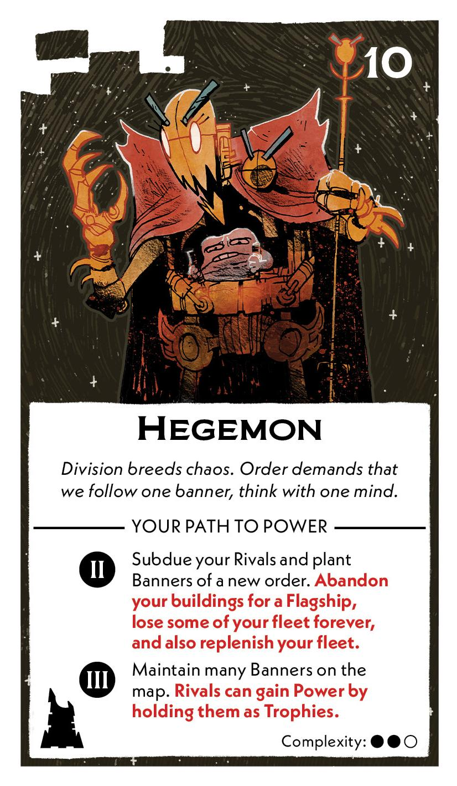
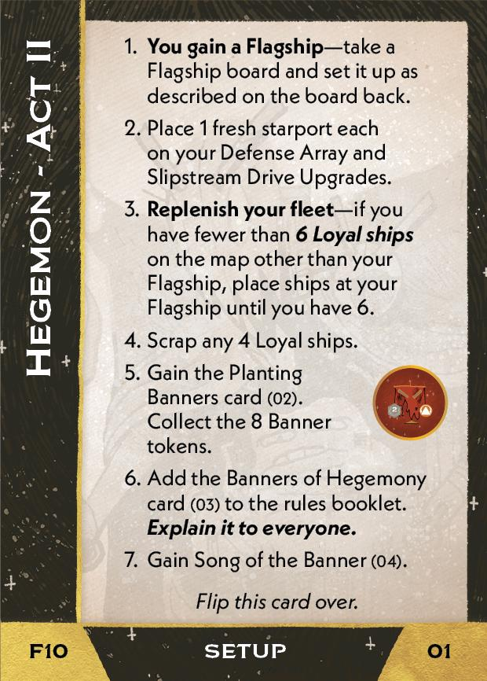
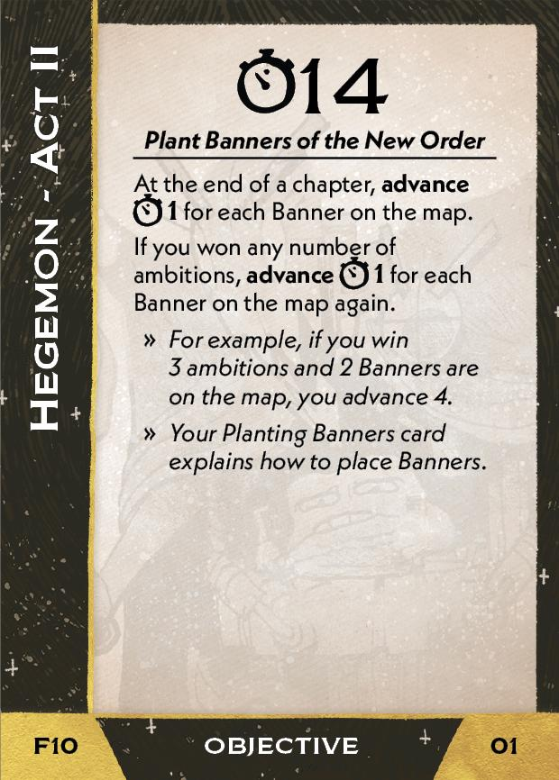
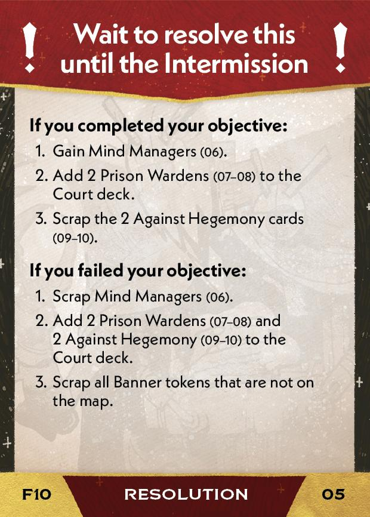
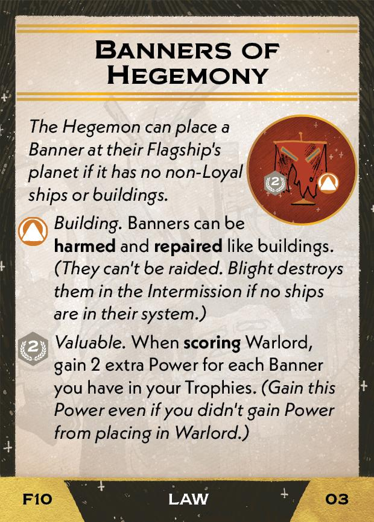
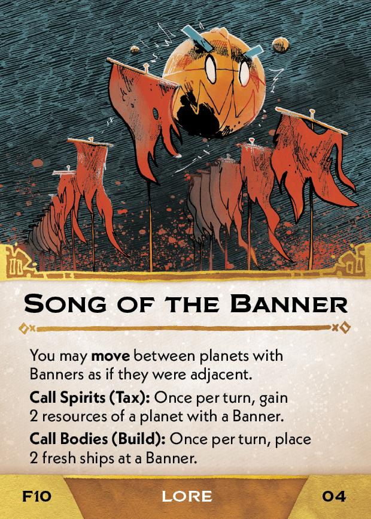
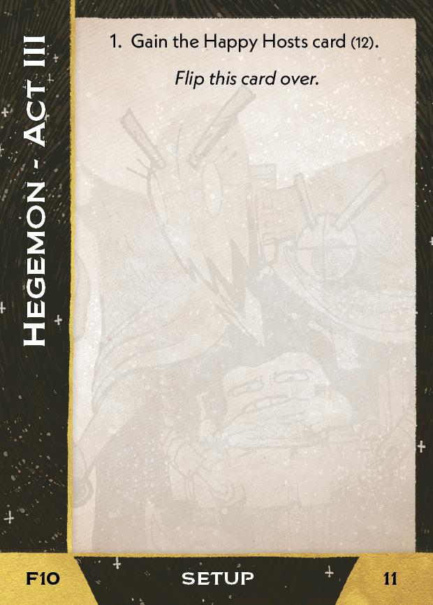
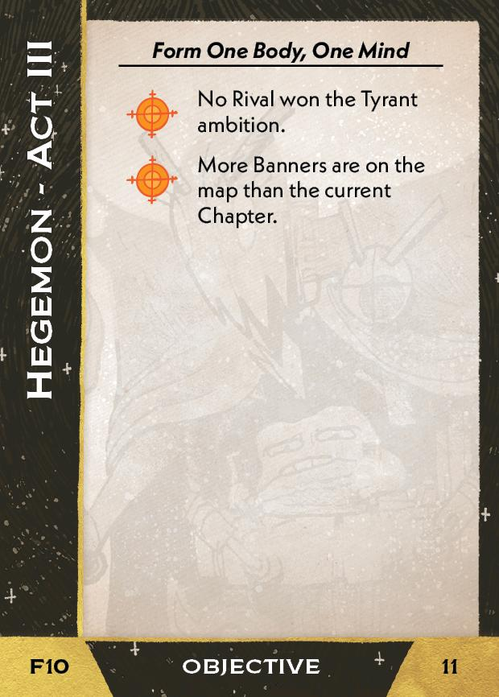

#Hegemon
## Overview
<figure markdown="span">
{ width="300" }
</figure>

## Act II

[{ width="33%" }](10/piece_1_4.jpg){ data-lightbox="1" }[{ width="33%" }](10/back_1_4.jpg){ data-lightbox="1" }[{ width="33%px" }](10/piece_1_0.jpg){ data-lightbox="1" }

??? info "Setup details"
    1. **You gain a Flagship** --take a Flagship board and set it up as describe on the board back.
    
    2. Place 1 fresh starport each on your Defense Array and Slipstrem Drive Upgrades.
    
    3. **Replenish your fleet**-if you have fewer than **6 Loyal ships** on the map other than your Flagship, place ships at your Flagship until you have 6.
    
    4. Scrap any 4 Loyal ships.
    
    5. Gain the Planting Banners (02). Collect the 8 Banner tokens.
    
        [{ width="150" }](10/piece_1_3.jpg){ data-lightbox="1" }
    
    6. Add the Banners of Hegemony card (03) to the rules booklet. **Explain it to everyone.**
    
        [{ width="150" }](10/piece_1_2.jpg){ data-lightbox="1" }
    
    7. Gain Song of the Banner (04).

        [{ width="150" }](10/piece_1_1.jpg){ data-lightbox="1" }

??? success "If successful"
    1. Gain Mind Managers (06).
    
        [{ width="150" }](10/piece_0_6.jpg){ data-lightbox="1" }
    
    2. Add 2 Prison Wardens (07-08) to the Court deck.
    
        [{ width="150" }](10/piece_0_5.jpg){ data-lightbox="1" } [{ width="150" }](10/piece_0_4.jpg){ data-lightbox="1" }
    
    3. Scrap the 2 Against the Hegemony cards (09-10).

??? failure "If failed"
    1. Scrap Mind Managers (06).
    
    2. Add 2 Prison Wardens (07-08) and 2 Against Hegemony (09-10) to the Court deck.
    
        [{ width="150" }](10/piece_0_5.jpg){ data-lightbox="1" } [{ width="150" }](10/piece_0_4.jpg){ data-lightbox="1" } [{ width="150" }](10/piece_0_3.jpg){ data-lightbox="1" } [{ width="150" }](10/piece_0_2.jpg){ data-lightbox="1" }
    
    3. Scrap all Banner tokens that are not on the map.

## Act III

[{ width="33%" }](10/piece_0_1.jpg){ data-lightbox="1" }[{ width="33%" }](10/back_0_1.jpg){ data-lightbox="1" }

??? info "Setup details"
    1. Gain the Happy Hosts card (12).

        [{ width="150" }](10/piece_0_0.jpg){ data-lightbox="1" }

## FAQ / Errata

??? question "Planting Banners - Does a Survivalist Bunker count as a Rival building for resolving this effect?"
    No. You can plant a banner even if a rival Bunker is on the planet, as it only counts as a building for effects which Harm.