#Pirate
## Overview
<figure markdown="span">
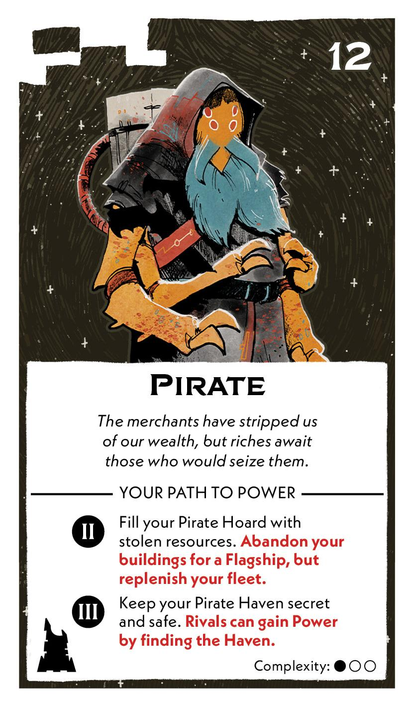{ width="300" }
</figure>

## Act II

[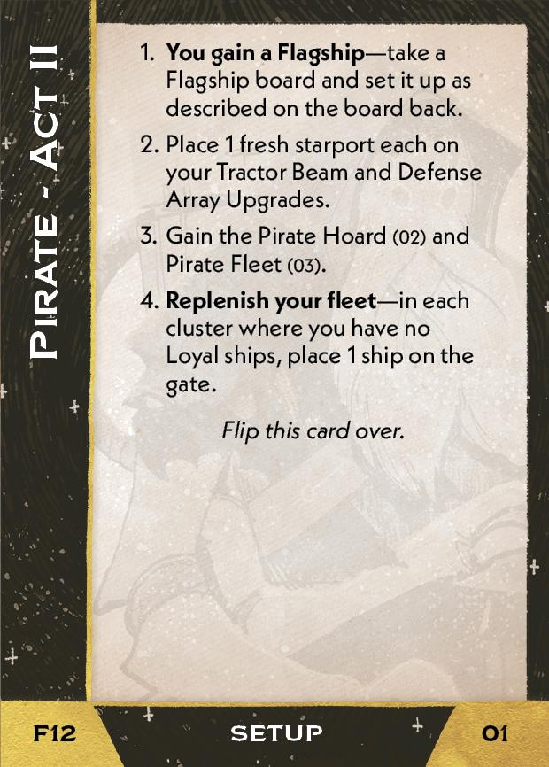{ width="33%" }](12/piece_1_4.jpg){ data-lightbox="1" }[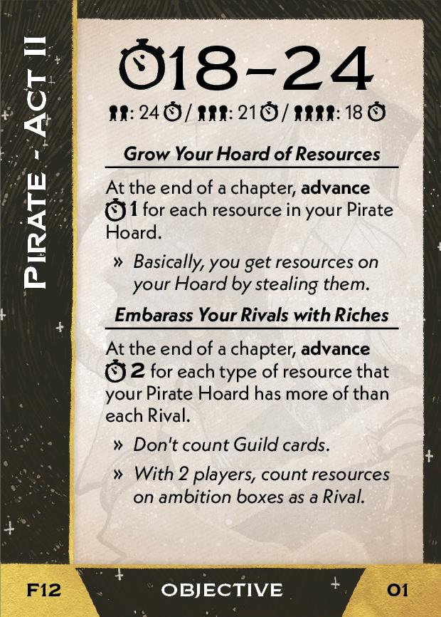{ width="33%" }](12/back_1_4.jpg){ data-lightbox="1" }[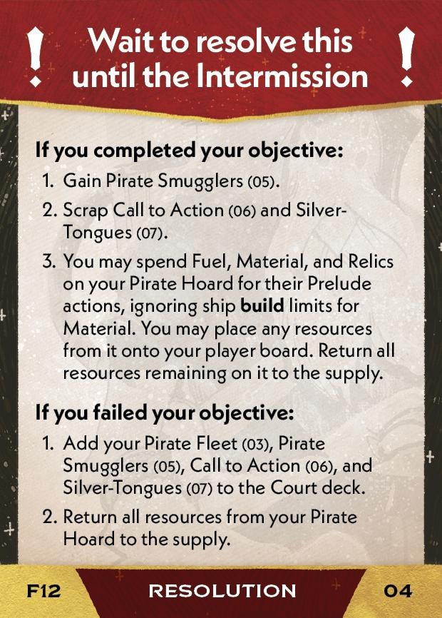{ width="33%px" }](12/piece_1_1.jpg){ data-lightbox="1" }

??? info "Setup details"
    1. **You gain a Flagship** --take a Flagship board and set it up as describe on the board back.
   
    2. Place 1 fresh starport each on your Tractor Beam and Defense Array Upgrades.
   
    3. Gain the Pirate Hoard (02) and Pirate Fleet (03).

        [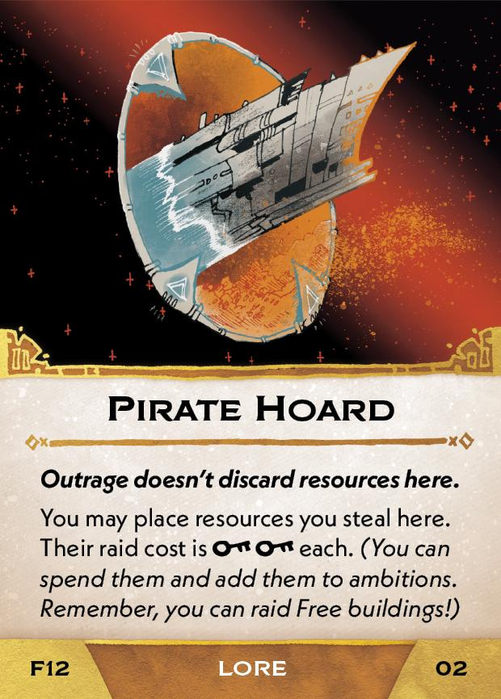{ width="150" }](12/piece_1_3.jpg){ data-lightbox="1" } [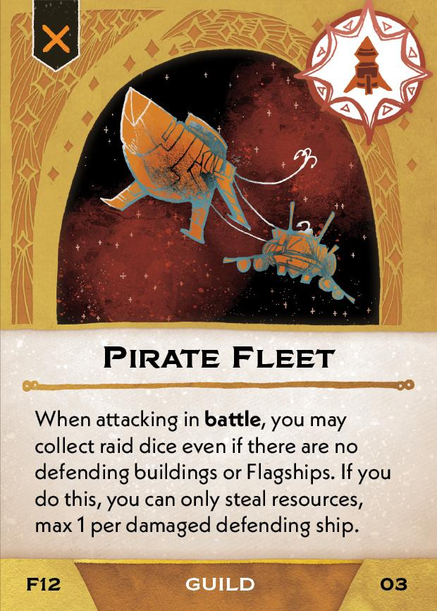{ width="150" }](12/piece_1_2.jpg){ data-lightbox="1" }

    4. **Replenish your fleet** - if you have fewer than **8 Loyal ships** on the map, place 1 ship each in any systems until you have 8 Loyal ships on the map.

??? success "If successful"
    1. Gain Pirate Smugglers (05).
    
        [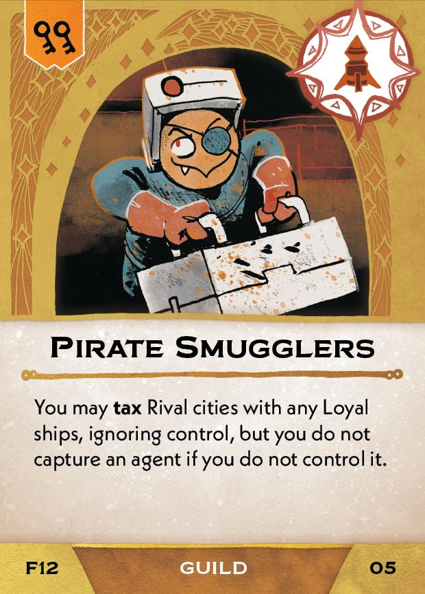{ width="150" }](12/piece_1_0.jpg){ data-lightbox="1" }
    
    2. Scrap Call to Action (06) and Silver-Tongues (07).
    
    3. You may spend Fuel, Material, and Relics on your Pirate Hoard for their Prelude actions, ignoring ship **build** limits for Material. You may place any resources from it onto your player board. Return all resources remaining on it to the supply.

??? failure "If failed"
    1. Add your Pirate Fleet (03), Pirate Smugglers (05), Call to Action (06), and Silver-Tongues (07) to the Court deck.
     
        [{ width="150" }](12/piece_1_0.jpg){ data-lightbox="1" } [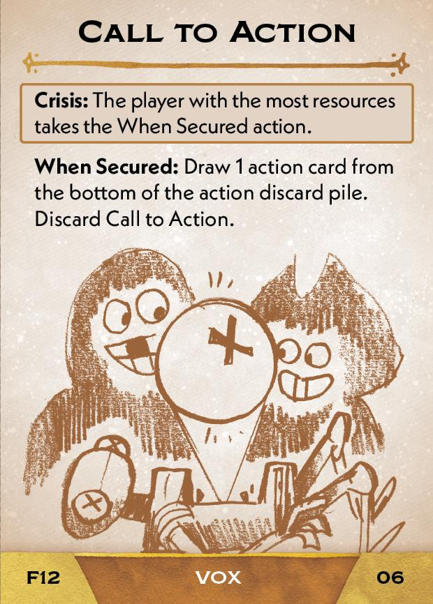{ width="150" }](12/piece_0_6.jpg){ data-lightbox="1" } [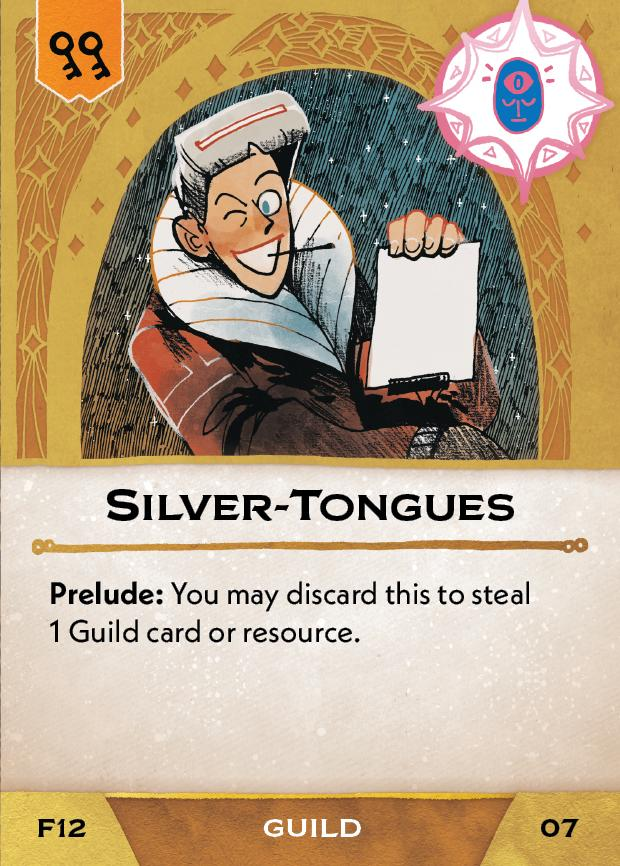{ width="150" }](12/piece_0_5.jpg){ data-lightbox="1" }
    
    2. Return all resources from your Pirate Hoard to the supply.

## Act III

[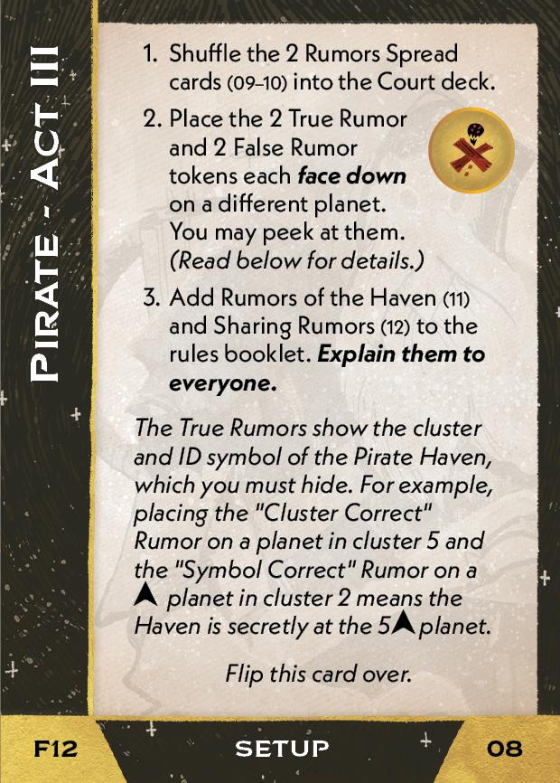{ width="33%" }](12/piece_0_4.jpg){ data-lightbox="1" }[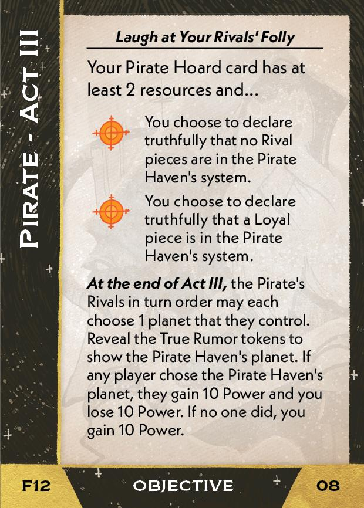{ width="33%" }](12/back_0_4.jpg){ data-lightbox="1" }

??? info "Setup details"
    1. Shuffle the 2 Rumors Spread cards (09-10) into the Court deck.
    
        [{ width="150" }](12/piece_0_3.jpg){ data-lightbox="1" } [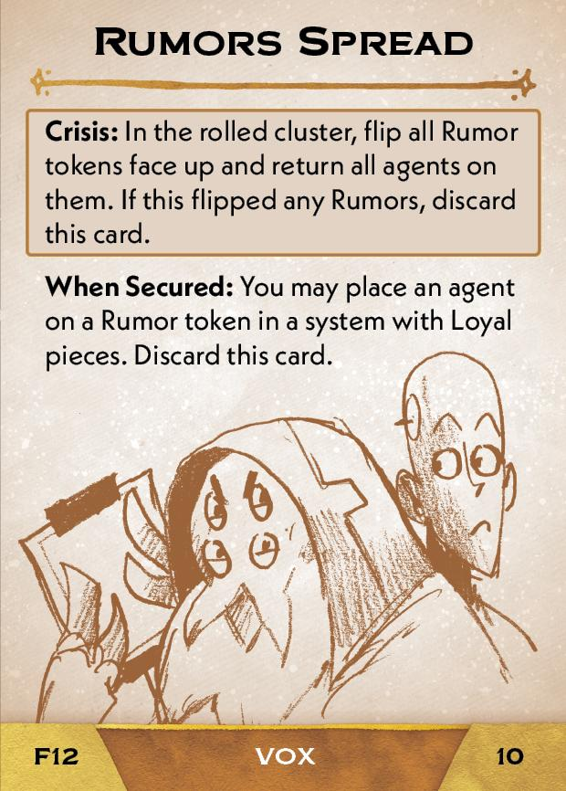{ width="150" }](12/piece_0_2.jpg){ data-lightbox="1" }
    
    2. Place the 2 True Rumor and 2 False Rumor tokens each **face down** on a different planet. You may peek at them. *(Read below for details.)*
    
    3. Add Rumors of the Haven (11) and Sharing Rumors<a href="#faq1">[1]</a> (12) to the rules booklet. **Explain them to everyone.**

        [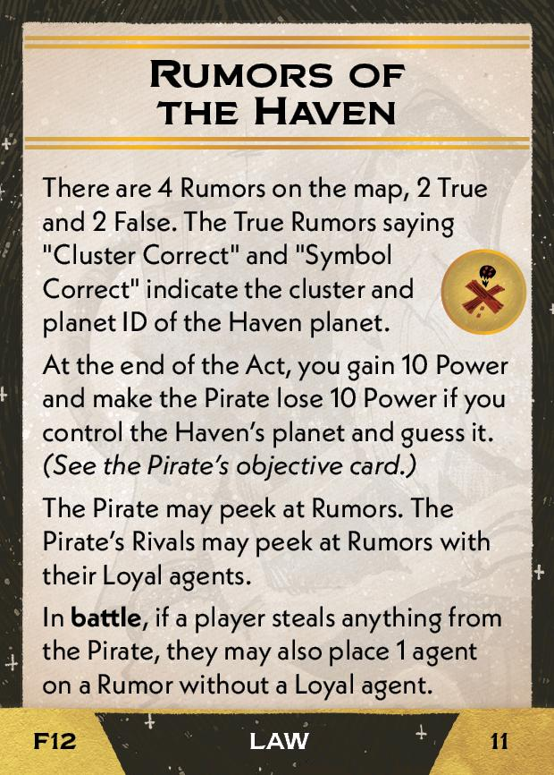{ width="150" }](12/piece_0_1.jpg){ data-lightbox="1" } [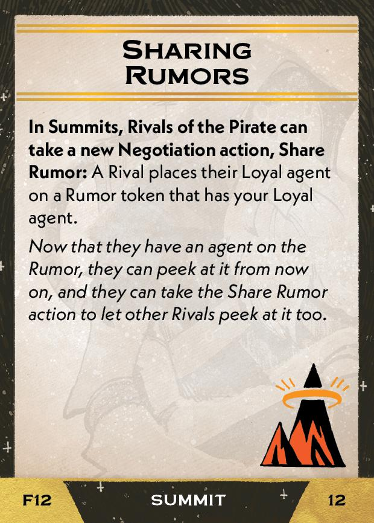{ width="150" }](12/piece_0_0.jpg){ data-lightbox="1" }

    *The True Rumors show the cluster and ID symbol of the Pirate Haven, which you must hide. For example, placing the "Cluster Correct" Rumor on a planet in cluster 5 and the "Symbol Correct" Rumor on a triangle planet in cluster 2 means the Haven is secret at the 5-triangle planet.*

## FAQ / Errata

??? question "[1]Sharing Rumors - Does the Agent placed by this card count as a Loyal piece?"
    Yes. This means the Agent's presence enables its owner to build, and it also means the Pirate cannot declare that there are no Rival pieces in the system.