#Blight Speaker
## Overview
<figure markdown="span">
{ width="300" }
</figure>

## Act II

[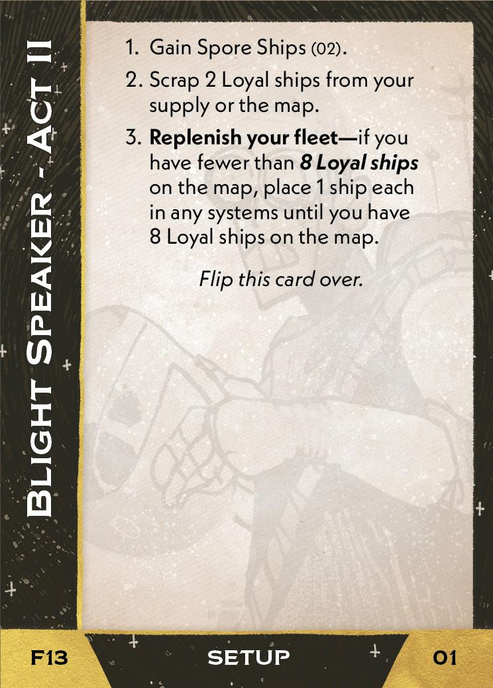{ width="33%" }](13/piece_1_5.jpg){ data-lightbox="1" }[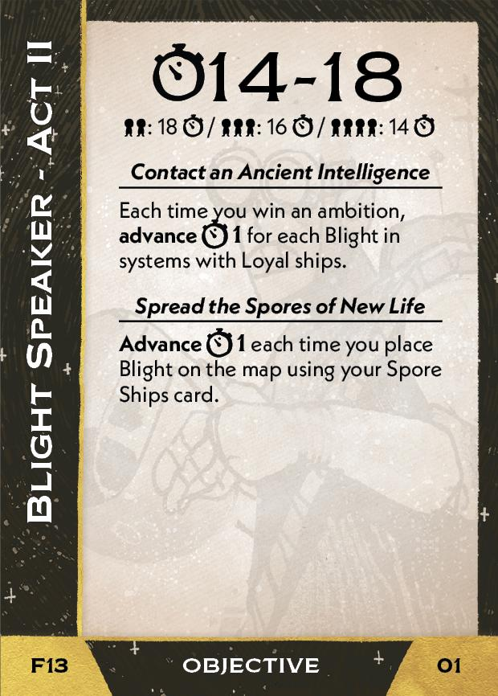{ width="33%" }](13/back_1_5.jpg){ data-lightbox="1" }[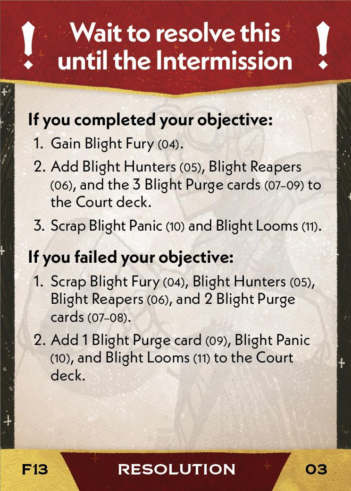{ width="33%px" }](13/piece_1_3.jpg){ data-lightbox="1" }

??? info "Setup details"
    1. Gain Spore Ships (02).
    
        [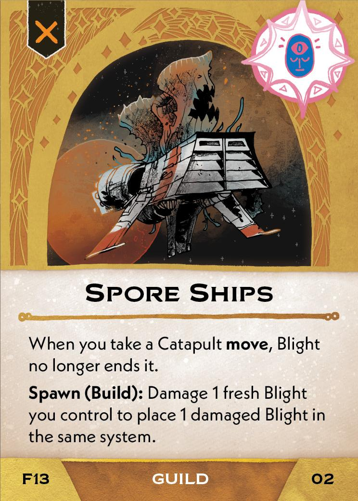{ width="150" }](13/piece_1_4.jpg){ data-lightbox="1" }
    
    2. Scrap 2 Loyal ships from your supply or the map.
    
    3. **Replenish your fleet** - if you have fewer than **8 Loyal ships** on the map, place 1 ship each in any systems until you have 8 Loyal ships on the map.

??? success "If successful"
    1. Gain Blight Fury (04).
    
        [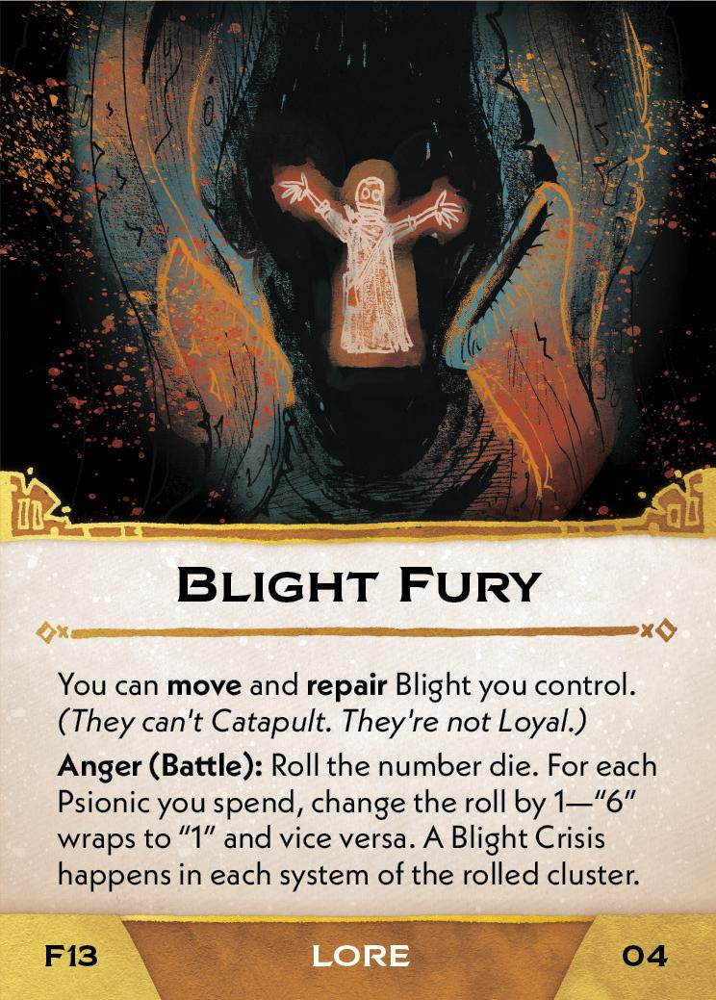{ width="150" }](13/piece_1_2.jpg){ data-lightbox="1" }
    
    2. Add Blight Hunters (05), Blight Reapers (06), and the 3 Blight Purge cards (07-09) to the Court deck.
    
        [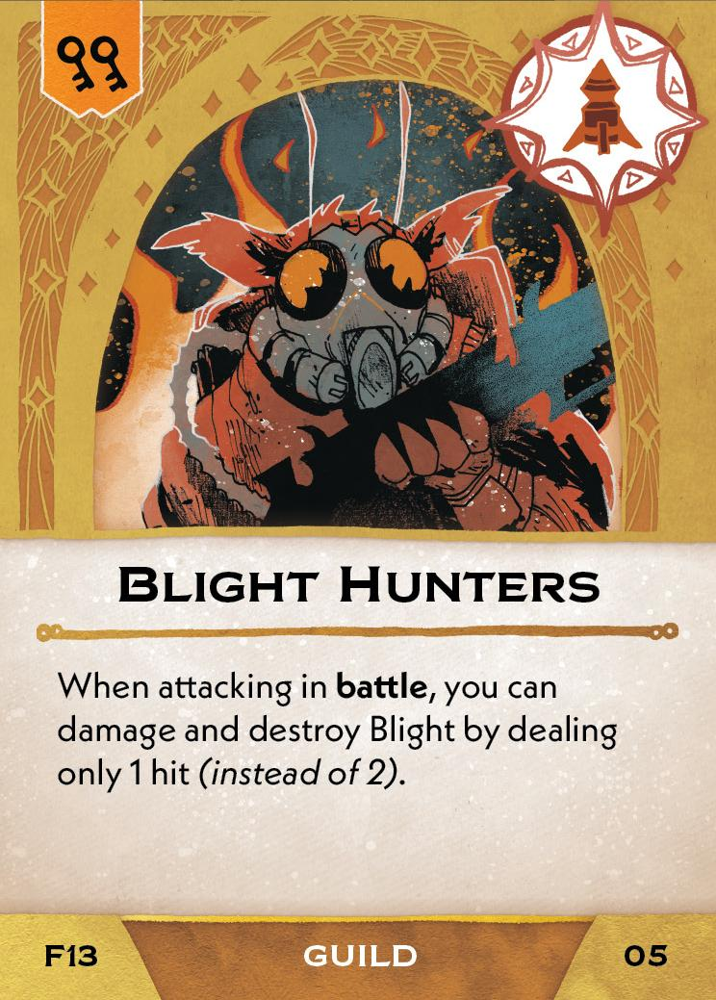{ width="150" }](13/piece_1_1.jpg){ data-lightbox="1" } [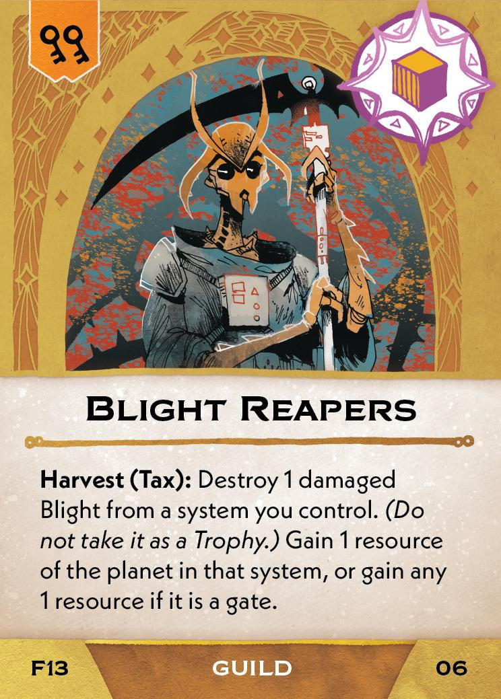{ width="150" }](13/piece_1_0.jpg){ data-lightbox="1" } [{ width="150" }](13/piece_0_6.jpg){ data-lightbox="1" } [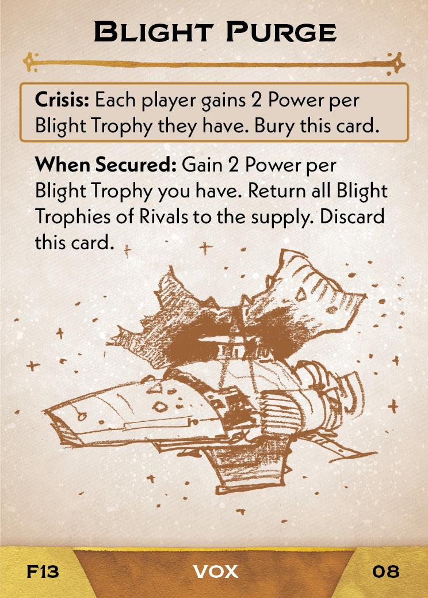{ width="150" }](13/piece_0_5.jpg){ data-lightbox="1" } [{ width="150" }](13/piece_0_4.jpg){ data-lightbox="1" }
    
    3. Scrap Blight Panic (10) and Blight Looms (11).

??? failure "If failed"
    1. Scrap Blight Fury (04), Blight Hunters (05), Blight Reapers (06), and 2 Blight Purge (07-08) cards.
    
    2. Add 1 Blight Purge card (09), Blight Panic (10), and Blight Looms (11) to the Court deck.

        [{ width="150" }](13/piece_0_43.jpg){ data-lightbox="1" } [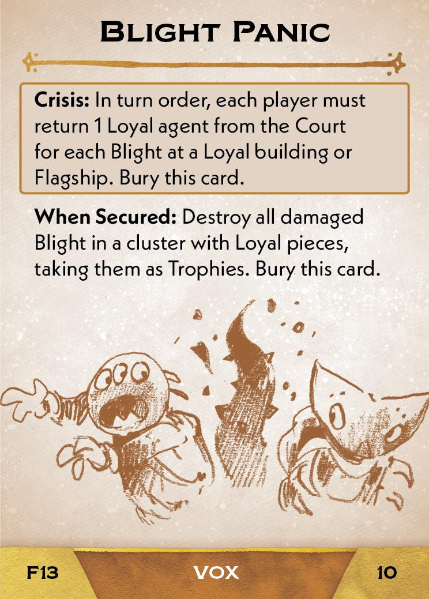{ width="150" }](13/piece_0_3.jpg){ data-lightbox="1" } [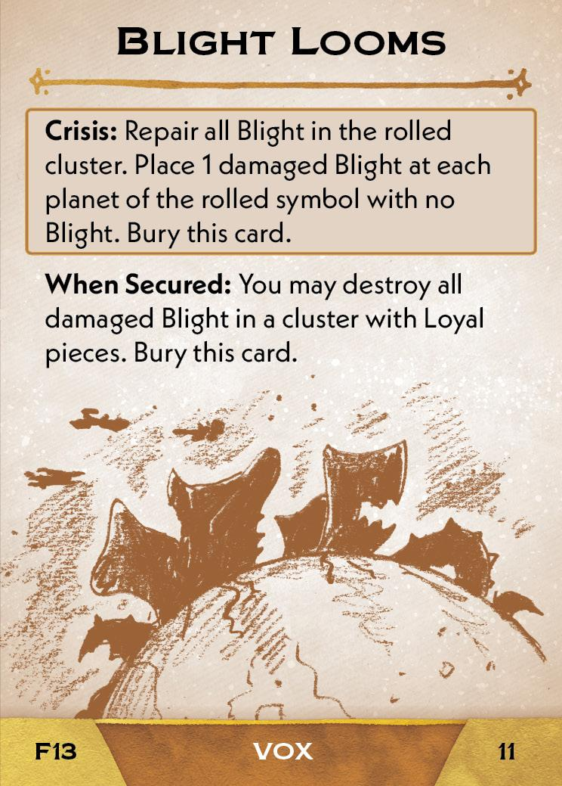{ width="150" }](13/piece_0_2.jpg){ data-lightbox="1" }

## Act III

[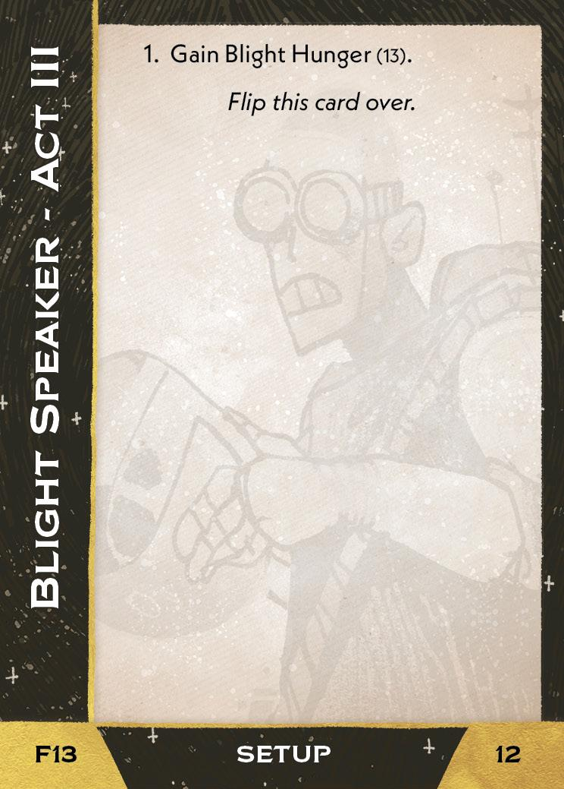{ width="33%" }](13/piece_0_1.jpg){ data-lightbox="1" }[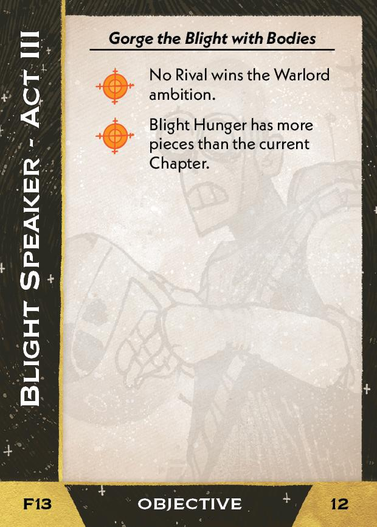{ width="33%" }](13/back_0_1.jpg){ data-lightbox="1" }

??? info "Setup details"
    1. Gain Blight Hunger (13).

        [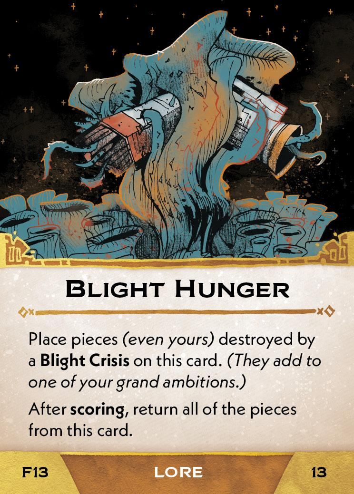{ width="150" }](13/piece_0_0.jpg){ data-lightbox="1" }