#Pacifist
## Overview
<figure markdown="span">
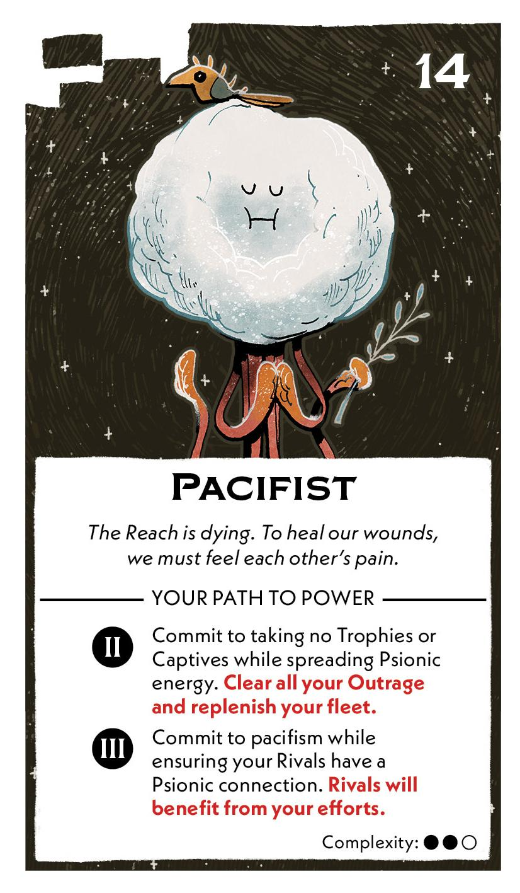{ width="300" }
</figure>

## Act II

[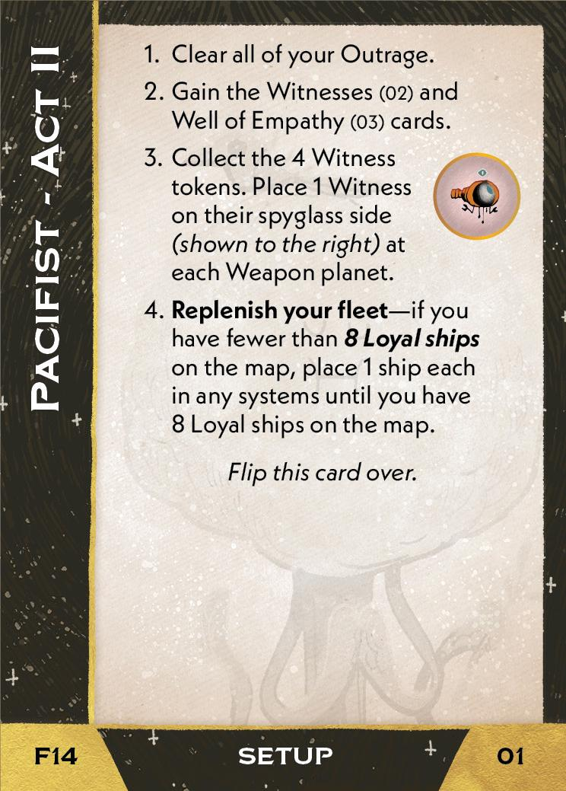{ width="33%" }](14/piece_1_4.jpg){ data-lightbox="1" }[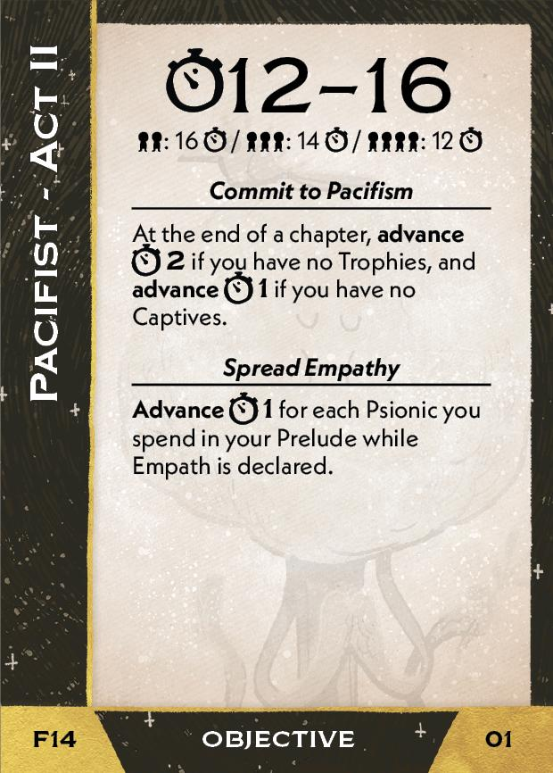{ width="33%" }](14/back_1_4.jpg){ data-lightbox="1" }[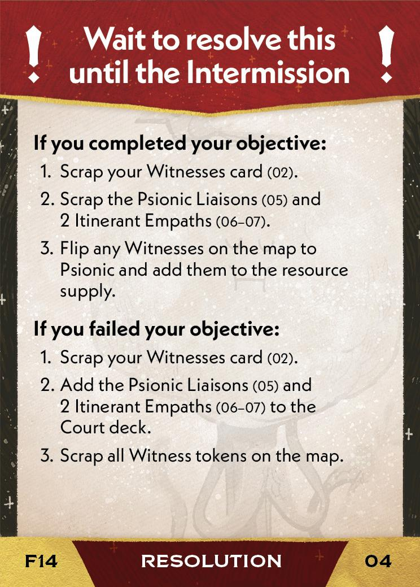{ width="33%px" }](14/piece_1_1.jpg){ data-lightbox="1" }

??? info "Setup details"
    1. Clear all of your Outrage.
    
    2. Gain the Witnesses (02) and Well of Empathy (03) cards.
    
        [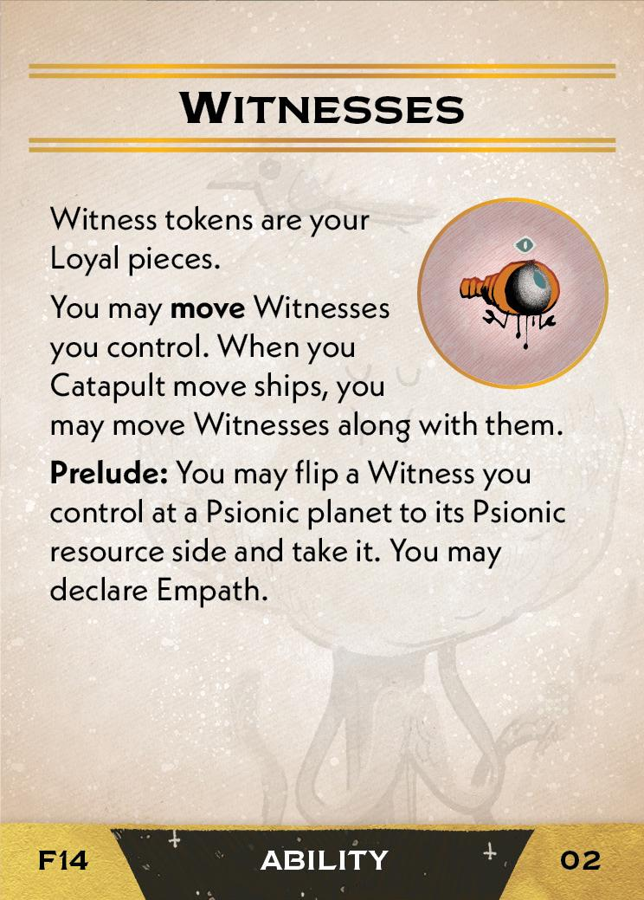{ width="33%" }](14/piece_1_3.jpg){ data-lightbox="1" } [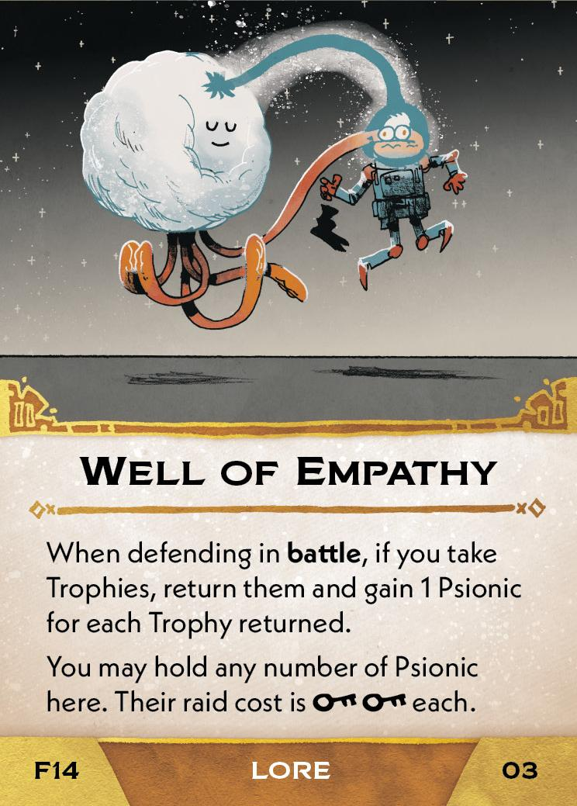{ width="33%" }](14/piece_1_2.jpg){ data-lightbox="1" }
    
    3. Collect the 4 Witness tokens. Place 1 Witness on their spyglass side at each Weapon planet.
    
    4. **Replenish your fleet** - if you have fewer than **8 Loyal ships** on the map, place 1 ship each in any systems until you have 8 Loyal ships on the map.

??? success "If successful"
    1. Scrap your Witnesses card (02).
    
    2. Scrap the Psionic Liaisons (05) and 2 Itenerant Empaths (06-07).
    
    3. Flip any Witnesses on the map to Psionic and add them to the resource supply.

??? failure "If failed"
    1. Scrap your Witnesses card (02).
    
    2. Add the Psionic Liaisons (05) and 2 Itenerant Empaths (06-07) to the Court deck.
    
        [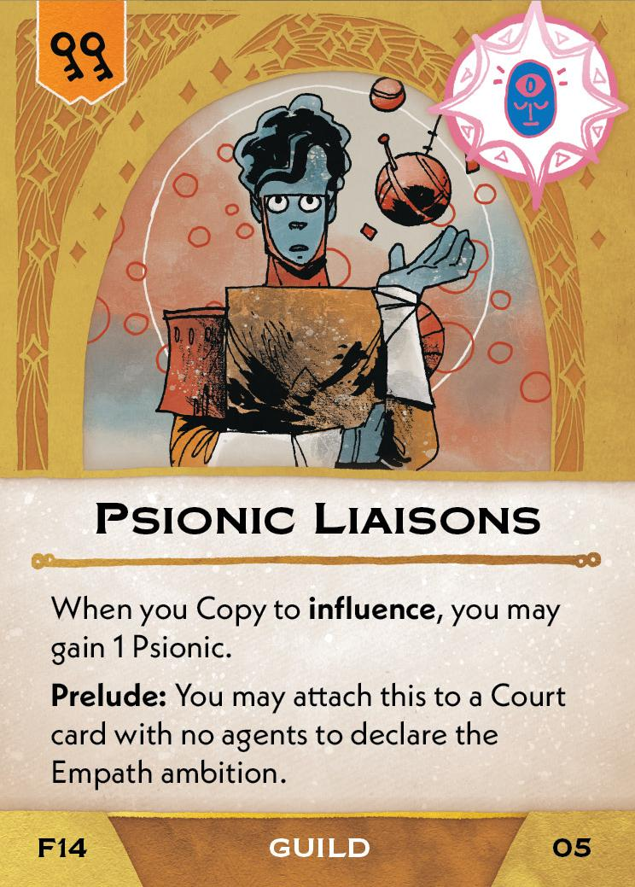{ width="33%" }](14/piece_1_0.jpg){ data-lightbox="1" } [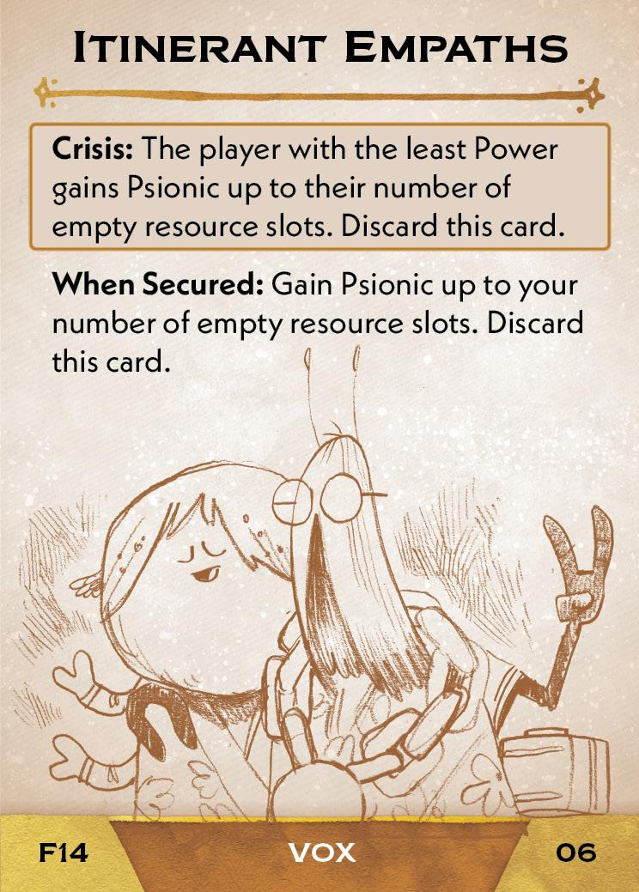{ width="33%" }](14/piece_0_6.jpg){ data-lightbox="1" } [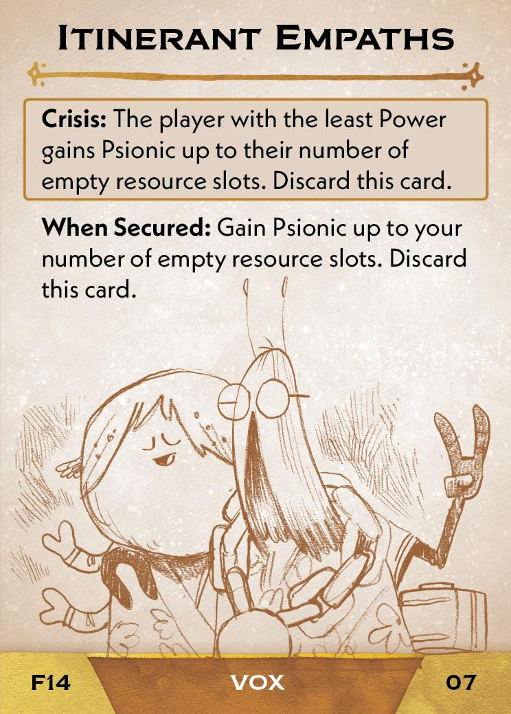{ width="33%" }](14/piece_0_5.jpg){ data-lightbox="1" }
    
    3. Scrap all Witness tokens on the map.

## Act III

[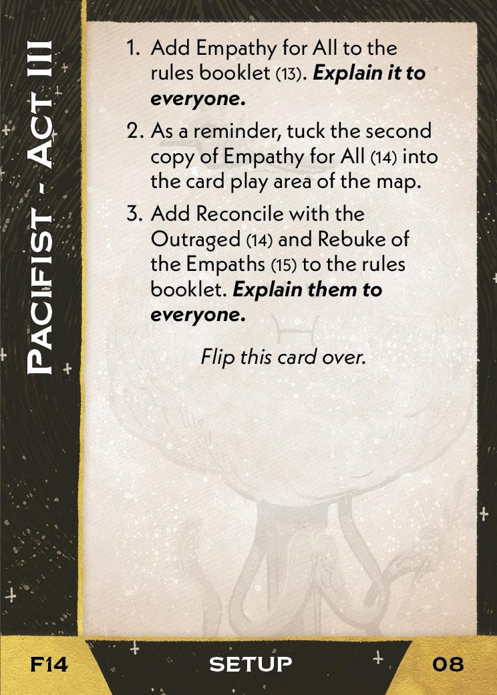{ width="33%" }](14/piece_0_4.jpg){ data-lightbox="1" }[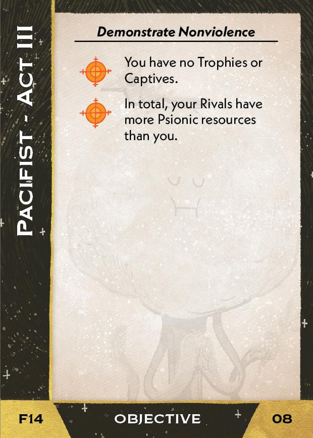{ width="33%" }](14/back_0_4.jpg){ data-lightbox="1" }

??? info "Setup details"
    1. Add Empathy for All to the rules booklet (13). **Explain it to everyone.**
    
        [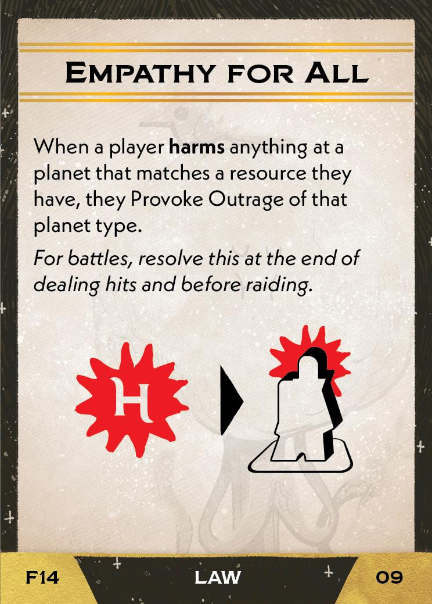{ width="33%" }](14/piece_0_3.jpg){ data-lightbox="1" }
    
    2. As a reminder, tuck the second copy of Empathy for All (14) into the card play area of the map.
    
        [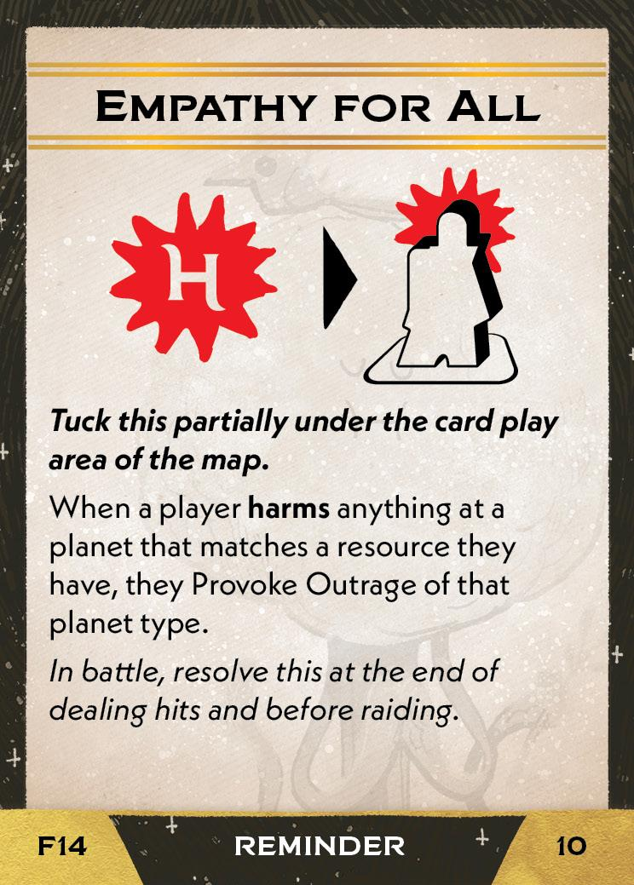{ width="33%" }](14/piece_0_2.jpg){ data-lightbox="1" }

    3. Add Reconcile with the Outraged (14) and Rebuke of the Empaths (15) to the rules booklet. **Explain them to everyone.**

        [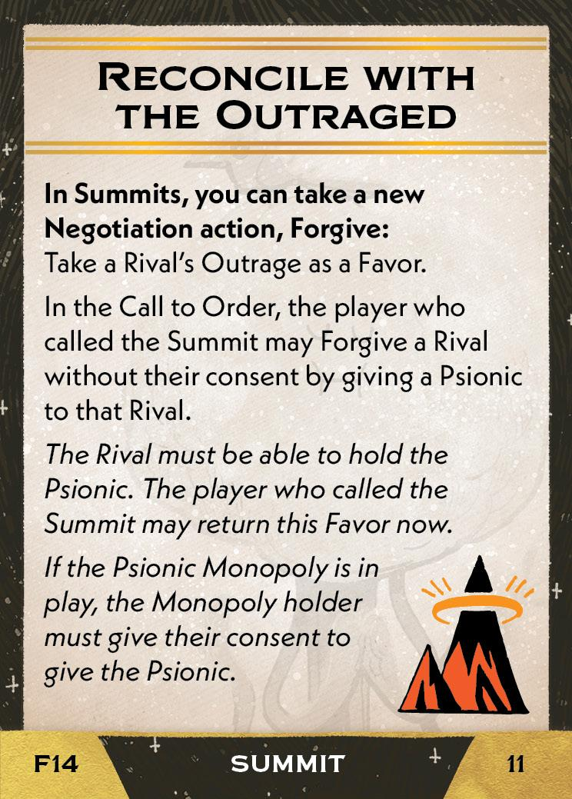{ width="33%" }](14/piece_0_1.jpg){ data-lightbox="1" } [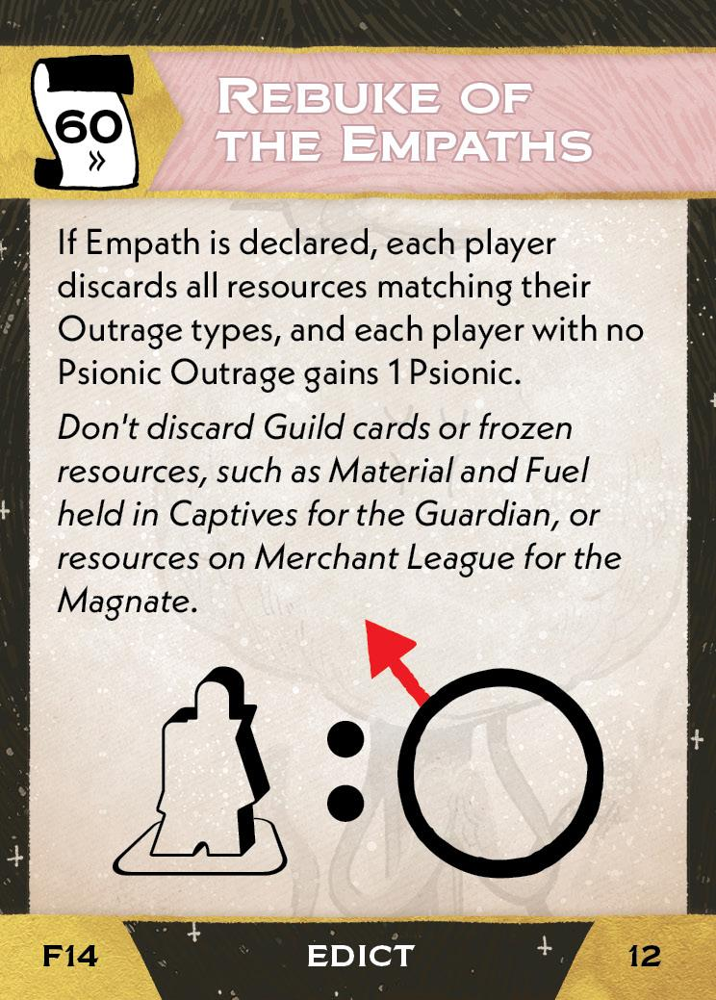{ width="33%" }](14/piece_0_0.jpg){ data-lightbox="1" }