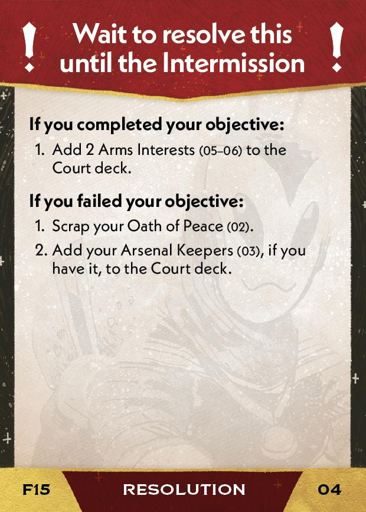

#Peacekeeper
## Overview
<figure markdown="span">
{ width="300" }
</figure>

## Act II

[{ width="33%" }](15/piece_1_3.jpg){ data-lightbox="1" }[{ width="33%" }](15/back_1_3.jpg){ data-lightbox="1" }[{ width="33%px" }](15/piece_1_0.jpg){ data-lightbox="1" }

??? info "Setup details"
    1. With 2 players, return all Weapons from the Warlord ambition box to the supply.
    
    2. Clear all your Outrage.
    
    3. Provoke Outrage with Weapons. *(Discard all Weapons and Weapon Guild cards.)*
    
    4. Gain Oath of Peace (02) and Arsenal Keepers (03).
    
        [{ width="150" }](15/piece_1_2.jpg){ data-lightbox="1" } [{ width="150" }](15/piece_1_1.jpg){ data-lightbox="1" }
    
    5. **Replenish your fleet** - if you have fewer than **8 Loyal ships** on the map, place 1 ship each in any systems until you have 8 Loyal ships on the map.

??? success "If successful"
    1. Add 2 Arms Interests (05-06) to the Court deck.

        [{ width="150" }](15/piece_0_6.jpg){ data-lightbox="1" } [{ width="150" }](15/piece_0_5.jpg){ data-lightbox="1" }

??? failure "If failed"
    1. Scrap your Oath of Peace (02).
    2. Add your Arsenal Keepers (03), if you have it, to the Court deck.

## Act III

[{ width="33%" }](15/piece_0_4.jpg){ data-lightbox="1" }[{ width="33%" }](15/back_0_4.jpg){ data-lightbox="1" }

??? info "Setup details"
    1. Place 1 Ceasefire token near each cluster - we recommend in its gate. Place it on its Peace side if you control any systems in that cluster, or on its War side if not. *(If you're the First Regent, you control Empire-controlled systems.)*
    
    2. With 2 players, return all Weapons from the Warlord ambition box.
    
    3. Add Ceasefires (08), Empire Balks at Peace (09), Peace Dividends (10), and Peace Accords (11) to the rules booklet. **Explain them to everyone.**

        [{ width="150" }](15/piece_0_3.jpg){ data-lightbox="1" } [{ width="150" }](15/piece_0_2.jpg){ data-lightbox="1" } [{ width="150" }](15/piece_0_1.jpg){ data-lightbox="1" } [{ width="150" }](15/piece_0_0.jpg){ data-lightbox="1" }