#Warden
## Overview
<figure markdown="span">
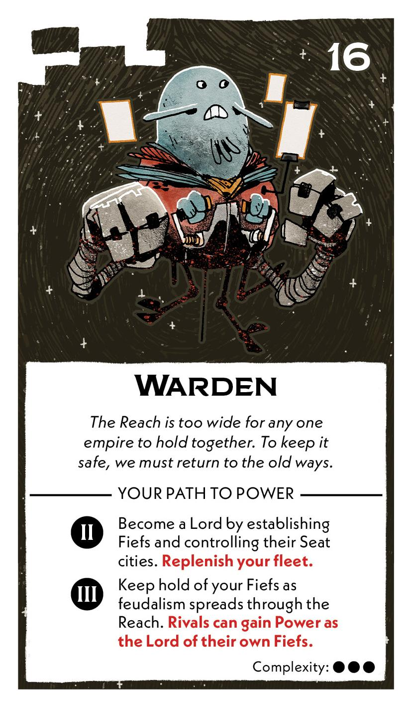{ width="300" }
</figure>

## Act II

[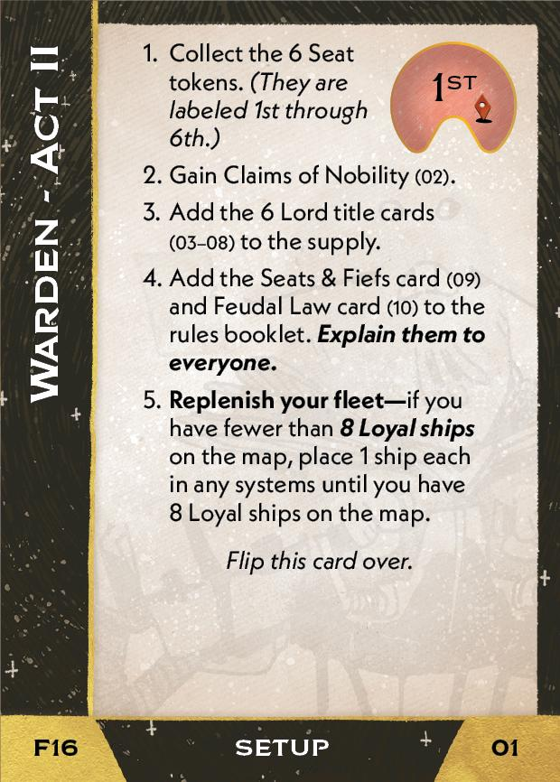{ width="33%" }](16/piece_2_4.jpg){ data-lightbox="1" }[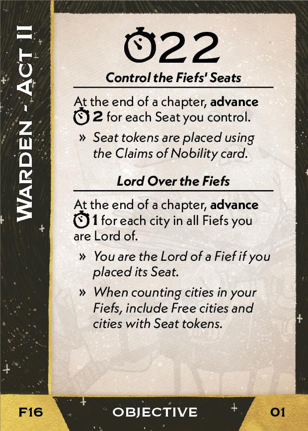{ width="33%" }](16/back_2_4.jpg){ data-lightbox="1" }[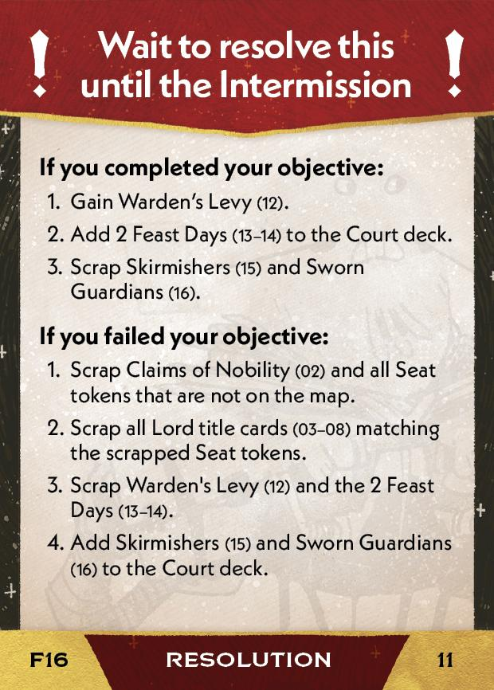{ width="33%px" }](16/piece_1_1.jpg){ data-lightbox="1" }

??? info "Setup details"
    1. Collect the 6 Seat tokens. *(They are labeled 1st through 6th)*
    
    2. Gain Claims of Nobility (02).
    
        [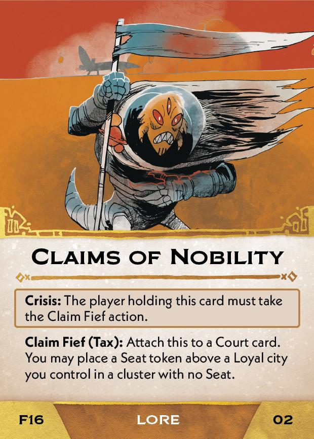{ width="150" }](16/piece_2_3.jpg){ data-lightbox="1" }
    
    3. Add the 6 Lord title cards (03-08) to the supply.
    
        [{ width="150" }](16/piece_2_2.jpg){ data-lightbox="1" } [{ width="150" }](16/piece_2_1.jpg){ data-lightbox="1" } [{ width="150" }](16/piece_2_0.jpg){ data-lightbox="1" } [{ width="150" }](16/piece_1_6.jpg){ data-lightbox="1" } [{ width="150" }](16/piece_1_5.jpg){ data-lightbox="1" } [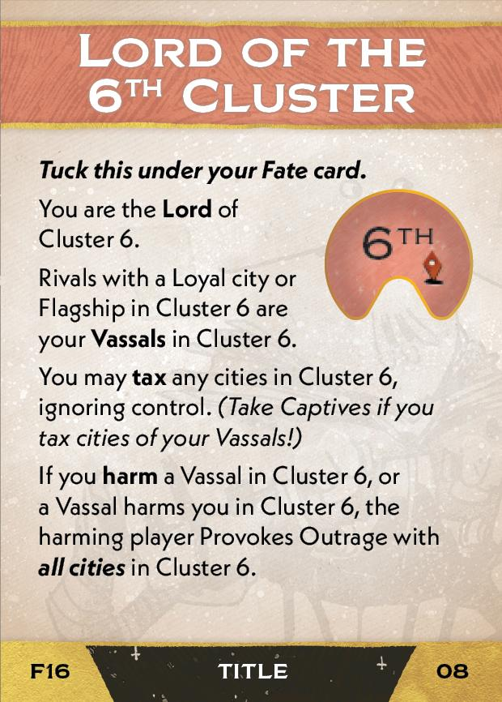{ width="150" }](16/piece_1_4.jpg){ data-lightbox="1" }
    
    4. Add the Seats & Fiefs card (09) and Feudal Law card (10) to the rules booklet. **Explain them to everyone.**
    
        [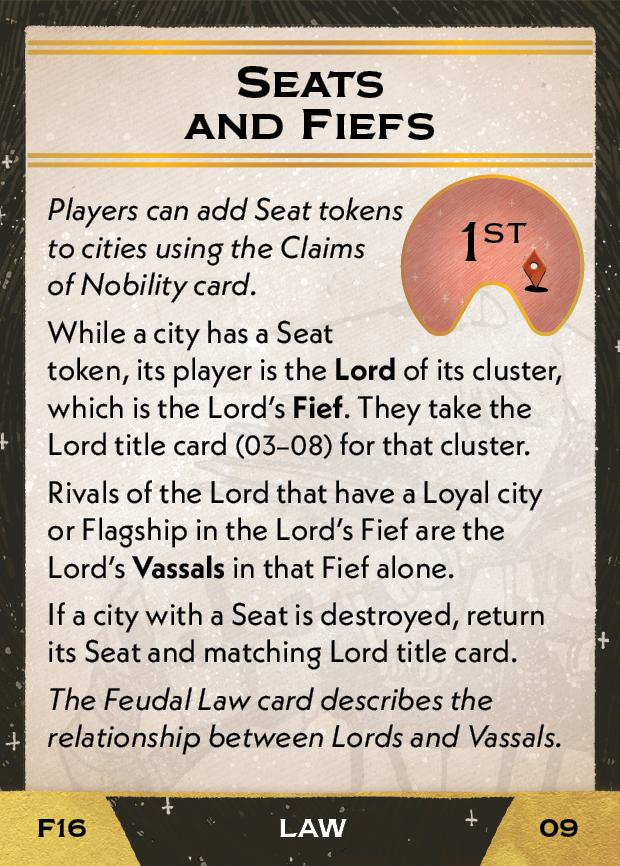{ width="150" }](16/piece_1_3.jpg){ data-lightbox="1" } [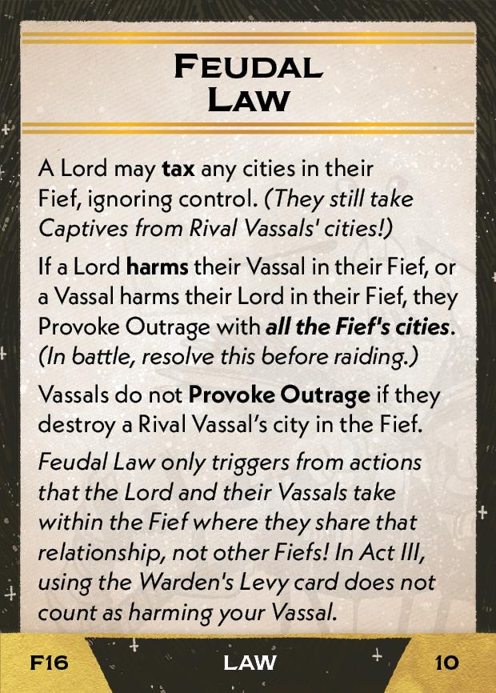{ width="150" }](16/piece_1_2.jpg){ data-lightbox="1" }
    
    5. **Replenish your fleet** - if you have fewer than **8 Loyal ships** on the map, place 1 ship each in any systems until you have 8 Loyal ships on the map.

??? success "If successful"
    1. Gain Warden's Levy (12).
    
        [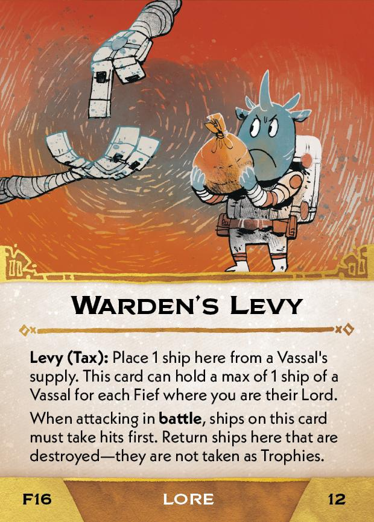{ width="150" }](16/piece_1_0.jpg){ data-lightbox="1" }
    
    2. Add 2 Feast Days (13-14) to the Court deck.
    
        [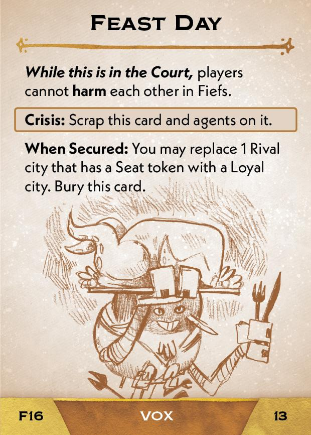{ width="150" }](16/piece_0_6.jpg){ data-lightbox="1" } [{ width="150" }](16/piece_0_5.jpg){ data-lightbox="1" }
    
    3. Scrap Skirmishers (15) and Sworn Guardians (16).

??? failure "If failed"
    1. Scrap Claims of Nobility (02) and all Seat tokens that are not on the map.
    
    2. Scrap all Lord title cards (03-08) matching the scrapped Seat tokens.
    
    3. Scrap Warden's Levy (12) and the 2 Feast Days (13-14).
    
    4. Add Skirmishers (15) and Sworn Guardians (16) to the Court deck.

        [{ width="150" }](16/piece_0_4.jpg){ data-lightbox="1" } [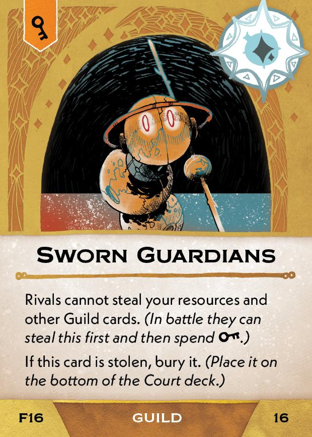{ width="150" }](16/piece_0_3.jpg){ data-lightbox="1" }

## Act III

[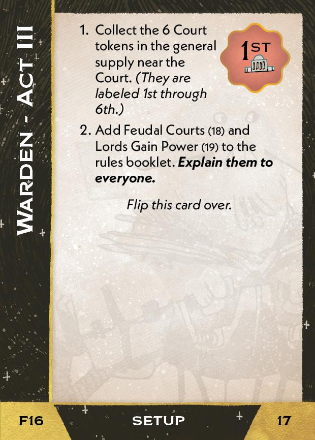{ width="33%" }](16/piece_0_2.jpg){ data-lightbox="1" }[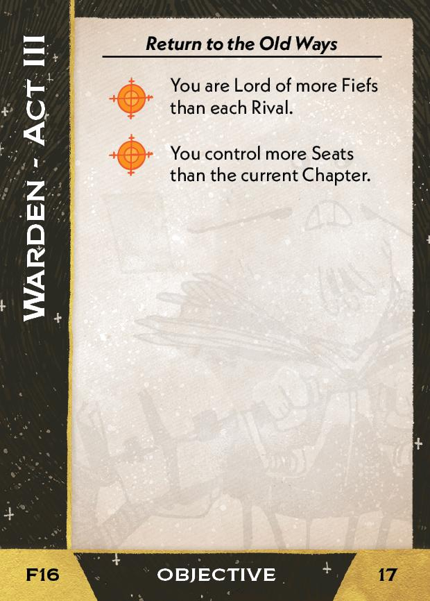{ width="33%" }](16/back_0_2.jpg){ data-lightbox="1" }

??? info "Setup details"
    1. Collect the 6 Court tokens in the general supply near the Court. *(They are labeled 1st through 6th)*
    
    2. Add Feudal Courts<a href="#faq1">[1]</a> (18) and Lords Gain Power (19) to the rules booklet. **Explain them to everyone.**

        [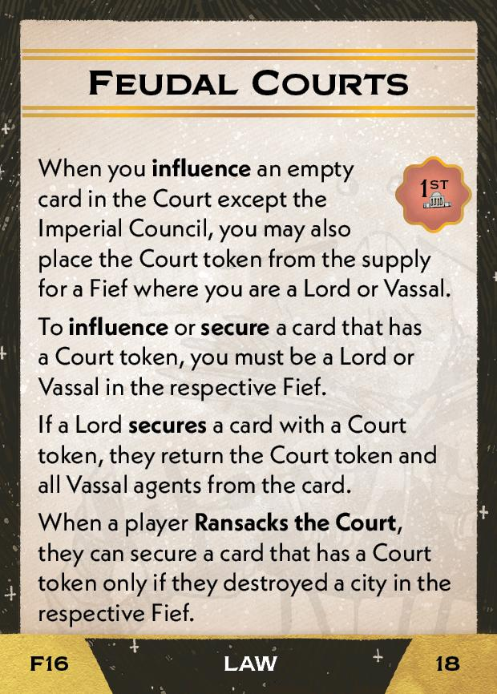{ width="150" }](16/piece_0_1.jpg){ data-lightbox="1" } [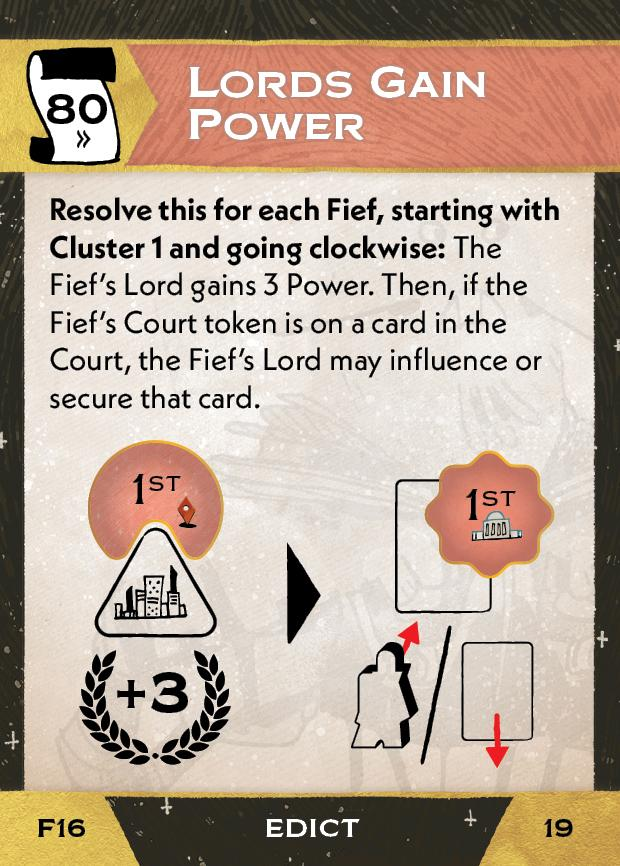{ width="150" }](16/piece_0_0.jpg){ data-lightbox="1" }

## FAQ / Errata

??? question "[1]Feudal Courts - What happens to the token if the Court card is won by somebody other than the Lord?"
    The token remains in the Court and applies to the next card that fills that slot.