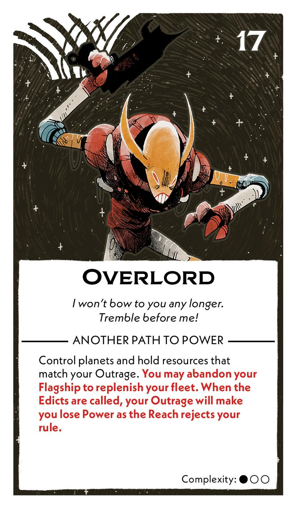
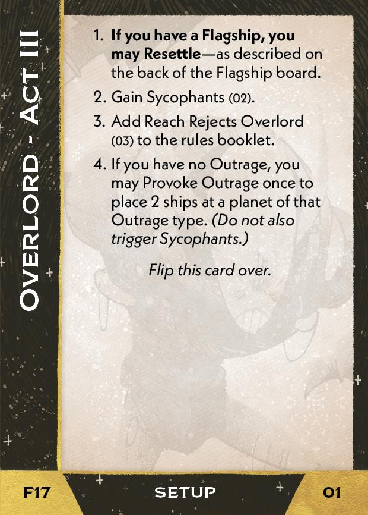
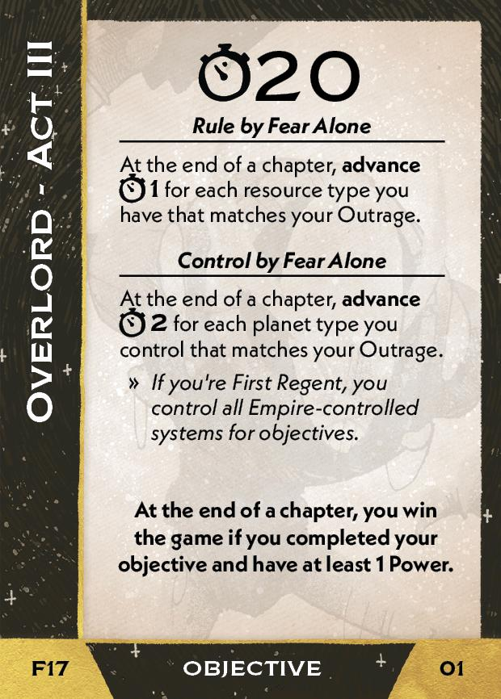
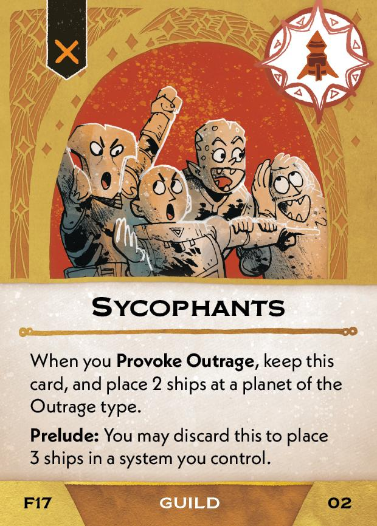
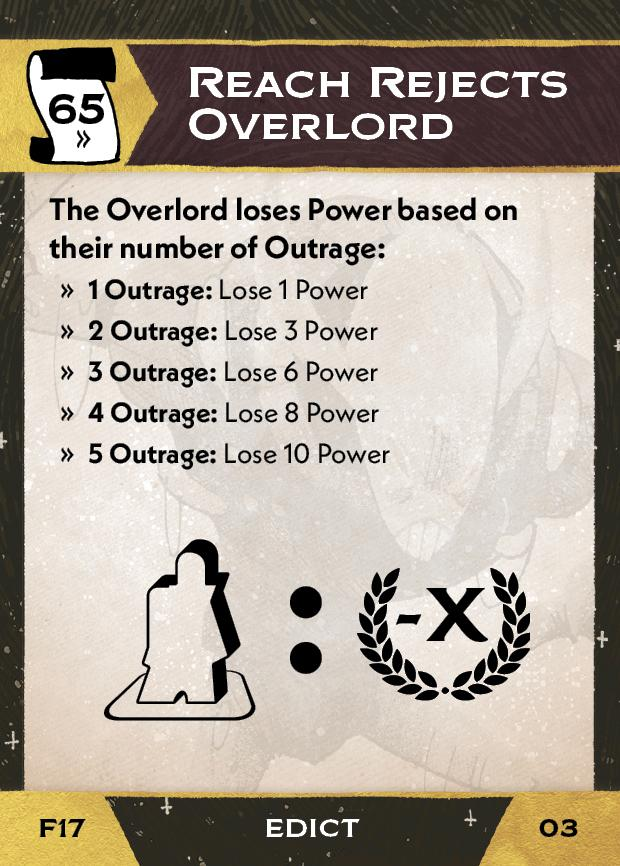

#Overlord
## Overview
<figure markdown="span">
{ width="300" }
</figure>

## Act III

[{ width="33%" }](17/piece_0_2.jpg){ data-lightbox="1" }[{ width="33%" }](17/back_0_2.jpg){ data-lightbox="1" }

??? info "Setup details"
    1. **If you have a Flagship, you may Resettle** - as describe on the back of the Flagship board.
    
    2. Gain Sycophants (02).
    
        [{ width="150" }](17/piece_0_1.jpg){ data-lightbox="1" }
    
    3. Add Reach Rejects Overlord (03) to the rules booklet.
    
        [{ width="150" }](17/piece_0_0.jpg){ data-lightbox="1" }
    
    4. If you have no Outrage, you may Provoke Outrage once to place 2 ships at a planet of that Outrage type. *(Do not also trigger Sycophants.)*