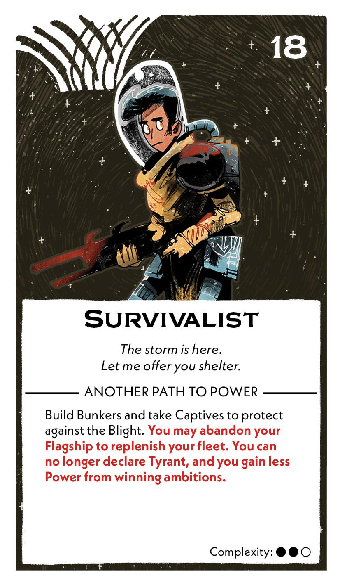
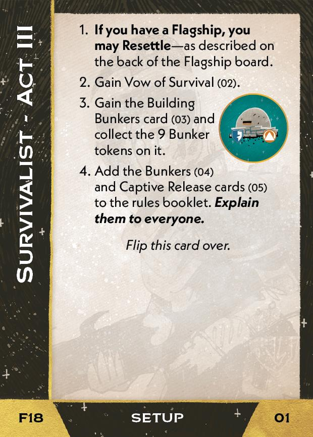
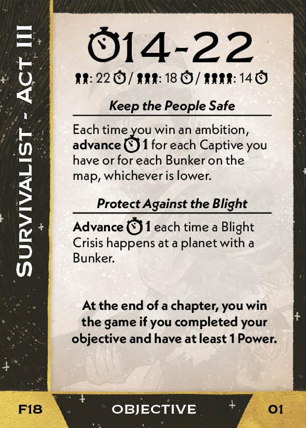
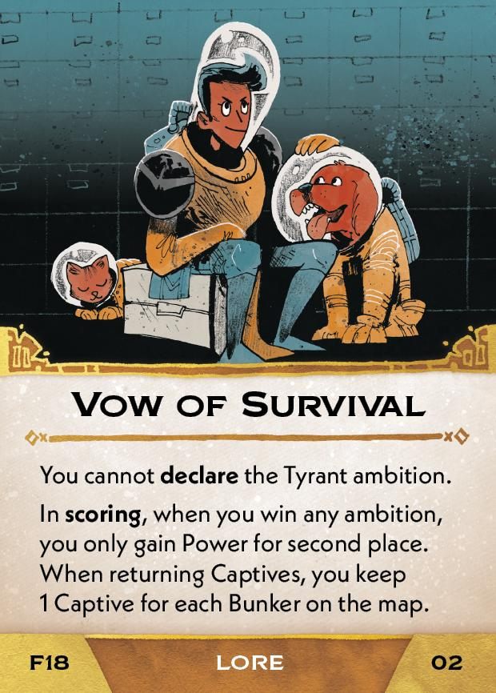
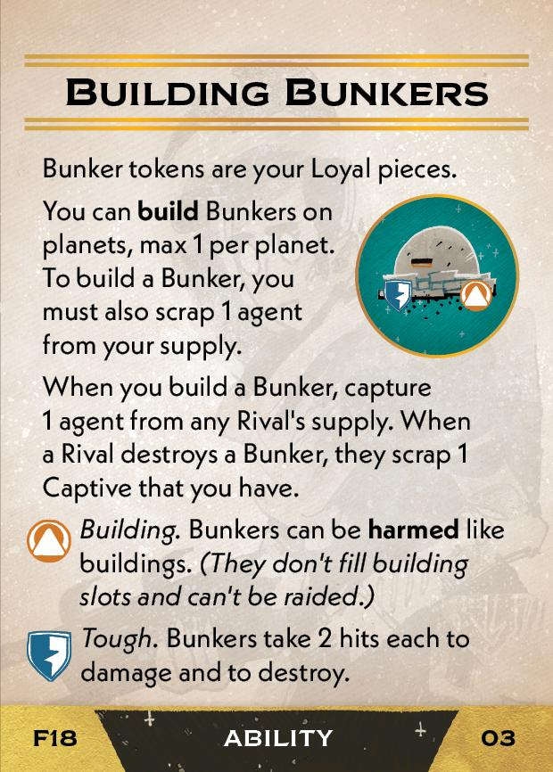
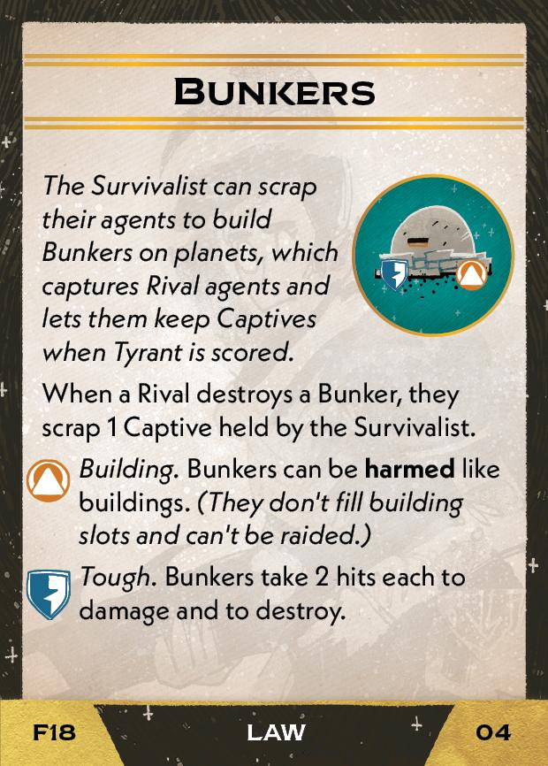
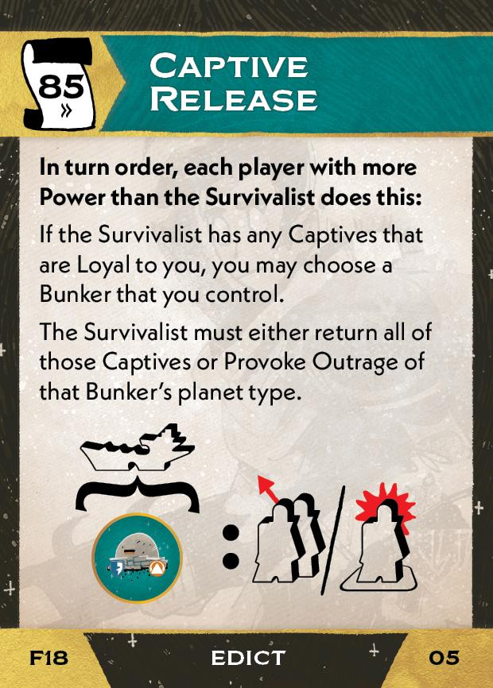

#Survivalist
## Overview
<figure markdown="span">
{ width="300" }
</figure>

## Act III

[{ width="33%" }](18/piece_1_0.jpg){ data-lightbox="1" }[{ width="33%" }](18/back_1_0.jpg){ data-lightbox="1" }

??? info "Setup details"
    1. **If you have a Flagship, you may Resettle** - as describe on the back of the Flagship board.
    
    2. Gain Vow of Survival<a href="#faq1">[1]</a> (02).
    
        [{ width="150" }](18/piece_0_3.jpg){ data-lightbox="1" }
    
    3. Gain the Building Bunkers card (03) and collect the 9 Bunker tokens on it.
    
        [{ width="150" }](18/piece_0_2.jpg){ data-lightbox="1" }
    
    4. Add the Bunkers (04) and Captive Release cards (05) to the rules booklet. **Explain them to everyone.**

        [{ width="150" }](18/piece_0_1.jpg){ data-lightbox="1" } [{ width="150" }](18/piece_0_0.jpg){ data-lightbox="1" }

## FAQ / Errata

??? question "[1]Vow of Survival - How does this interact with the Commonwealth Ambition?"
    If the Survivalist is a Commonwealth Member, then Vow of Survival has no effect on how much Power is earned from the Commonwealth ambition.

    If the Survivalist is not a Commonwealth Member and wins the ambition, Commonwealth Ambition has no effect. The Survivalist gets the second place power and it is not doubled.