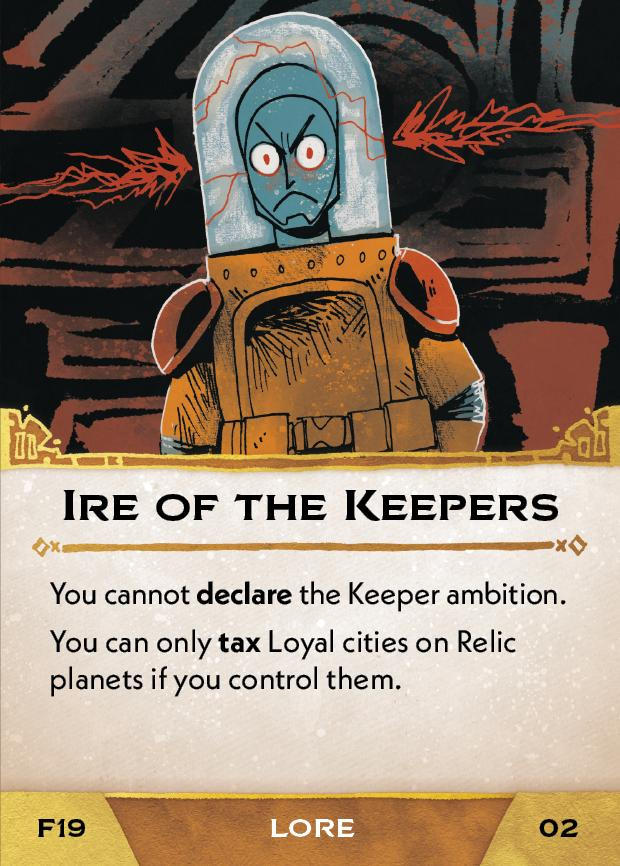

#Redeemer
## Overview
<figure markdown="span">
{ width="300" }
</figure>

## Act III

[{ width="33%" }](19/piece_0_3.jpg){ data-lightbox="1" }[{ width="33%" }](19/back_0_3.jpg){ data-lightbox="1" }

??? info "Setup details"
    1. **If you have a Flagship, you may Resettle** - as described on the back of the Flagship board.
    
    2. Provoke Relic Outrage.
    
    3. Gain Ire of the Keepers (02).
    
        [{ width="150" }](19/piece_0_2.jpg){ data-lightbox="1" }
    
    4. Add Rebuke of the Keepers (03) to the rules booklet. **Explain it to everyone.**
    
        [{ width="150" }](19/piece_0_1.jpg){ data-lightbox="1" }
    
    5. Place Relic Fence (04) on top of the Court deck.
    
        [{ width="150" }](19/piece_0_0.jpg){ data-lightbox="1" }
    
    6. With 2 players, return all Relics from the Keeper ambition box to the supply.

## FAQ / Errata

??? question "Ire of the Keepers - Do the restrictions of taxing Loyal cities apply to non-Loyal cities if they are taxed "like" Loyal cities?"
    No. The effects apply only to cities that are actually Loyal. Treating a city "like it is Loyal" means it uses the rules associated with Loyal cities, but is still non-Loyal for other card effects.
    
    However, these limits are in place for Loyal cities even if another card such as Empath's Bond would give you permission to tax them.