#Founder
## Overview
<figure markdown="span">
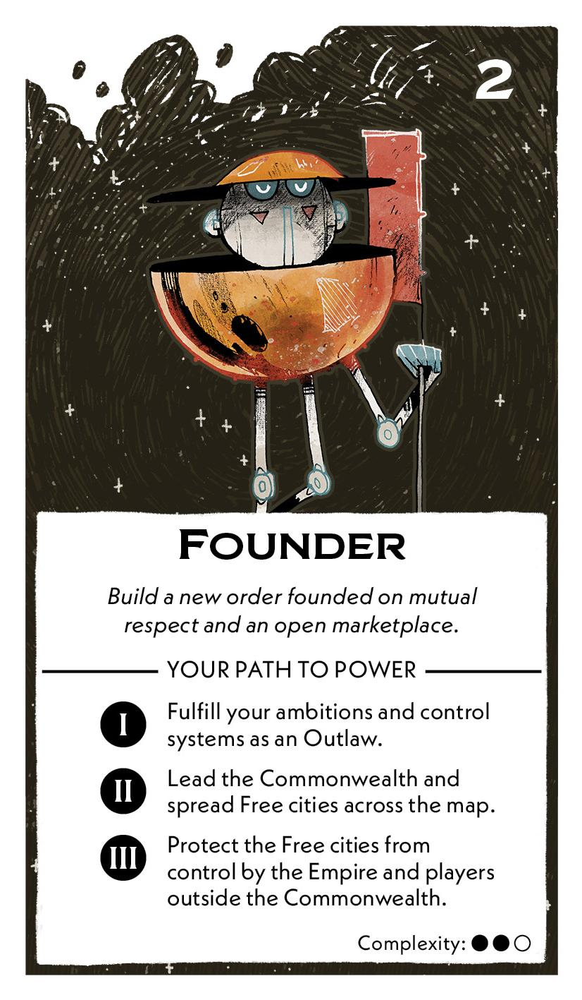{ width="300" }
</figure>

## Act I

[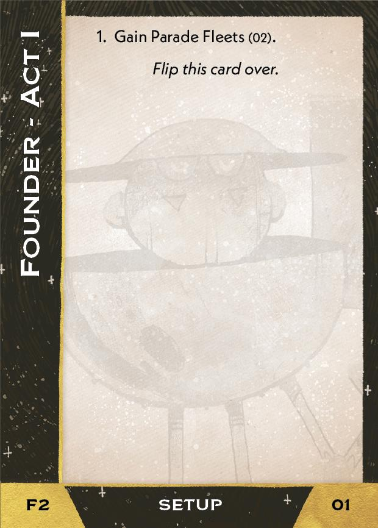{ width="33%"}](2/piece_3_5.jpg){ data-lightbox="1" }[{ width="33%" }](2/back_3_5.jpg){ data-lightbox="1" }[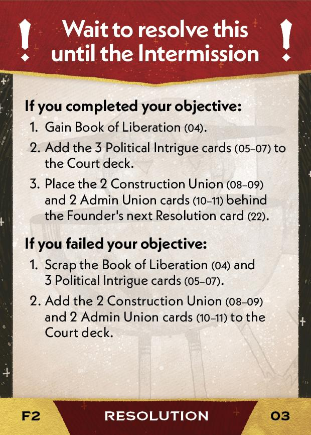{ width="33%" }](2/piece_3_3.jpg){ data-lightbox="1" }

??? info "Setup details"
     1. Gain Parade Fleets (02).
    
         [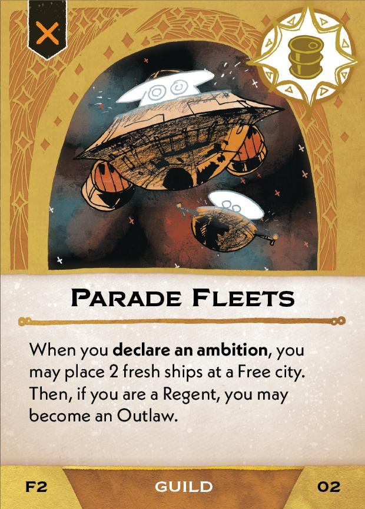{ width="150" }](2/piece_3_4.jpg){ data-lightbox="1" }

??? success "If successful"
    1. Gain Book of Liberation (04).
      
        [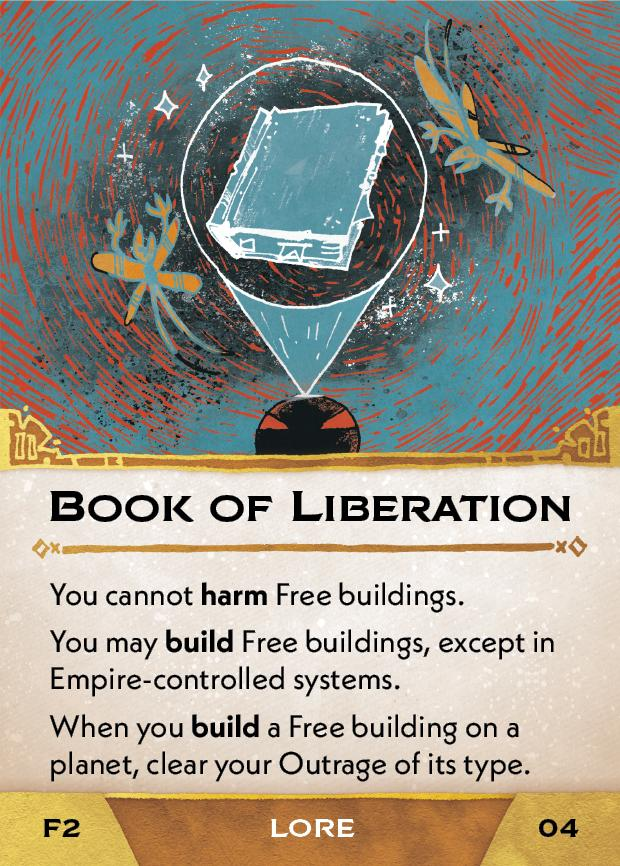{ width="150" }](2/piece_3_2.jpg){ data-lightbox="1" }

    2. Add the 3 Political Intrigue cards (05-07) to the Court deck.
      
        [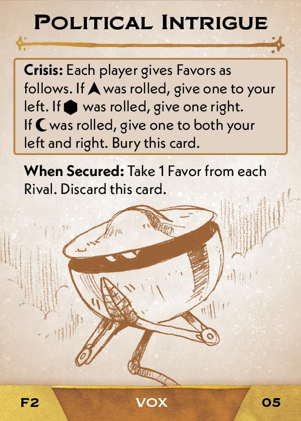{ width="150" }](2/piece_3_1.jpg){ data-lightbox="1" } [{ width="150" }](2/piece_3_0.jpg){ data-lightbox="1" } [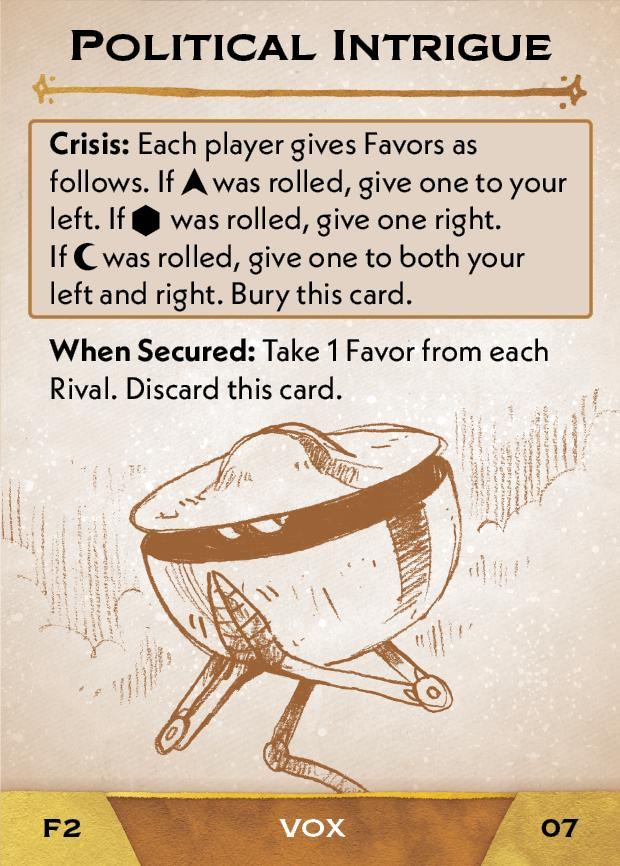{ width="150" }](2/piece_2_6.jpg){ data-lightbox="1" }

    3. Place the 2 Construction Union (08-09) and 2 Admin Union cards (10-11) behind the Founder's next Resolution card (22).

??? failure "If failed"
    1. Scrap the Book of Liberation (04) and 3 Political Intrigue (05-07).
    
    2. Add the 2 Construction Union (08-09) and 2 Admin Union cards (10-11) to the Court deck.
      
        [{ width="150" }](2/piece_2_5.jpg){ data-lightbox="1" } [{ width="150" }](2/piece_2_4.jpg){ data-lightbox="1" } [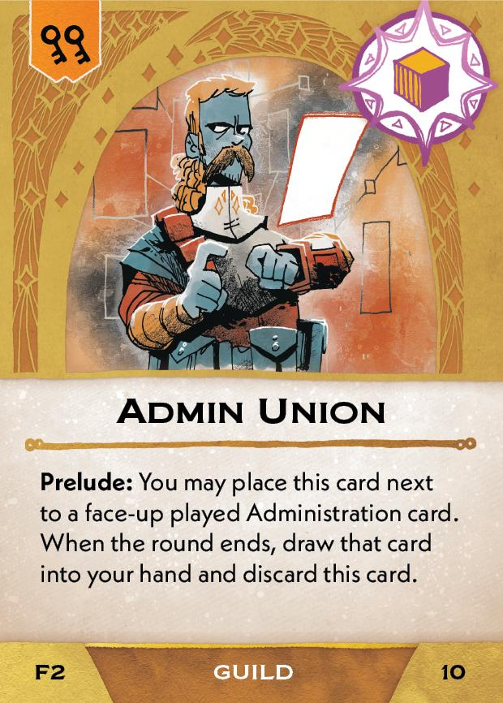{ width="150" }](2/piece_2_3.jpg){ data-lightbox="1" } [{ width="150" }](2/piece_2_2.jpg){ data-lightbox="1" } 

## Act II

[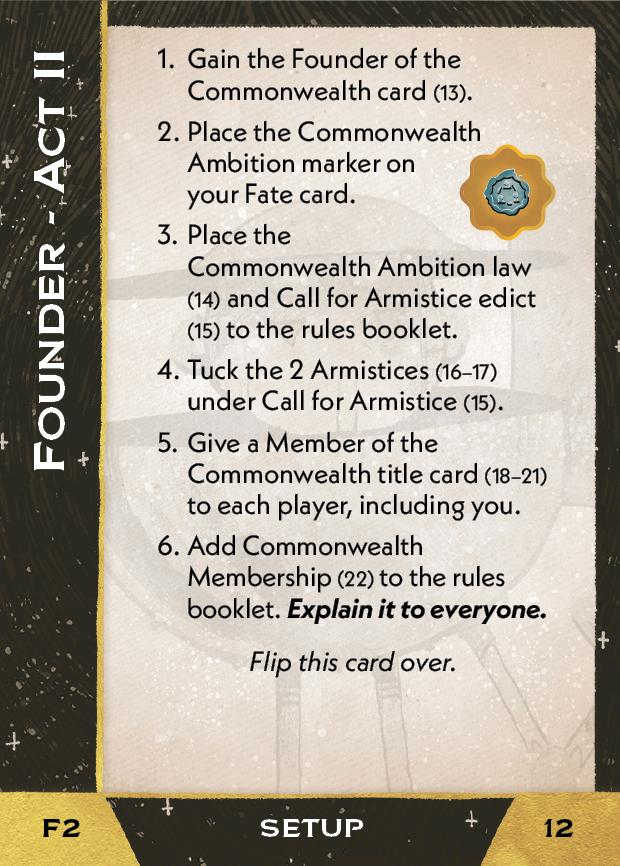{ width="33%" }](2/piece_2_1.jpg){ data-lightbox="1" }[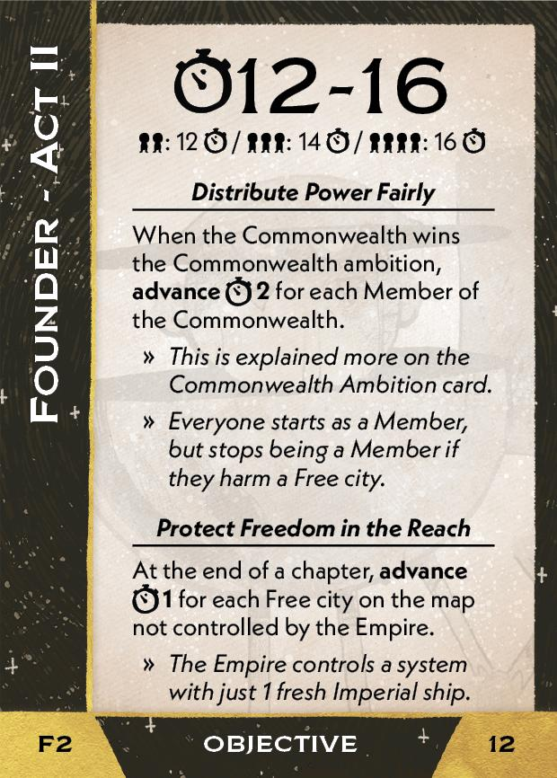{ width="33%" }](2/back_2_1.jpg){ data-lightbox="1" }[{ width="33%px" }](2/piece_0_4.jpg){ data-lightbox="1" }

??? info "Setup details"
     1. Gain the Found of the Commonwealth card (13).
    
        [{ width="150" }](2/piece_2_0.jpg){ data-lightbox="1" }

     2. Place the Commonwealth Ambition marker on your Fate card.

     3. Place the Commonwealth Ambition (14) and Call for Armistice edict (15) to the rules booklet.

        [{ width="150" }](2/piece_1_6.jpg){ data-lightbox="1" } [{ width="150" }](2/piece_1_5.jpg){ data-lightbox="1" }

     4. Tuck the 2 Armistices (16-17) under Call for Armistice (15).

        [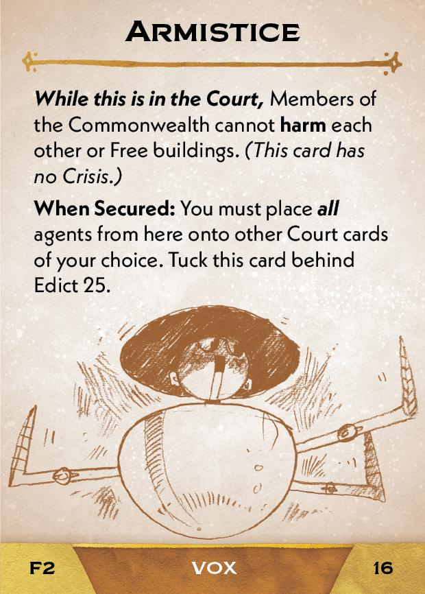{ width="150" }](2/piece_1_4.jpg){ data-lightbox="1" } [{ width="150" }](2/piece_1_3.jpg){ data-lightbox="1" }

     5. Give a Member of the Commonwealtitle card (18-21) to each player, including you.

        [{ width="150" }](2/piece_1_2.jpg){ data-lightbox="1" } [{ width="150" }](2/piece_1_1.jpg){ data-lightbox="1" } [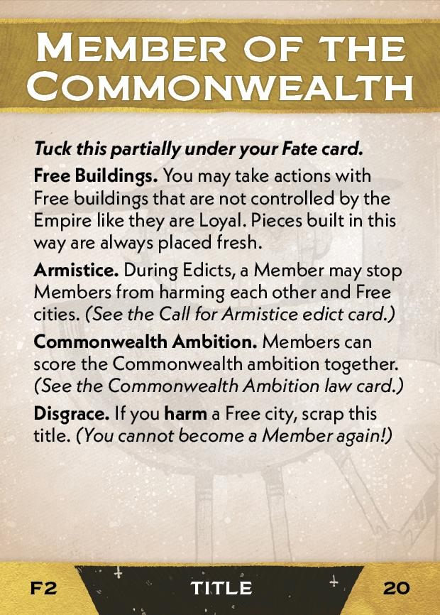{ width="150" }](2/piece_1_0.jpg){ data-lightbox="1" } [{ width="150" }](2/piece_0_6.jpg){ data-lightbox="1" }

    6. Add Commonwealth Membership (22) to the rules booklet. **Explain it to everyone.**

        [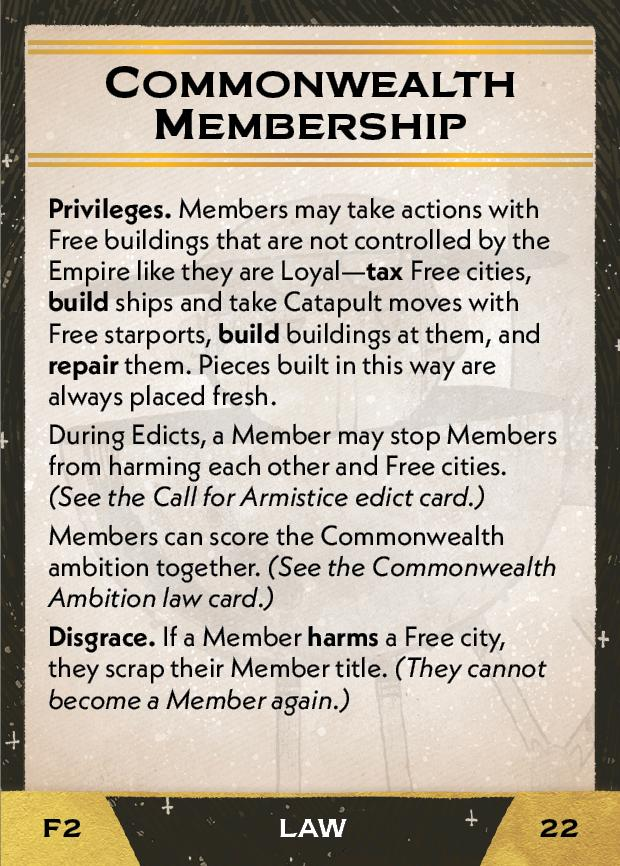{ width="150" }](2/piece_0_5.jpg){ data-lightbox="1" }

??? success "If successful"
    1. Gain Spirit of Freedom (24).
      
        [{ width="150" }](2/piece_0_3.jpg){ data-lightbox="1" }

    2. Scrap the 2 Construction Union (08-09) and 2 Admin Union cards (10-11).

??? failure "If failed"
    1. Scrap Spirit of Freedom (24).
      
        [{ width="150" }](2/piece_2_0.jpg){ data-lightbox="1" }

    2. Scrap your Founder of the Commonwealth card (12) and the Commonwealth Ambition marker.

    3. Add the 2 Construction Union (08-09) and 2 Admin Union cards (10-11) to the Court deck.
      
        [{ width="150" }](2/piece_2_5.jpg){ data-lightbox="1" } [{ width="150" }](2/piece_2_4.jpg){ data-lightbox="1" } [{ width="150" }](2/piece_2_3.jpg){ data-lightbox="1" } [{ width="150" }](2/piece_2_2.jpg){ data-lightbox="1" } 

## Act III

[{ width="33%" }](2/piece_0_2.jpg){ data-lightbox="1" }[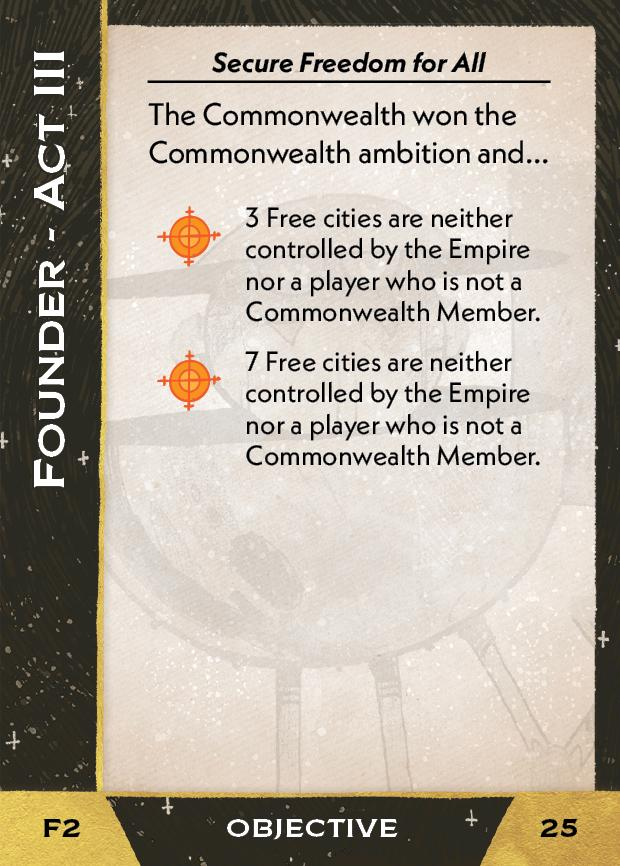{ width="33%" }](2/back_0_2.jpg){ data-lightbox="1" }

??? info "Setup details"
    1. Scrap the Call for Armistice edict (15) and add the Mass Call for Armistice edict (26) to the rules booklet. **Explain that it is the same as before, but now the Founder can also call for an Armistice**.
    
        [{ width="150" }](2/piece_0_1.jpg){ data-lightbox="1" }

    2. Gain Freedom Fighters (27).

        [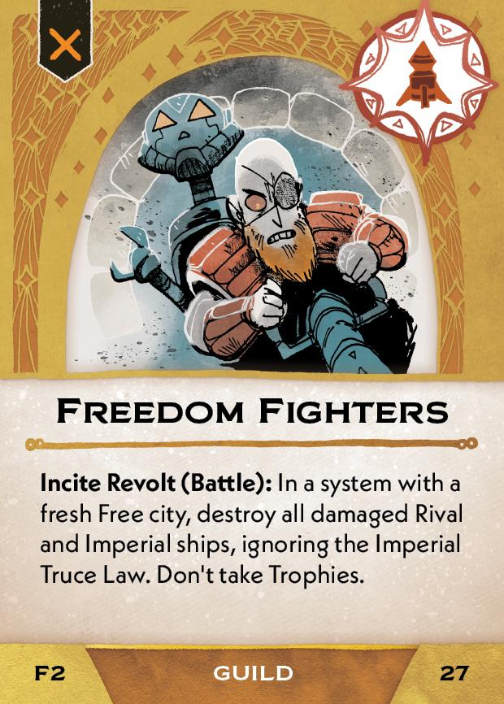{ width="150" }](2/piece_0_0.jpg){ data-lightbox="1" }

## FAQ / Errata

??? question "Does the Commonwealth Ambition token ever get moved after it is placed on an ambition?"
    (Unofficial ruling) Return it to the Fate card after the ambition is scored or undeclared, or when the Act ends. From here it can be placed again. *Nothing in the cards tells you to do this, but there are too many holes and ambiguities if you don't move it.*