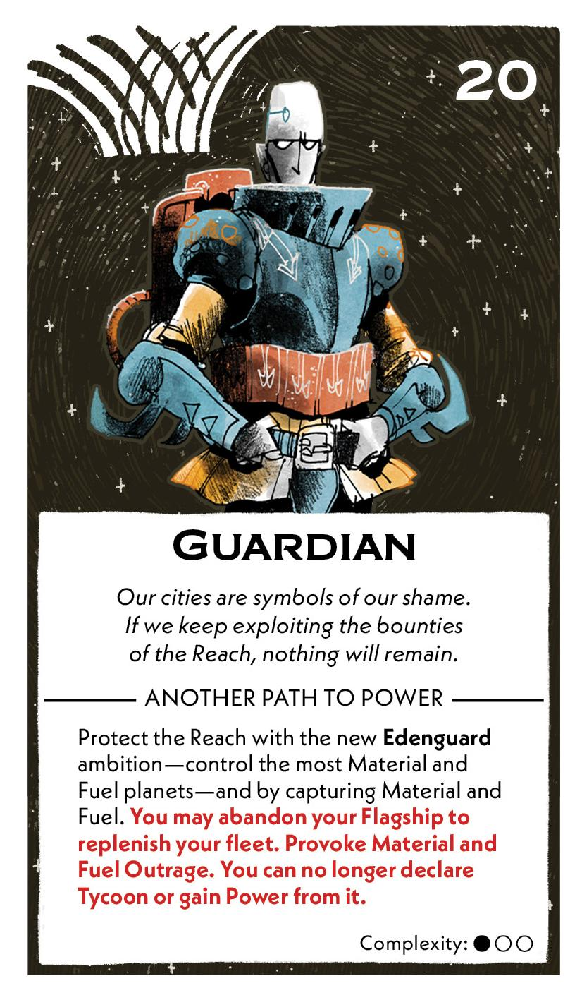
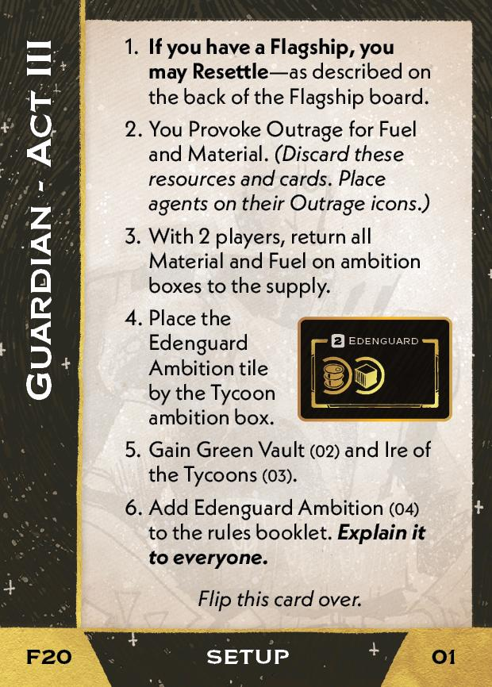
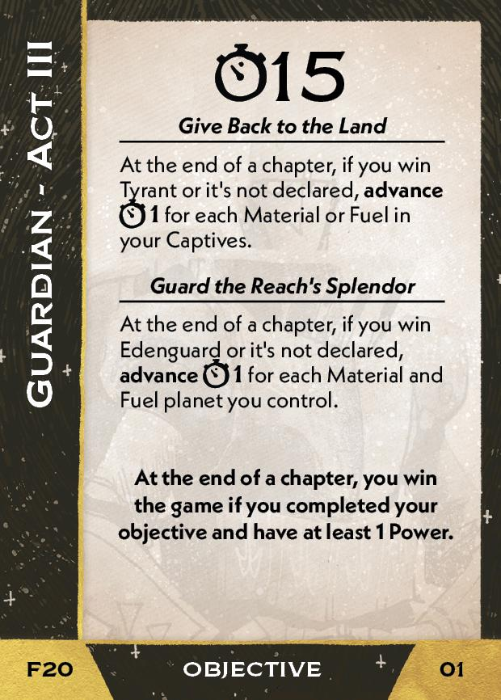
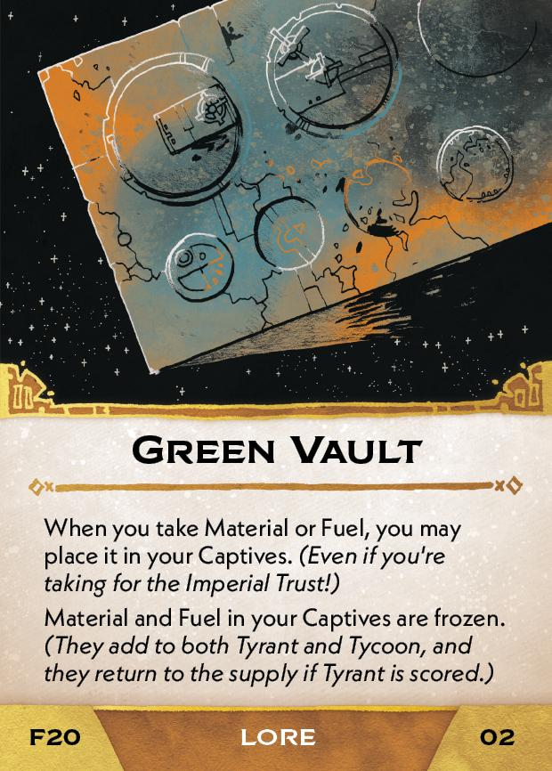
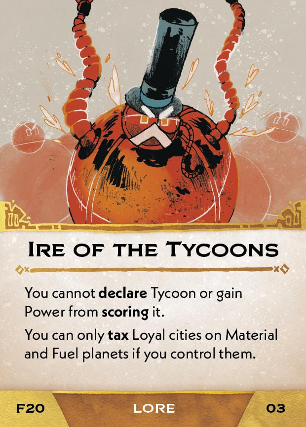
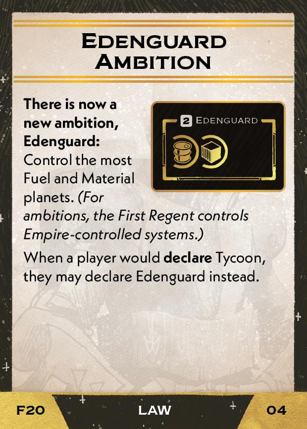

#Guardian
## Overview
<figure markdown="span">
{ width="300" }
</figure>

## Act III

[{ width="33%" }](20/piece_0_3.jpg){ data-lightbox="1" }[{ width="33%" }](20/back_0_3.jpg){ data-lightbox="1" }

??? info "Setup details"
    1. **If you have a Flagship, you may Resettle** - as describe on the back of the Flagship board.
    
    2. You Provoke Outrage for Fuel and Material. *(Discard these resources and cards. Place agents on their Outrage icons.)*
    
    3. With 2 players, return all Material and Fuel on ambition boxes to the supply.
    
    4. Place the Edenguard Ambition tile by the Tycoon ambition box.
   
    5. Green Green Vault (02) and Ire of the Tycoons (03)
    
        [{ width="33%" }](20/piece_0_2.jpg){ data-lightbox="1" } [{ width="33%" }](20/piece_0_1.jpg){ data-lightbox="1" }
    
    6. Add the Edenguard Ambition (04) to the rules booklet. **Explain it to everyone.**

        [{ width="33%" }](20/piece_0_0.jpg){ data-lightbox="1" }