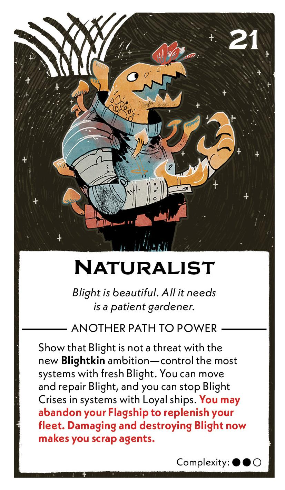
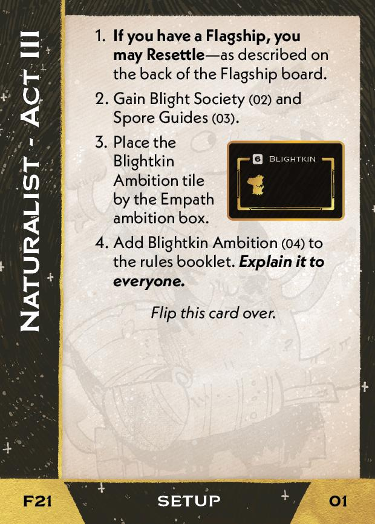
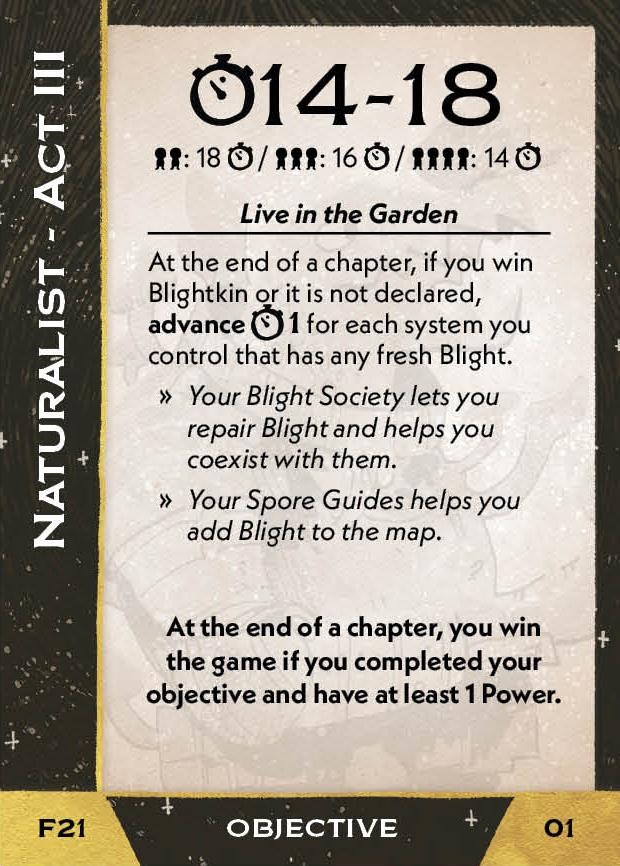
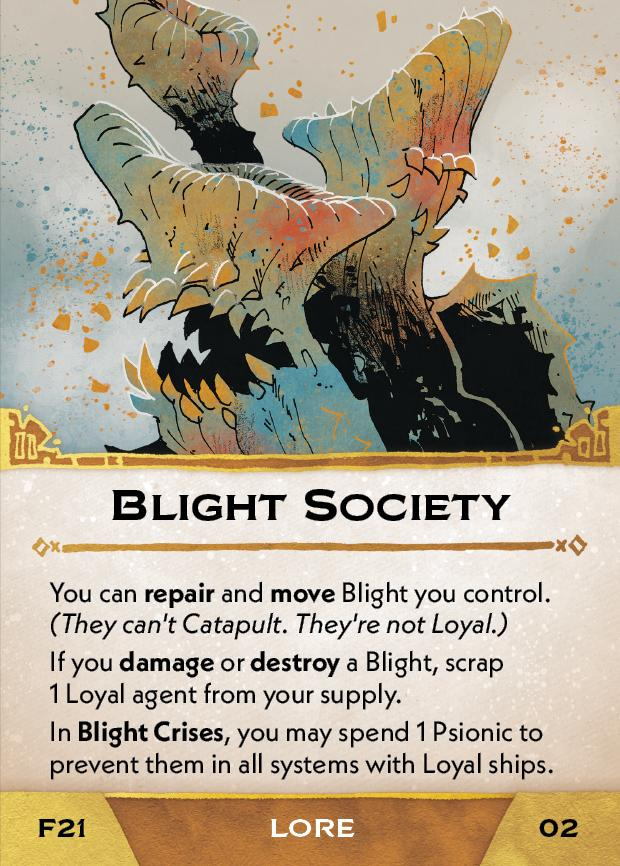
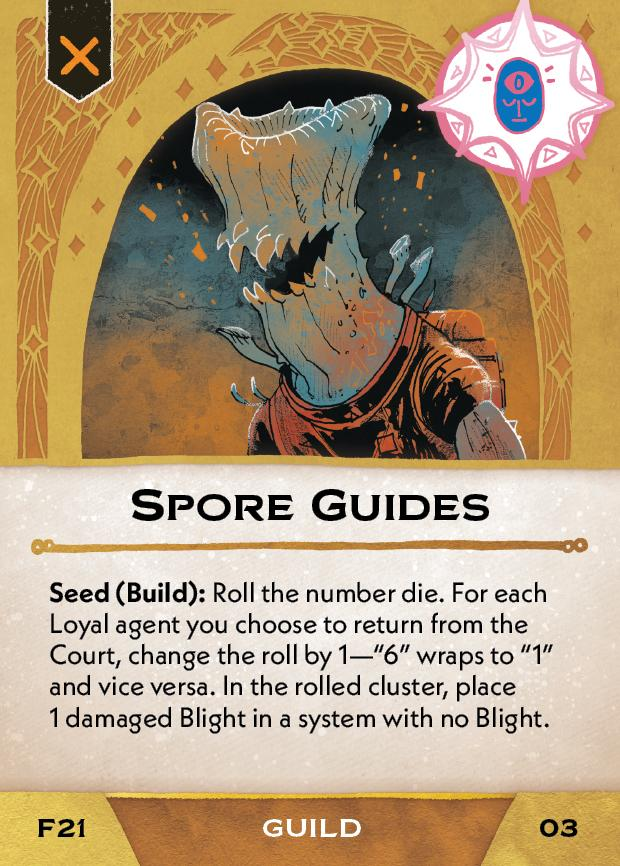
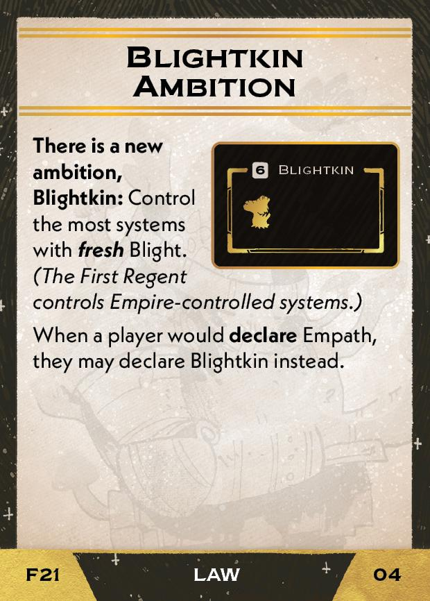

#Naturalist
## Overview
<figure markdown="span">
{ width="300" }
</figure>

## Act III

[{ width="33%" }](21/piece_0_3.jpg){ data-lightbox="1" }[{ width="33%" }](21/back_0_3.jpg){ data-lightbox="1" }

??? info "Setup details"
    1. **If you have a Flagship, you may Resettle** - as described on the back of the Flagship board.
    
    2. Gain Blight Society (02) and Spore Guides (03).
    
        [{ width="150" }](21/piece_0_2.jpg){ data-lightbox="1" } [{ width="150" }](21/piece_0_1.jpg){ data-lightbox="1" }
    
    3. Place the Blightkin Ambition tile by the Empath ambition box.
    
    4. Add Blightkin Ambition (04) to the rules booklet. **Explain it to everyone.**

        [{ width="150" }](21/piece_0_0.jpg){ data-lightbox="1" }