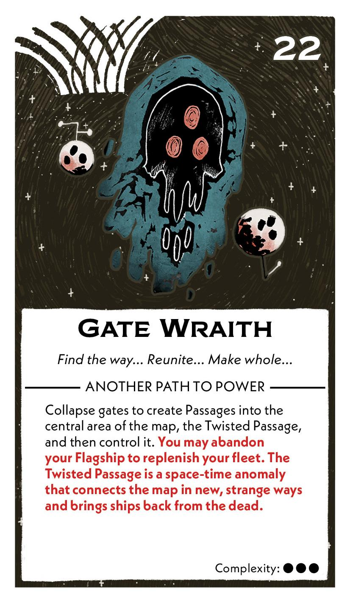
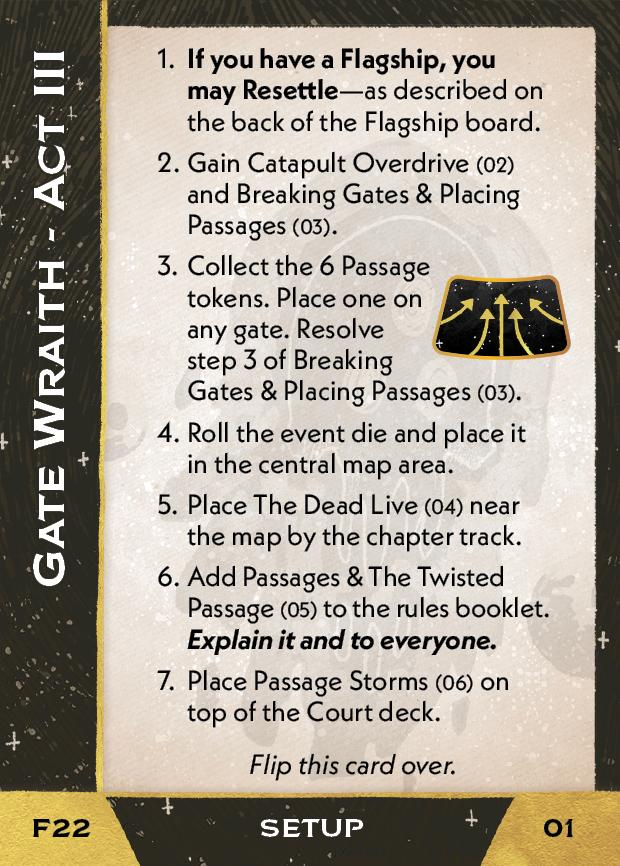
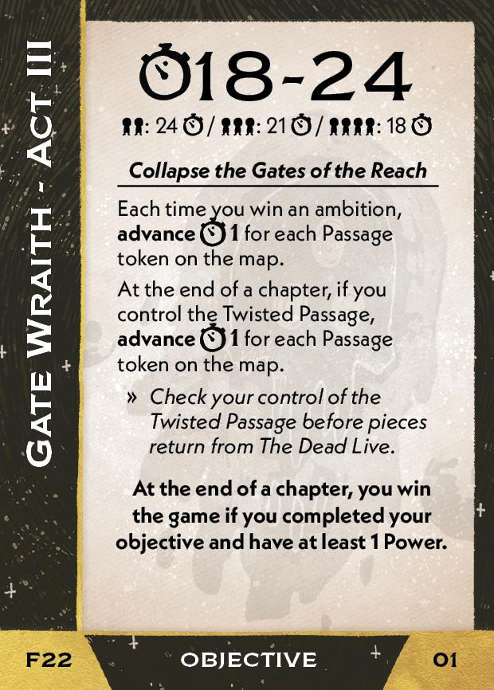
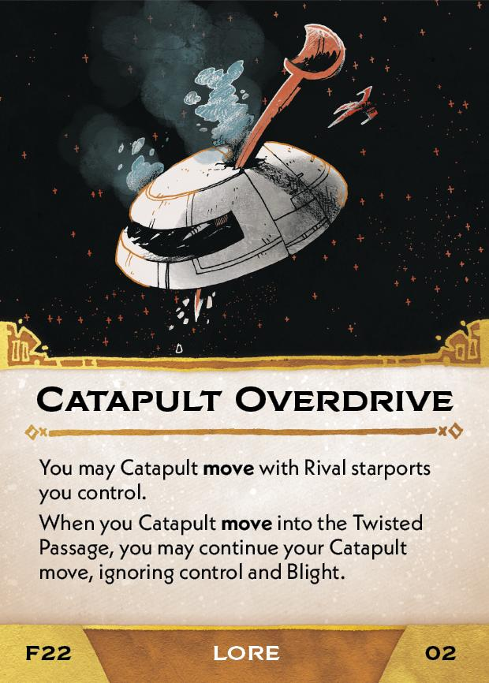
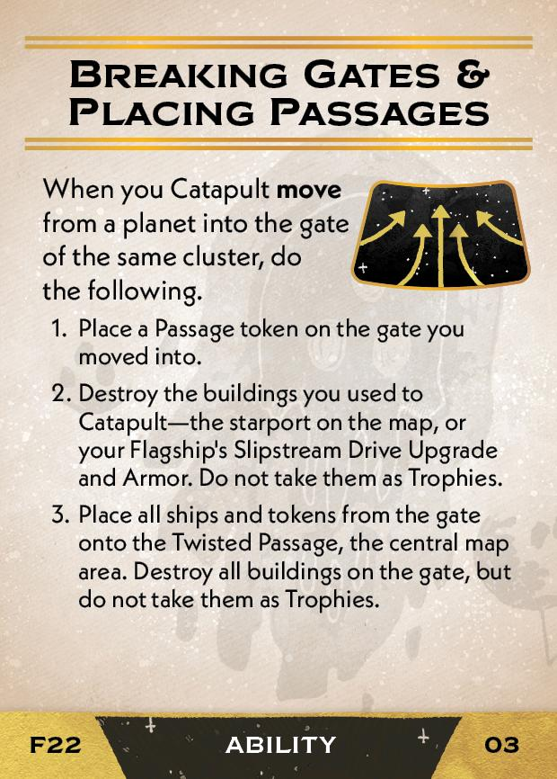
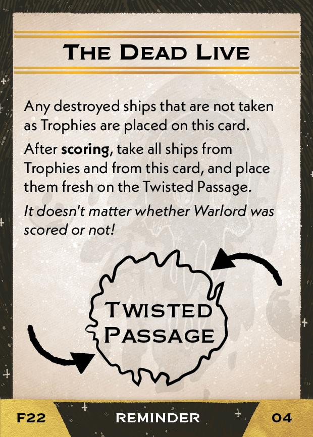
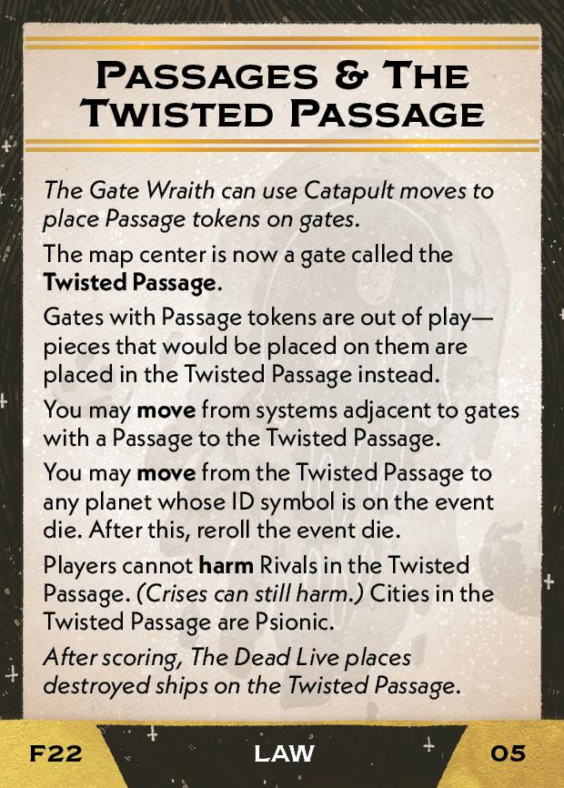
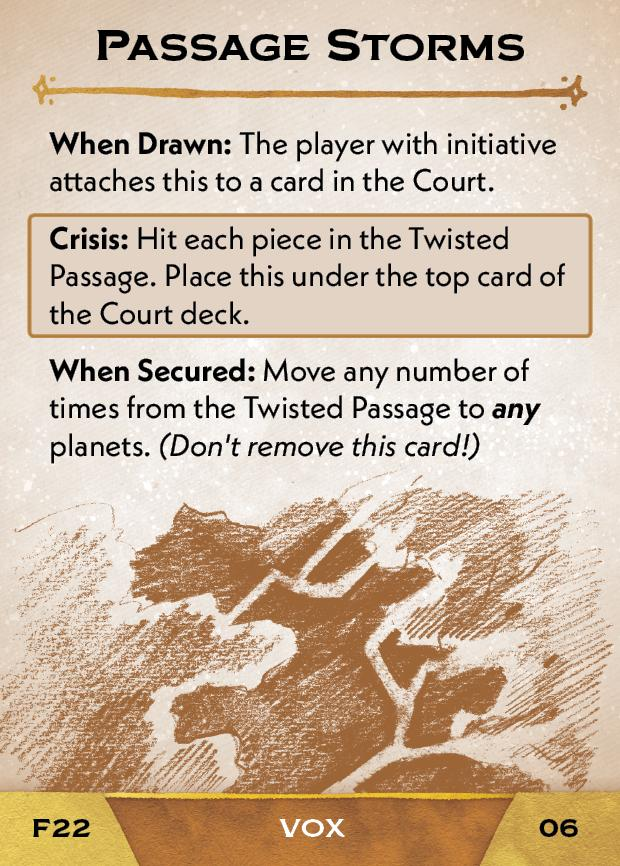

#Gate Wraith
## Overview
<figure markdown="span">
{ width="300" }
</figure>

## Act III

[{ width="33%" }](22/piece_1_1.jpg){ data-lightbox="1" }[{ width="33%" }](22/back_1_1.jpg){ data-lightbox="1" }

??? info "Setup details"
    1. **If you have a Flagship, you may Resettle** - as describe on the back of the Flagship board.
    
    2. Gain the Catapult Overdrive (02) and Breaking Gates & Placing Passages (03).
    
        [{ width="33%" }](22/piece_1_0.jpg){ data-lightbox="1" } [{ width="33%" }](22/piece_0_3.jpg){ data-lightbox="1" }
    
    3. Collect the 6 Passage tokens. Place one on any gate. Resolve step 3 of Breaking Gates & Placing Passages (03).
    
    4. Roll the event die and place it in the central map area.
    
    5. Place The Dead Live (04) near the map by the chapter track.
    
        [{ width="33%" }](22/piece_0_2.jpg){ data-lightbox="1" }
    
    6. Add Passages & The Twisted Passage<a href="#faq1">[1]</a> (05) to the rules booklet. **Explain it to everyone.**
    
        [{ width="33%" }](22/piece_0_1.jpg){ data-lightbox="1" }
    
    7. Place Passage Storms (06) on top of the Court deck.

        [{ width="33%" }](22/piece_0_0.jpg){ data-lightbox="1" }

??? question "[1]Passages & The Twisted Passage - Is the Twisted Passage adjacent to any other systems when resolving card effects that reference adjacent systems?"
    No. Ships can move to and from the the Twisted Passage as described on the card, but it is not considered adjacent to other systems for any other purpose.