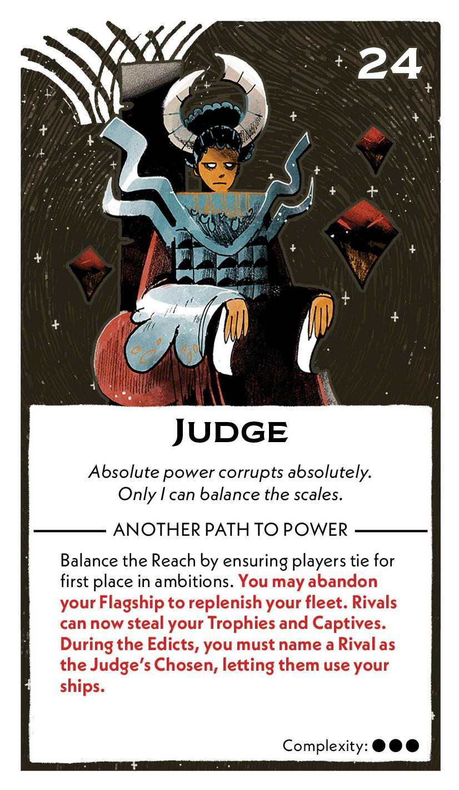
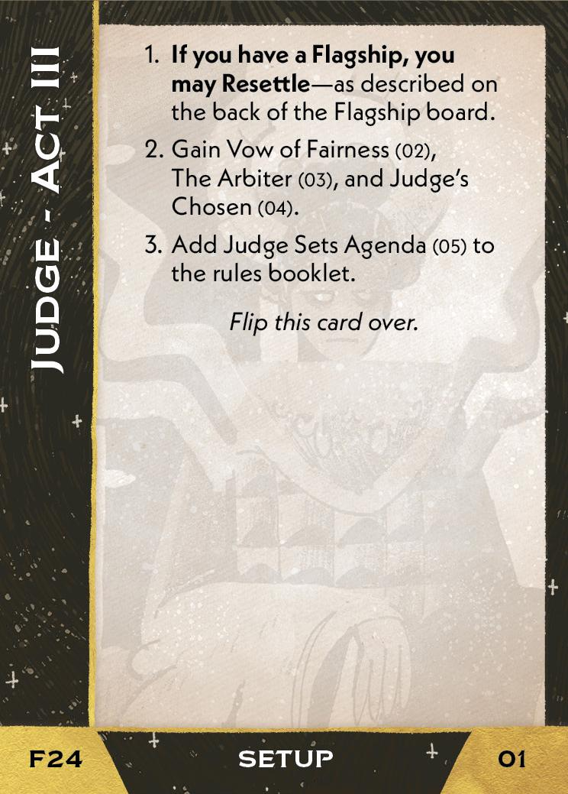
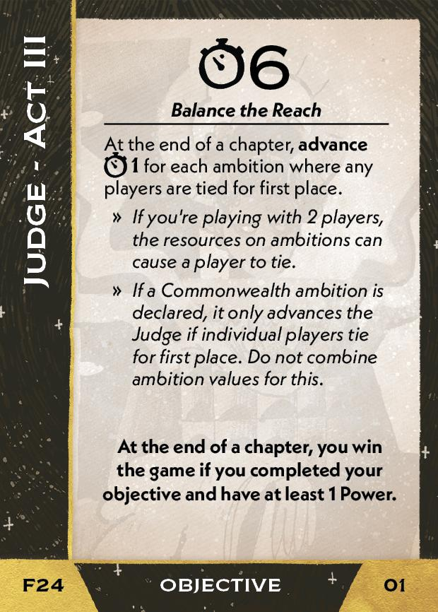
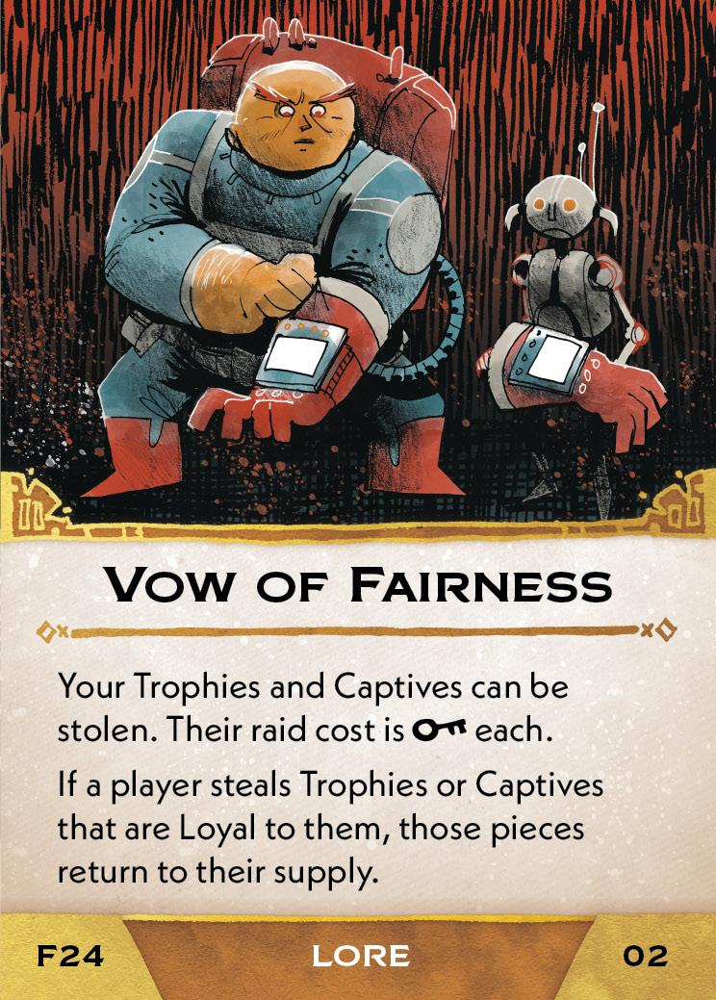
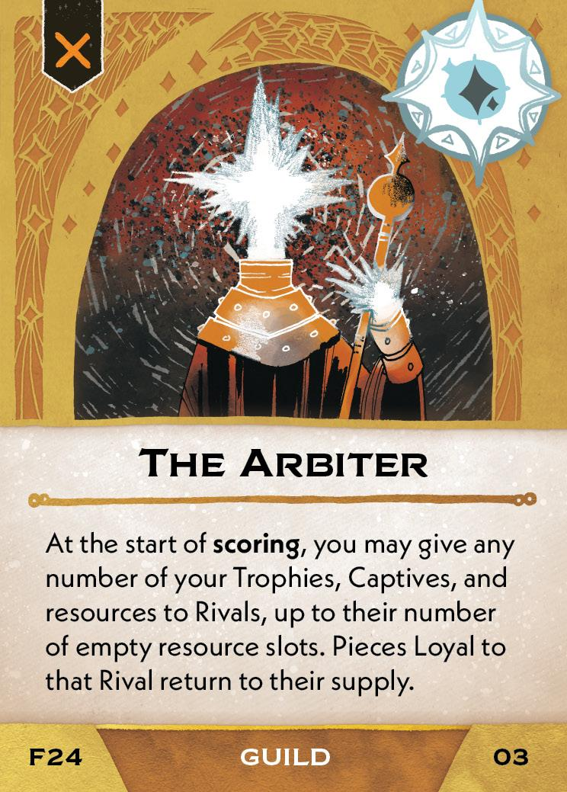
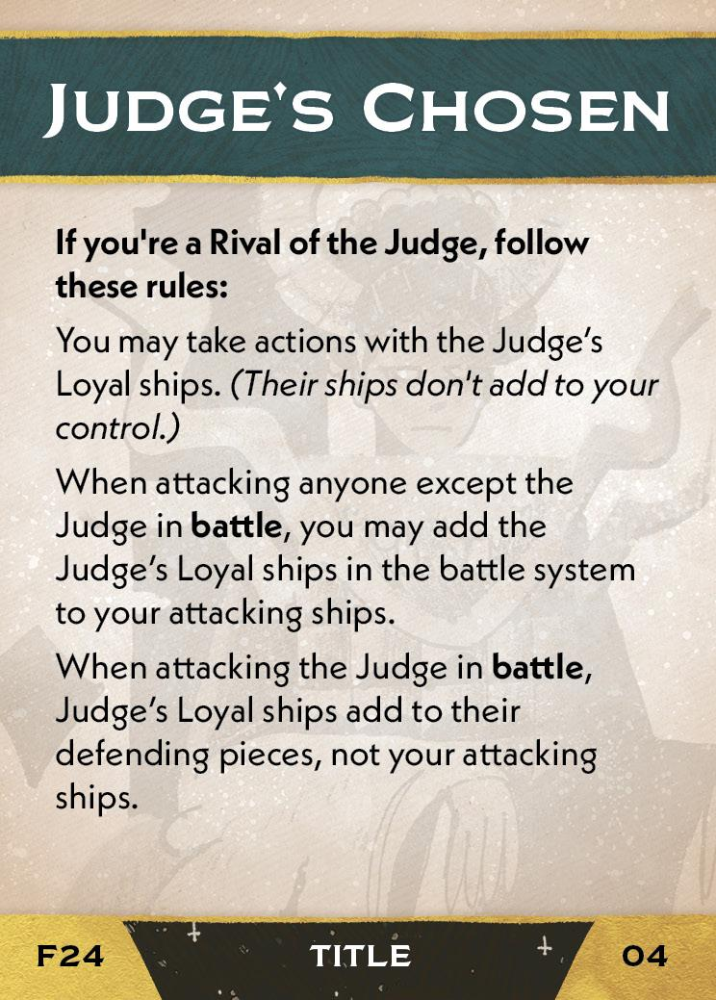
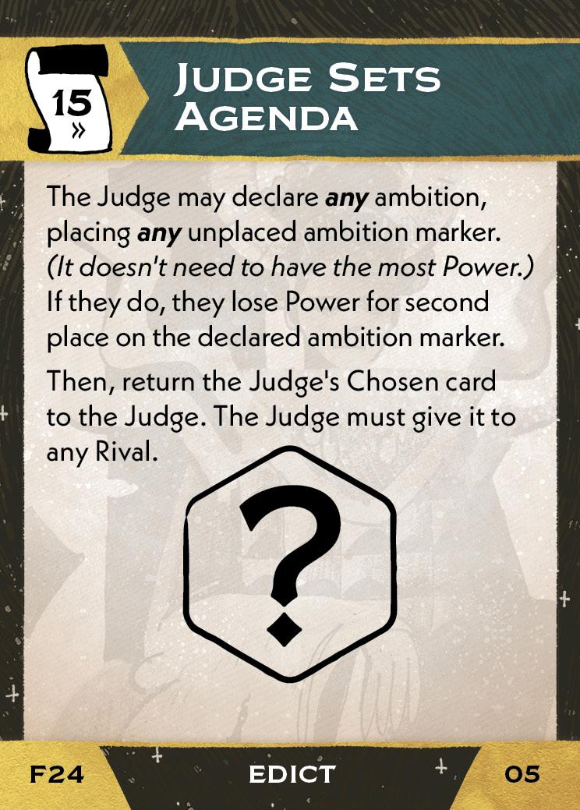

#Judge
## Overview
<figure markdown="span">
{ width="300" }
</figure>

## Act III

[{ width="33%" }](24/piece_1_0.jpg){ data-lightbox="1" }[{ width="33%" }](24/back_1_0.jpg){ data-lightbox="1" }

??? info "Setup details"
    1. **If you have a Flagship, you may Resettle** - as describe on the back of the Flagship board.
    2. Gain Vow of Fairness (02), The Arbiter<a href="#faq1">[1]</a> (03), and Judge's Chosen (04).
        
        [{ width="150" }](24/piece_0_3.jpg){ data-lightbox="1" } [{ width="150" }](24/piece_0_2.jpg){ data-lightbox="1" } [{ width="33%" }](24/piece_0_1.jpg){ data-lightbox="1" }

    3. Add Judge Sets Agenda (05) to the rules booklet.
        
        [{ width="150" }](24/piece_0_1.jpg){ data-lightbox="1" }
        
## FAQ / Errata

??? question "[1]The Arbiter - Does "up to their number of empty resource slots" limit only the resources you give, or all of the listed components?"
    Only the resources are limited by slots. Other pieces may be given with no limit.