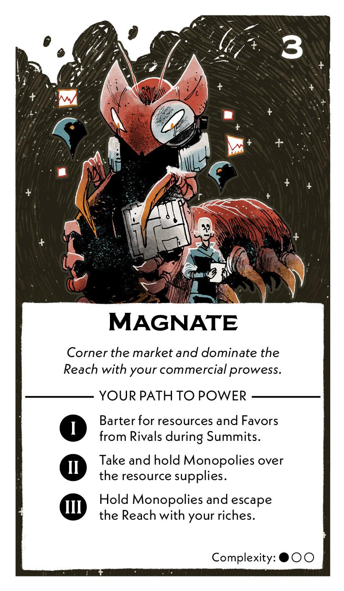
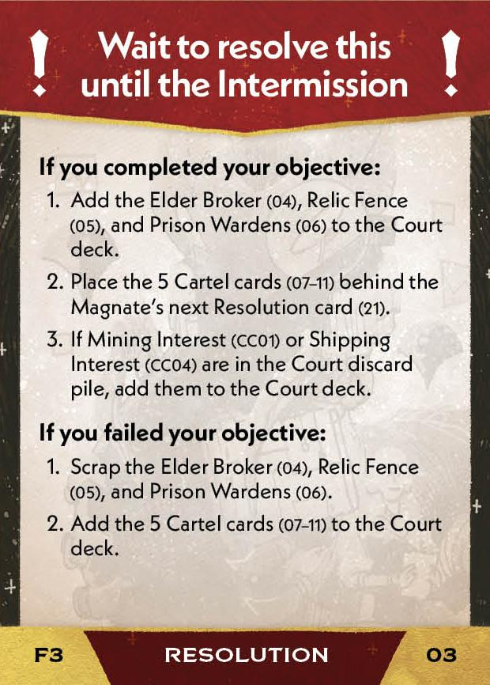
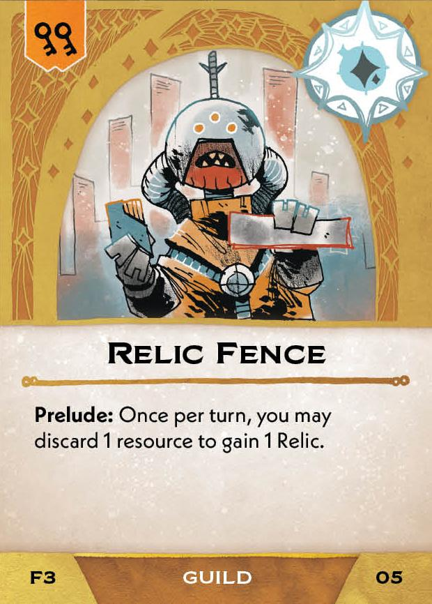
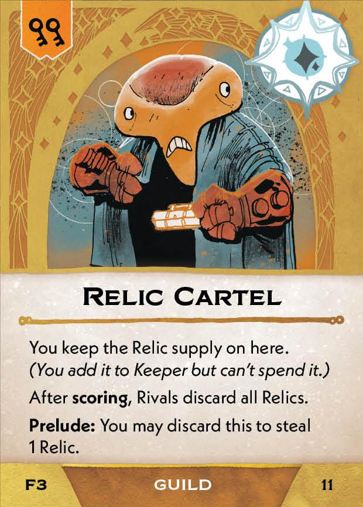
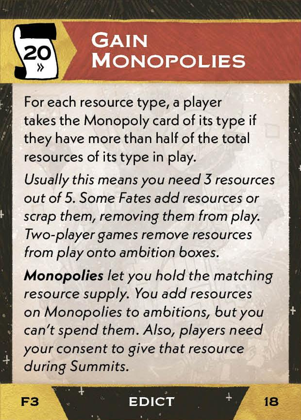
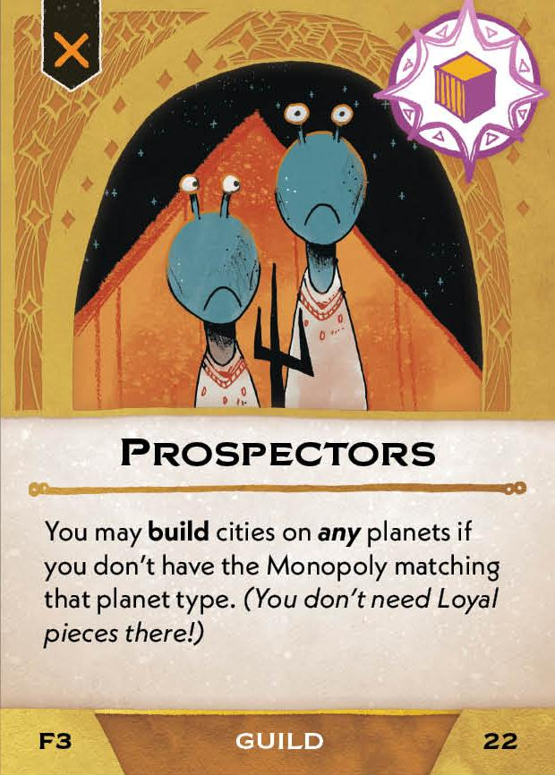

#Magnate
## Overview
<figure markdown="span">
{ width="300" }
</figure>

## Act I

[{ width="33%"}](3/piece_3_5.jpg){ data-lightbox="1" }[{ width="33%" }](3/back_3_5.jpg){ data-lightbox="1" }[{ width="33%" }](3/piece_3_3.jpg){ data-lightbox="1" }

??? info "Setup details"
     1. Gain Merchant League (02).
    
         [{ width="150" }](3/piece_3_4.jpg){ data-lightbox="1" }

??? success "If successful"
    1. Add the Elder Broker (04), Relic Fence (05), and Prison Wardens (06) to the Court deck.
      
        [{ width="150" }](3/piece_3_2.jpg){ data-lightbox="1" } [{ width="150" }](3/piece_3_1.jpg){ data-lightbox="1" } [{ width="150" }](3/piece_3_0.jpg){ data-lightbox="1" }

    2. Place the 5 Cartel cards (07-11) behind the Magnate's next Resolution card (21).
    
    3. If Mining Interest (CC01) or Shipping Interest (CC04) are in the Court discard pile, add them to the Court deck.

??? failure "If failed"
    1. Scrap the Elder Broker (04), Relic Fence (05), and Prison Wardens (06).
    
    2. Add the 5 Cartel cards (07-11) to the Court deck.
      
        [{ width="150" }](3/piece_2_6.jpg){ data-lightbox="1" } [{ width="150" }](3/piece_2_5.jpg){ data-lightbox="1" } [{ width="150" }](3/piece_2_4.jpg){ data-lightbox="1" } [{ width="150" }](3/piece_2_3.jpg){ data-lightbox="1" } [{ width="150" }](3/piece_2_2.jpg){ data-lightbox="1" }

## Act II

[{ width="33%" }](3/piece_2_1.jpg){ data-lightbox="1" }[{ width="33%" }](3/back_2_1.jpg){ data-lightbox="1" }[{ width="33%px" }](3/piece_0_6.jpg){ data-lightbox="1" }

??? info "Setup details"
     1. Place the 5 Monopoly cards (13-17) in the general supply. Place the resource supplies on their respective Monopoly cards.
    
        [{ width="150" }](3/piece_2_0.jpg){ data-lightbox="1" } [{ width="150" }](3/piece_1_6.jpg){ data-lightbox="1" } [{ width="150" }](3/piece_1_5.jpg){ data-lightbox="1" } [{ width="150" }](3/piece_1_4.jpg){ data-lightbox="1" } [{ width="150" }](3/piece_1_3.jpg){ data-lightbox="1" }

     2. Add the Gain Monopolies edict (18) to the rules booklet.

        [{ width="150" }](3/piece_1_2.jpg){ data-lightbox="1" }

     3. Place the War Profiteer marker on the Warlord ambition box.
     
     4. Add the Monopoly Consent card (19) and War Profiteering (20) to the rules booklet. **Explain them to everyone.** 

        [{ width="150" }](3/piece_1_1.jpg){ data-lightbox="1" } [{ width="150" }](3/piece_1_0.jpg){ data-lightbox="1" }

??? success "If successful"
    1. Gain Prospectors (22).
      
        [{ width="150" }](3/piece_0_5.jpg){ data-lightbox="1" }

    2. Scrap the 5 Cartel cards (07-11) and the 2 Extortion cards (23-24).
    
    3. If Mining Interest (CC01) or Fuel Interest (CC04) [(?)](#faq1) are in the Court discard pile, add them to the Court deck.

??? failure "If failed"
    1. Scrap Prospectors (22) any Monopoly cards (13-17) that players do not have. 
    
    2. Add the Cartel cards (07-11) matching the scapped Monopolies to the court deck. Scrap the rest of the Cartel cards (07-11).

        [{ width="150" }](3/piece_2_6.jpg){ data-lightbox="1" } [{ width="150" }](3/piece_2_5.jpg){ data-lightbox="1" } [{ width="150" }](3/piece_2_4.jpg){ data-lightbox="1" } [{ width="150" }](3/piece_2_3.jpg){ data-lightbox="1" } [{ width="150" }](3/piece_2_2.jpg){ data-lightbox="1" }

    3. Add the 2 Extortion cards (23-24) to the Court deck.
      
        [{ width="150" }](3/piece_0_4.jpg){ data-lightbox="1" } [{ width="150" }](3/piece_0_3.jpg){ data-lightbox="1" }

## Act III

[{ width="33%" }](3/piece_0_2.jpg){ data-lightbox="1" }[{ width="33%" }](3/back_0_2.jpg){ data-lightbox="1" }

??? info "Setup details"
    1. If you're a Regent, tuck the Economy law card (26) on its Closed Economy side under the card play area near the map. If you're an Outlaw, tuck it on its Open Economy side.
    
        [{ width="150" }](3/piece_0_1.jpg){ data-lightbox="1" } [{ width="150" }](3/back_0_1.jpg){ data-lightbox="1" }

    2. Add Closed & Open Economy (27) to the rules booket. **Explain it to everyone.**

        [{ width="150" }](3/piece_0_0.jpg){ data-lightbox="1" }

    3. Remember to place the War Profiteer marker on the Warlord ambition box.

## FAQ / Errata

??? question "Act II resolution refers to card Fuel Interest (CC04) which does not exist."
    (Unofficial ruling) This should refer to Shipping Interest (CC04)