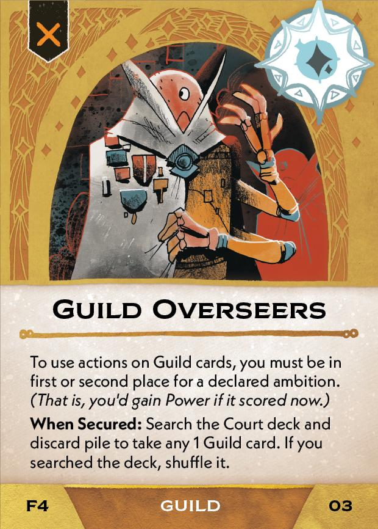
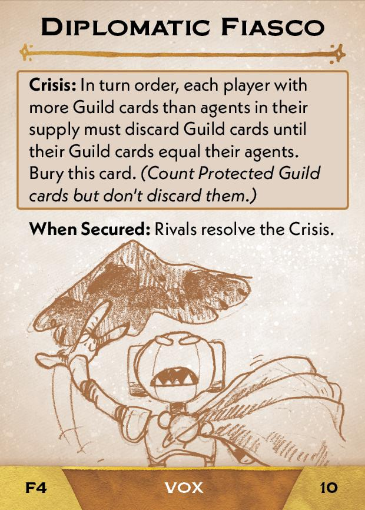

#Advocate
## Overview
<figure markdown="span">
{ width="300" }
</figure>

## Act I

[{ width="33%"}](4/piece_3_4.jpg){ data-lightbox="1" }[{ width="33%" }](4/back_3_4.jpg){ data-lightbox="1" }[{ width="33%" }](4/piece_3_1.jpg){ data-lightbox="1" }

??? info "Setup details"
     1. Gain Guild Investigators (02) and Guild Overseers (03). *Guild Overseers has a When Secured action. Do not resolve this now. It is only relevant once Guild Overseers enters the Court deck in Act II.*
    
         [{ width="150" }](4/piece_3_3.jpg){ data-lightbox="1" } [{ width="150" }](4/piece_3_2.jpg){ data-lightbox="1" }

??? success "If successful"
    1. Add your Guild Overseers (03), the 5 Liaison cards (05-09) and Diplomatic Fiasco (10) to the Court deck. *(You gained Guild Overseers during this Act's Setup.)*
      
        [{ width="150" }](4/piece_3_0.jpg){ data-lightbox="1" } [{ width="150" }](4/piece_2_6.jpg){ data-lightbox="1" } [{ width="150" }](4/piece_2_5.jpg){ data-lightbox="1" } [{ width="150" }](4/piece_2_4.jpg){ data-lightbox="1" } [{ width="150" }](4/piece_2_3.jpg){ data-lightbox="1" } [{ width="150" }](4/piece_2_2.jpg){ data-lightbox="1" }

    2. Scrap Guild Struggle (11).

??? failure "If failed"
    
    1. Add your Guild Overseers (03) to the Court deck. *(You gained Guild Overseers during this Act's Setup.)*
      
    2. For each Guild card suit that you have more than each other Rival, add the matching Liaison card (05-09) to the Court deck. Scrap the remaining Liaison cards.
   
        [{ width="150" }](4/piece_3_0.jpg){ data-lightbox="1" } [{ width="150" }](4/piece_2_6.jpg){ data-lightbox="1" } [{ width="150" }](4/piece_2_5.jpg){ data-lightbox="1" } [{ width="150" }](4/piece_2_4.jpg){ data-lightbox="1" } [{ width="150" }](4/piece_2_3.jpg){ data-lightbox="1" }

    3. Scrap Diplomatic Fiasco (10).

    4. Add Guild Struggle (11) to the Court deck.

        [{ width="150" }](4/piece_2_1.jpg){ data-lightbox="1" }

## Act II

[{ width="33%" }](4/piece_2_0.jpg){ data-lightbox="1" }[{ width="33%" }](4/back_2_0.jpg){ data-lightbox="1" }[{ width="33%px" }](4/piece_1_4.jpg){ data-lightbox="1" }

??? info "Setup details"
     1. Add the Advocate's Demand edict (13) to the rules booklet. *Explain it to everyone.*
        
        [{ width="150" }](4/piece_1_6.jpg){ data-lightbox="1" }

    1. Add the Guild Negotiations (14) to the rules booklet. *Explain it to everyone.*
        
        [{ width="150" }](4/piece_1_5.jpg){ data-lightbox="1" }

??? success "If successful"
    1. Add Guild Fair (16) and the 5 Guildmaster cards (17-21) to the Court deck.
      
        [{ width="150" }](4/piece_1_3.jpg){ data-lightbox="1" } [{ width="150" }](4/piece_1_2.jpg){ data-lightbox="1" } [{ width="150" }](4/piece_1_1.jpg){ data-lightbox="1" } [{ width="150" }](4/piece_1_0.jpg){ data-lightbox="1" } [{ width="150" }](4/piece_0_6.jpg){ data-lightbox="1" } [{ width="150" }](4/piece_0_5.jpg){ data-lightbox="1" }

    2. Scrap Guilds Withdraw (22).

??? failure "If failed"
    1. Scrap Guild Fair (16) and the 5 Guildmaster cards (17-21).

    2. Add Guilds Withdraw (22) to the Court deck.

        [{ width="150" }](4/piece_0_4.jpg){ data-lightbox="1" }

    3. Scrap Advocate's Demand (13) from the rules booklet. *(Advocate's Demand was placed during this Act's Setup)*

## Act III

[{ width="33%" }](4/piece_0_3.jpg){ data-lightbox="1" }[{ width="33%" }](4/back_0_3.jpg){ data-lightbox="1" }

??? info "Setup details"
    1. Gain Guild Loyalty (24).
    
        [{ width="150" }](4/piece_0_2.jpg){ data-lightbox="1" }

    2. Add Guild Supremacy (25) to the rules booklet. **Explain it to everyone.**

        [{ width="150" }](4/piece_0_1.jpg){ data-lightbox="1" } 
        
    3. As a reminder, place the second copy of Guild Supremacy (26) near the ambition boxes.
        
        [{ width="150" }](4/piece_0_0.jpg){ data-lightbox="1" }

## FAQ / Errata

??? question "Guild Investigators - Can I use this ability if every card in the Court has agents, or if the only cards with no agents already have other attached cards?"
    No. In this scenario you cannot resolve the effect. The rules text about ignoring attachment requirements does not apply here because you are not being forcd to use this ability.

??? question "Guild Overseers - What does "actions on Guild cards" refer to specifically?"
    This refers to **Prelude** effects and **New Action** effects (those with bolded text including a basic action name in parentheses). When Secured effects, and effects that are not preceded by bolded text are not affected.

??? question "Guild Overseers - The clarification text about earning power is confusing. When exactly am I allowed to use actions?"
    Ignore the clarification text. You may use Guild card actions if you are in first place, tied for first place, or in second place *(but not tied for second place)* for a declared ambition. This applies even if scoring the ambition would not give you power due to another modifier or the value of the declared ambition being 0.

??? question "Advocate's Demand - What happens if a protected card is demanded?"
    A protected card cannot be given under any circumstance, so the target will have no choice but to give a favor to satisfy the demand.

??? question "Guild Negotiations - The clarification text says a player cannot be forced to give a protected card. Does this mean they can give one voluntarily?"
    A protected card cannot be given under any circumstance, voluntarily or not. This bit of card text is technically unnecessary and confusing.

??? question "Guild Negotiations - If I Return Favors to force the Advocate to transfer a Guild card, must I also pay an additional Favor for consent?"
    No. By returning a favor to force the negotiate action, you also gain all of the necessary consent from the target player to carry out the action. (To force a player other than Advocate to transfer a guild card, you do need the Advocate's consent, forced or otherwise.)

??? question "Guild Loyalty - This card prevents guild cards from being buried due to outrage, but guild cards are not normally buried due to outrage anyway."
    The intention is that Guild Loyalty prevents cards from being *discarded* due to Outrage.