#Caretaker
## Overview
<figure markdown="span">
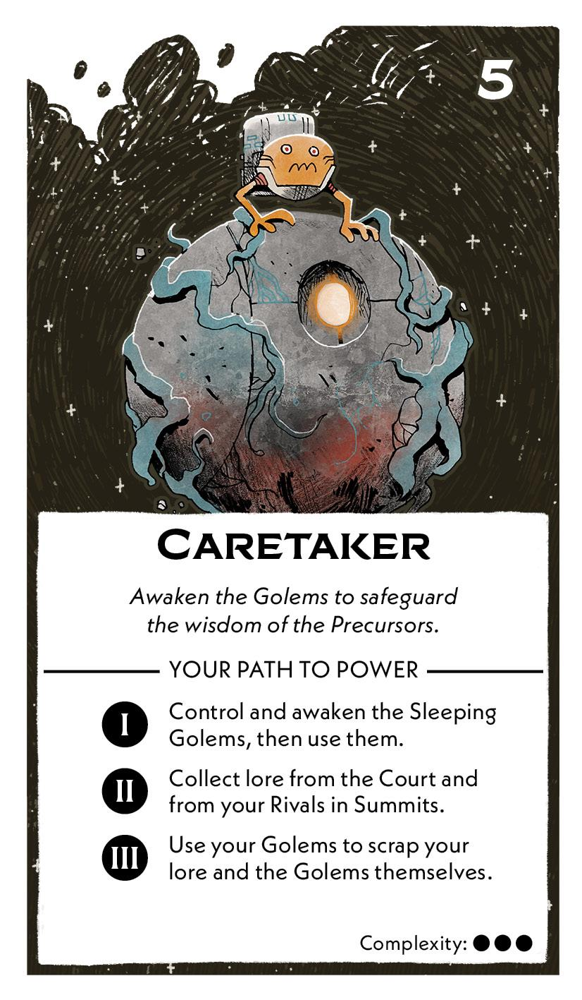{ width="300" }
</figure>

## Act I

[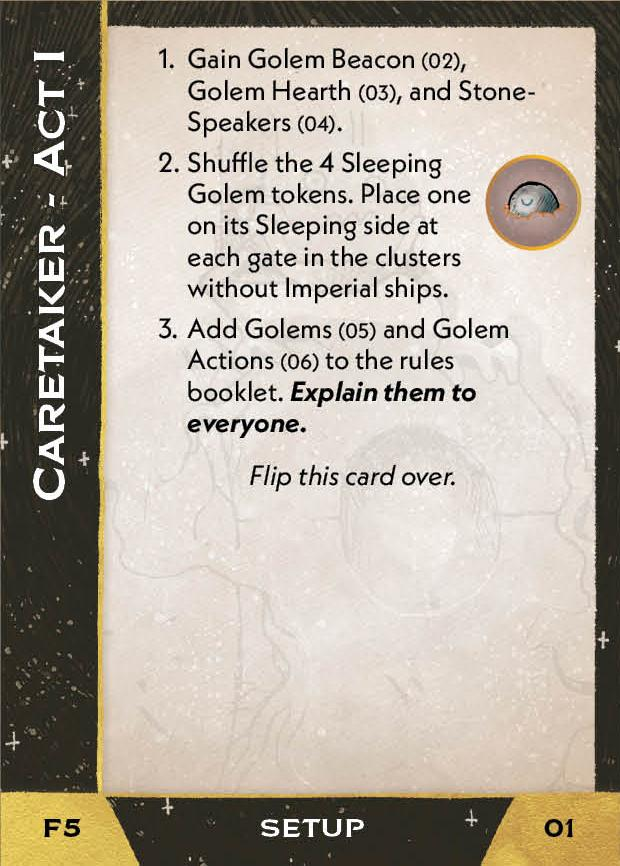{ width="33%"}](5/piece_2_6.jpg){ data-lightbox="1" }[{ width="33%" }](5/back_2_6.jpg){ data-lightbox="1" }[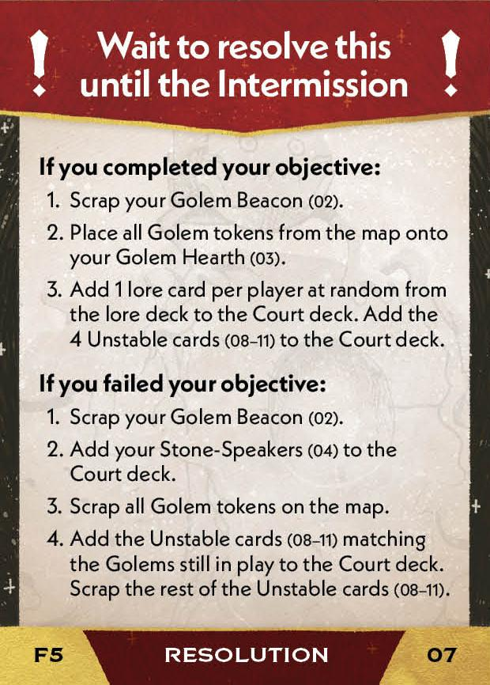{ width="33%" }](5/piece_2_0.jpg){ data-lightbox="1" }

??? info "Setup details"
    1. Gain Golem Beacon (02), Golem Hearth (03), and Stone-Speakers (04).
    
        [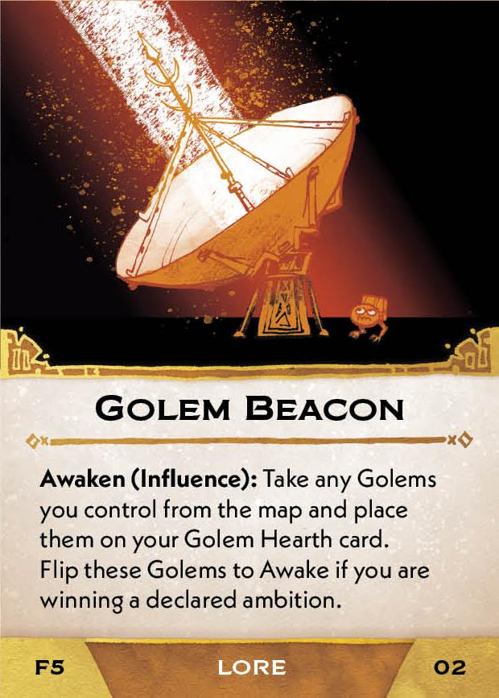{ width="150" }](5/piece_2_5.jpg){ data-lightbox="1" } [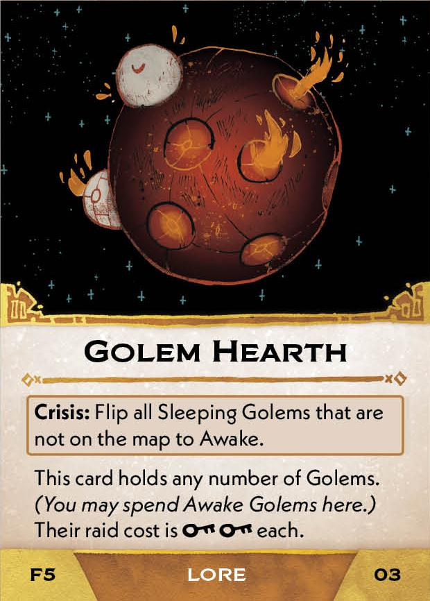{ width="150" }](5/piece_2_4.jpg){ data-lightbox="1" } [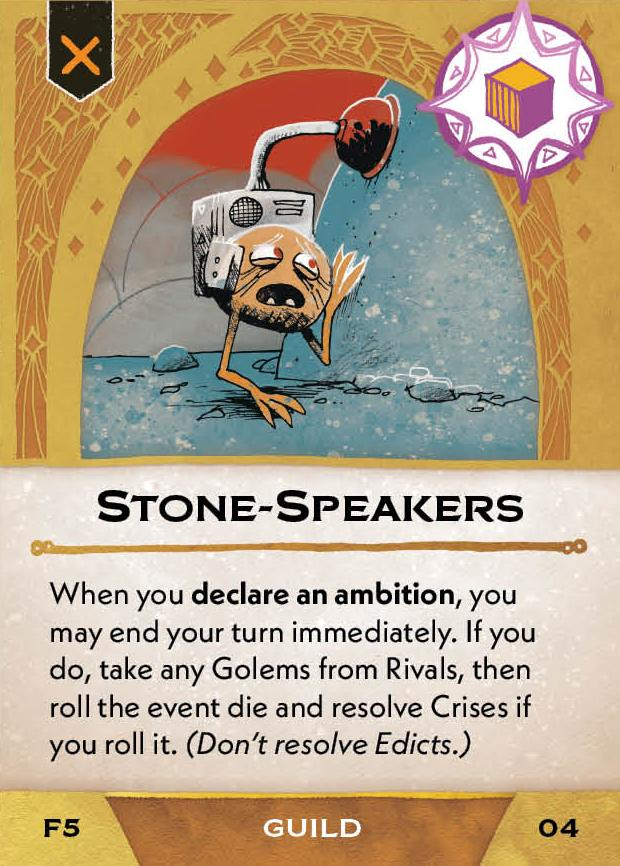{ width="150" }](5/piece_2_3.jpg){ data-lightbox="1" }

    2. Shuffle the 4 Sleeping Golem tokens. Place one on its Sleeping side at each gate in clusters without Imperial ships.
   
    3. Add Golems (05) and Golem Actions (06) to the rules booklet. **Explain them to everyone.**

        [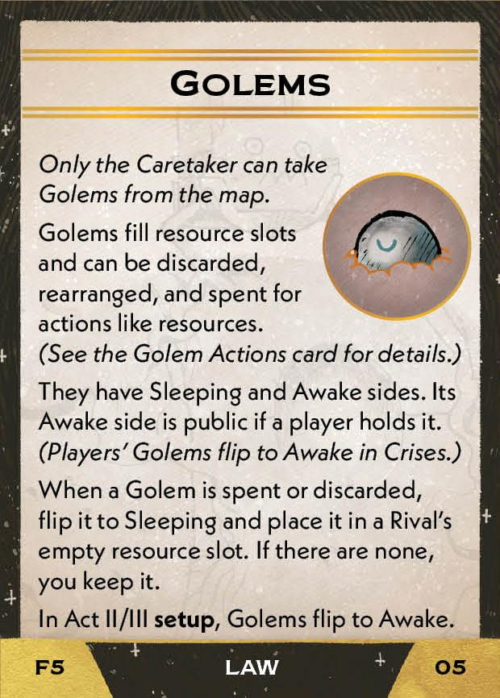{ width="150" }](5/piece_2_2.jpg){ data-lightbox="1" } [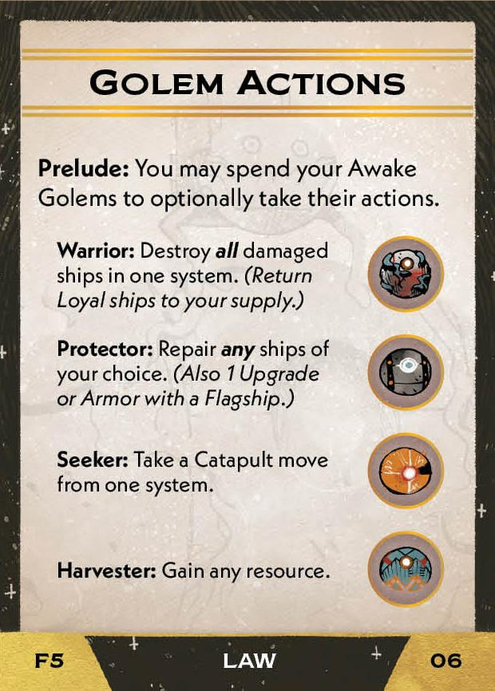{ width="150" }](5/piece_2_1.jpg){ data-lightbox="1" }

??? success "If successful"
    1. Scrap your Golem Beacon (02) *(You gained Golem Beacon during this Act's setup.)*

    2. Place all Golem tokens from the map onto your Golem Hearth (03).

    3. Add 1 lore card per player at random from the lore deck to the Court deck. Add the 4 Unstable cards (08-11) to the Court deck.

        [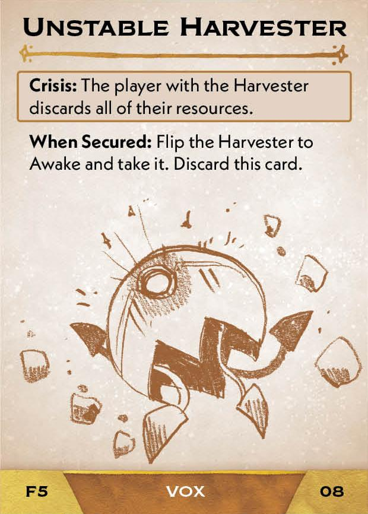{ width="150" }](5/piece_1_6.jpg){ data-lightbox="1" } [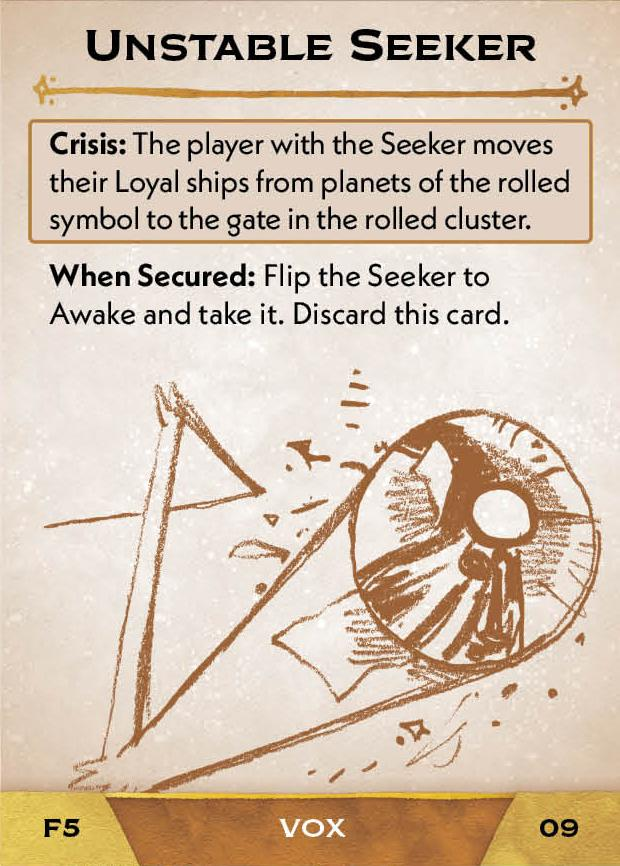{ width="150" }](5/piece_1_5.jpg){ data-lightbox="1" } [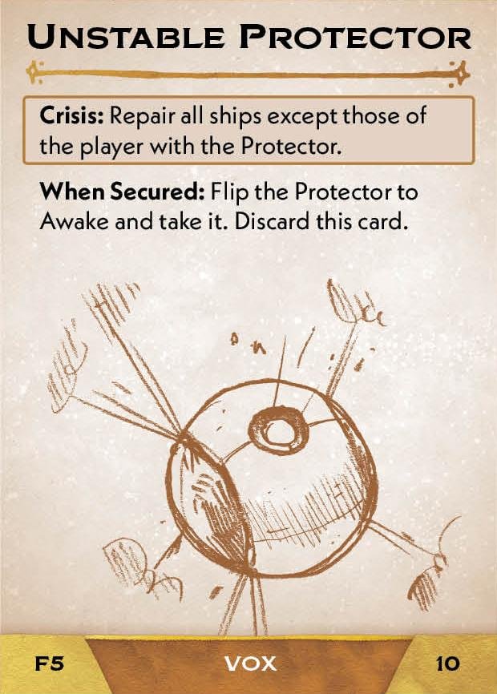{ width="150" }](5/piece_1_4.jpg){ data-lightbox="1" } [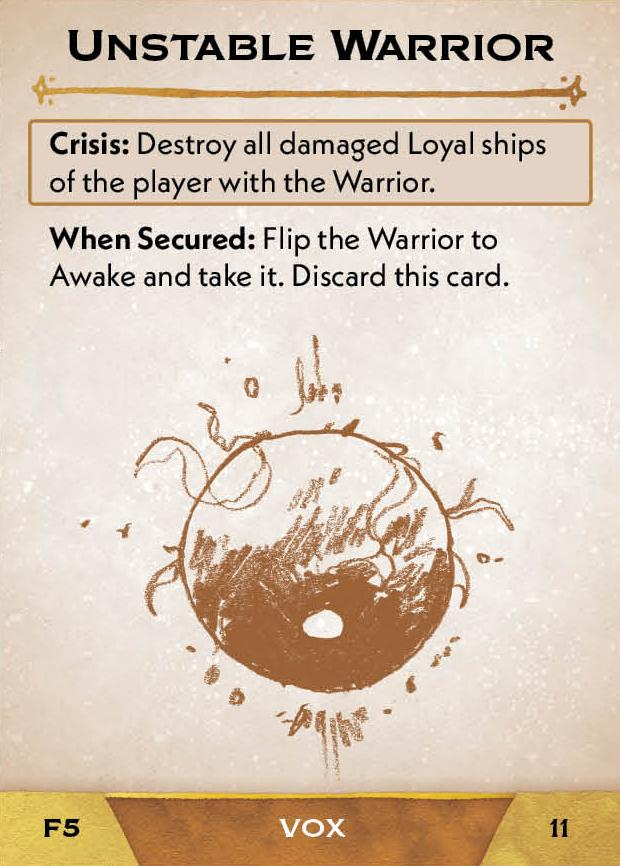{ width="150" }](5/piece_1_3.jpg){ data-lightbox="1" }

??? failure "If failed"
    1. Scrap your Golem Beacon (02) *(You gained Golem Beacon during this Act's setup.)*
        
    2. Add your Stone-Speakers (04) to the Court deck. *(You gained Stone-Speakers during this Act's setup.)*

    3. Scrap all Golem tokens on the map.

    4. Add the Unstable cards (08-11) matching the Golems still in play to the Court deck. Scrap the rest of the Unstable cards (08-11).
   
        [{ width="150" }](5/piece_1_6.jpg){ data-lightbox="1" } [{ width="150" }](5/piece_1_5.jpg){ data-lightbox="1" } [{ width="150" }](5/piece_1_4.jpg){ data-lightbox="1" } [{ width="150" }](5/piece_1_3.jpg){ data-lightbox="1" }  

## Act II

[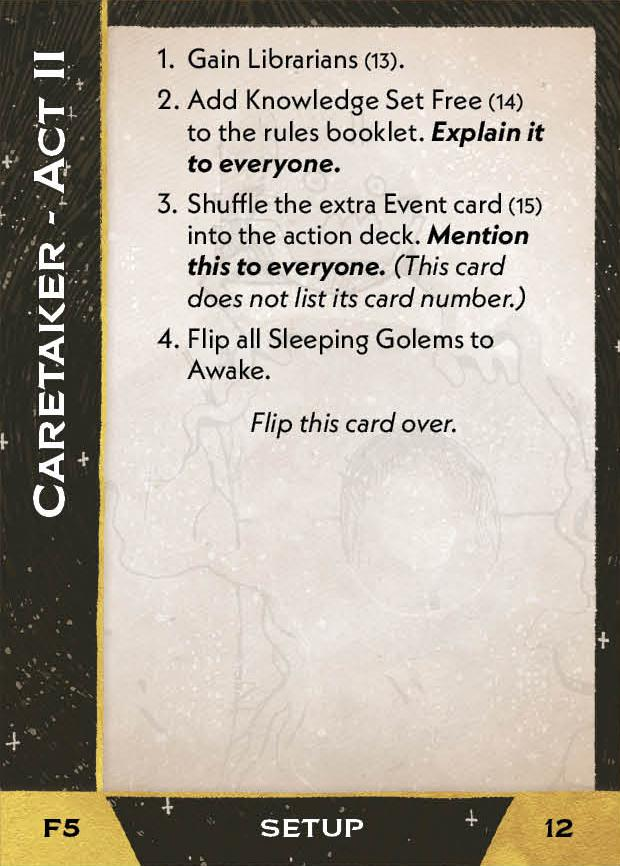{ width="33%" }](5/piece_1_2.jpg){ data-lightbox="1" }[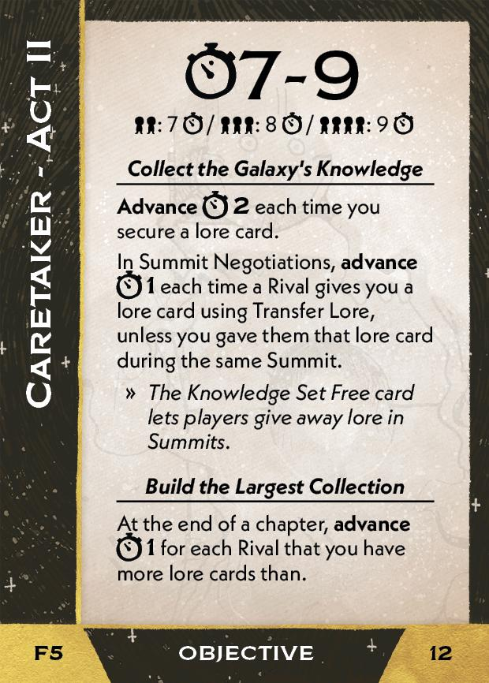{ width="33%" }](5/back_1_2.jpg){ data-lightbox="1" }[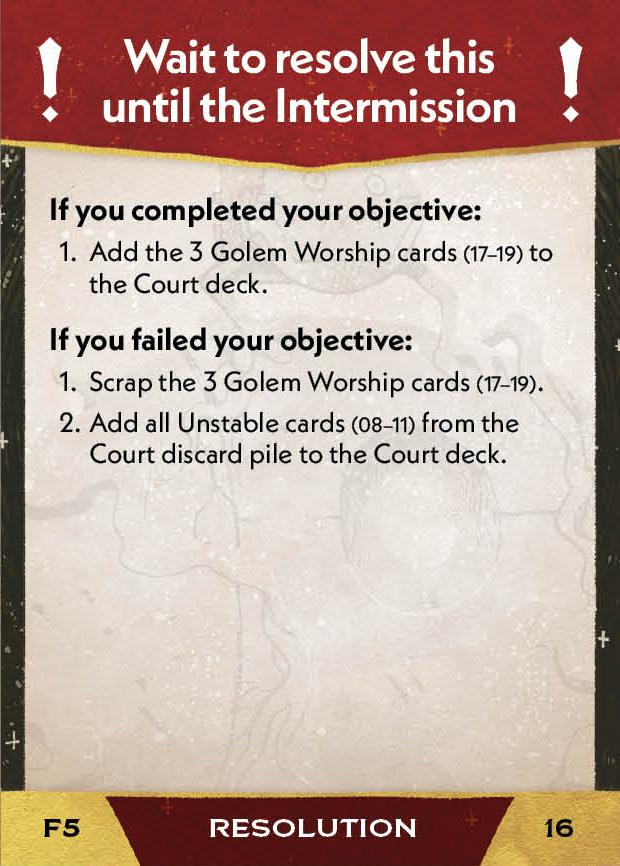{ width="33%px" }](5/piece_0_5.jpg){ data-lightbox="1" }

??? info "Setup details"
    1. Gain Librarians (13).
    
        [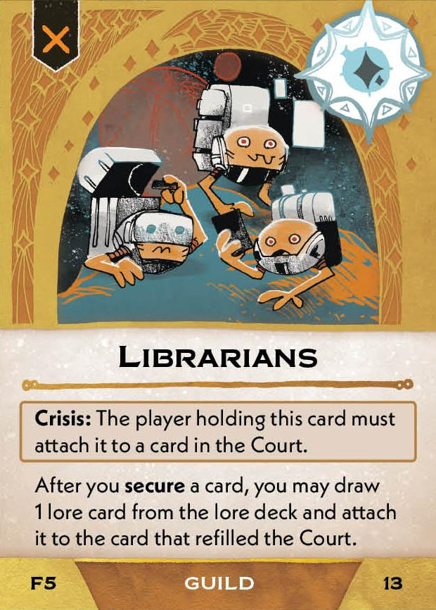{ width="150" }](5/piece_1_1.jpg){ data-lightbox="1" }

    2. Add Knowledge Set Free (14) to the rules booklet. **Explain it to everyone.**
    
        [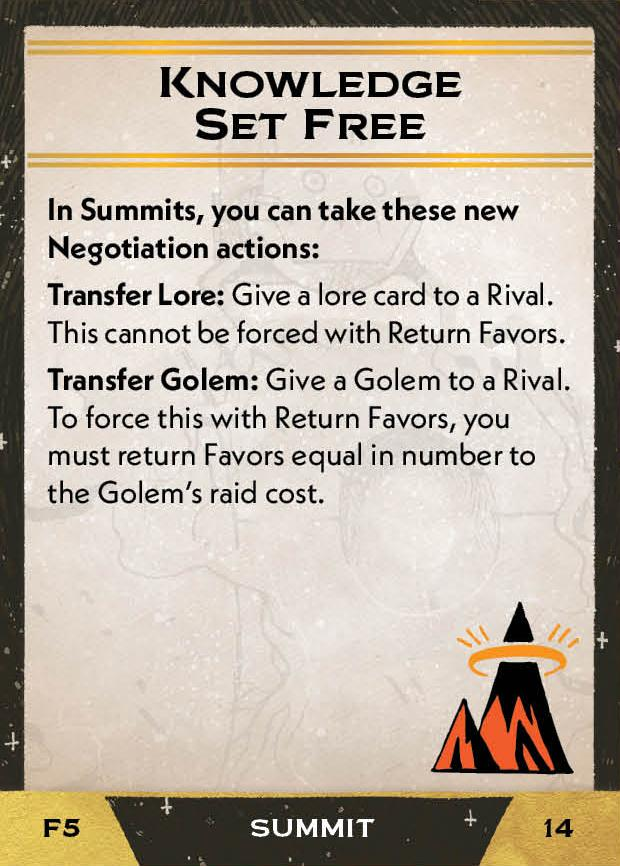{ width="150" }](5/piece_1_0.jpg){ data-lightbox="1" }

    3. Shuffle the extra Event card (15) into the action deck. **Mention this to everyone.** *(This card does not list its card number.)
    
        [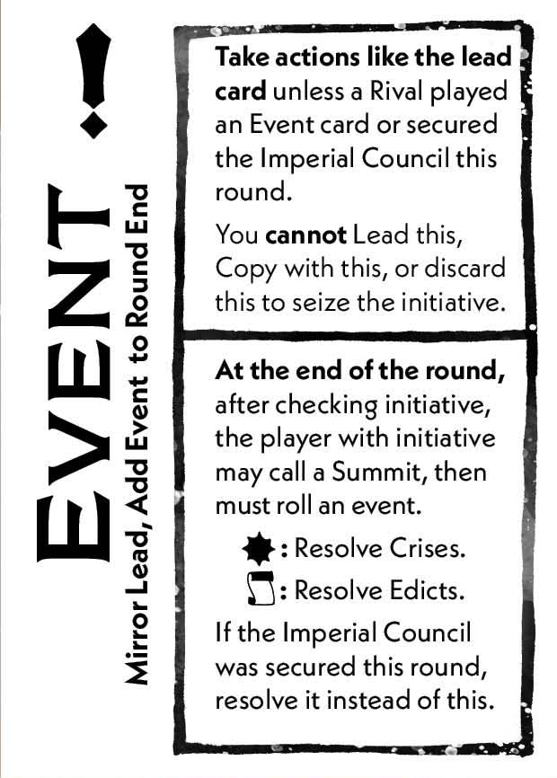{ width="150" }](5/piece_0_6.jpg){ data-lightbox="1" }

    4. Flip all Sleeping Golems to Awake.

??? success "If successful"
    1. Add the 3 Golem Worship cards (17-19) Court deck.
      
        [{ width="150" }](5/piece_0_4.jpg){ data-lightbox="1" } [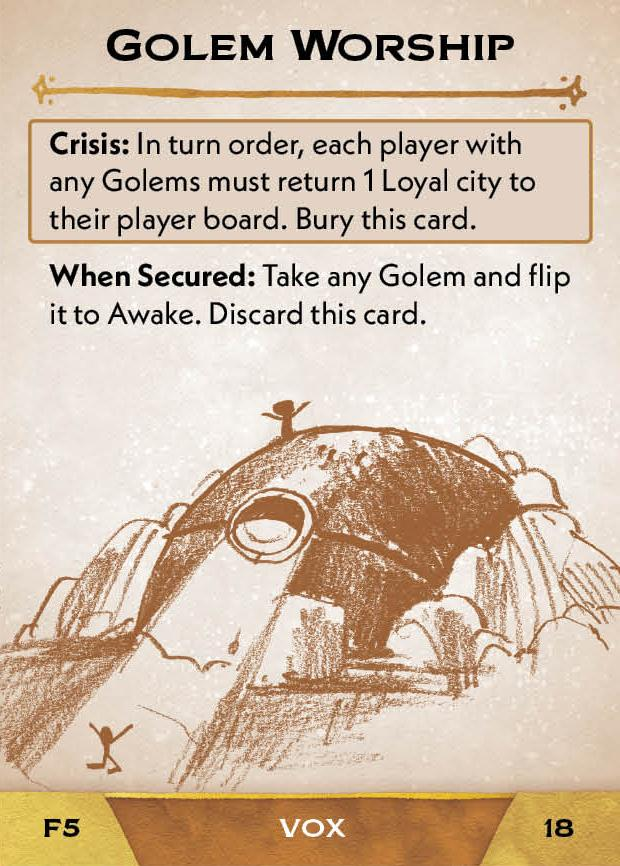{ width="150" }](5/piece_0_3.jpg){ data-lightbox="1" } [{ width="150" }](5/piece_0_2.jpg){ data-lightbox="1" }

??? failure "If failed"
    1. Scrap the 3 Golem Worship cards (17-19).
    
    2. Add all Unstable cards from the Court discard pile to the Court deck. *(These were added to the Court deck in Act I's resolution.)*

## Act III

[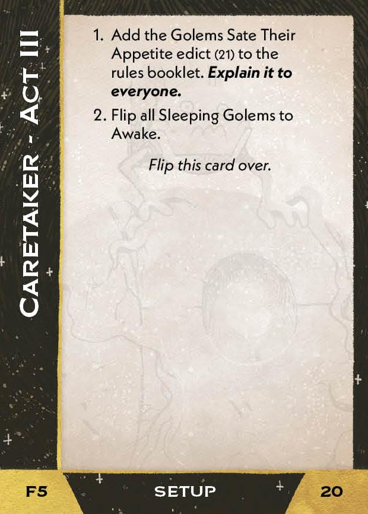{ width="33%" }](5/piece_0_1.jpg){ data-lightbox="1" }[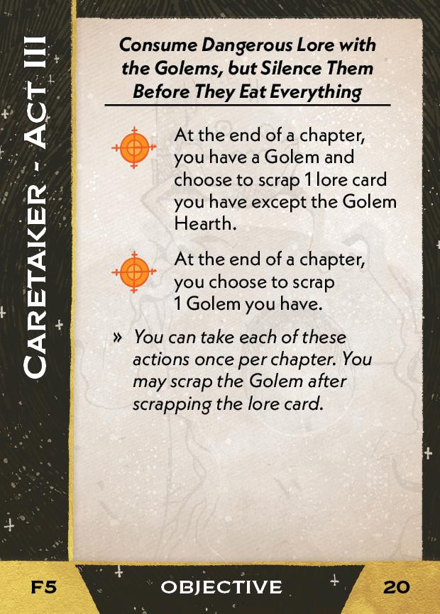{ width="33%" }](5/back_0_1.jpg){ data-lightbox="1" }

??? info "Setup details"
    1. Add the Golems Sate Their Appetite edict (21) to the rules booklet. **Explain it to everyone.**
    
        [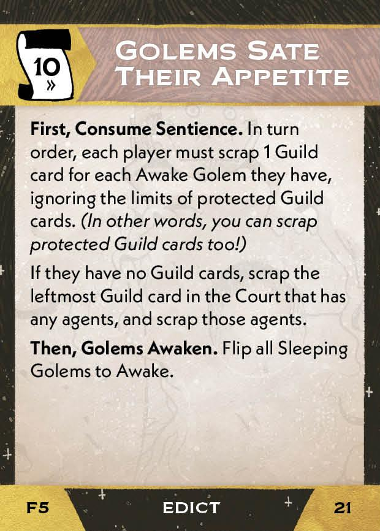{ width="150" }](5/piece_0_0.jpg){ data-lightbox="1" }

    2. Flip all Sleeping Golems to Awake.