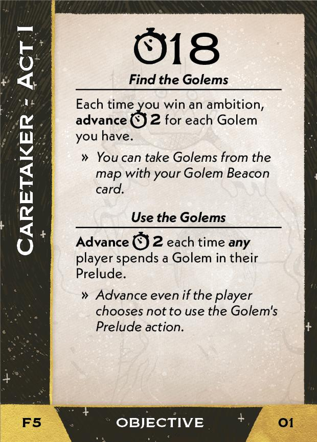

#Caretaker
## Overview
<figure markdown="span">
{ width="300" }
</figure>

## Act I

[{ width="33%"}](5/piece_2_6.jpg){ data-lightbox="1" }[{ width="33%" }](5/back_2_6.jpg){ data-lightbox="1" }[{ width="33%" }](5/piece_2_0.jpg){ data-lightbox="1" }

??? info "Setup details"
    1. Gain Golem Beacon (02), Golem Hearth (03), and Stone-Speakers (04).
    
        [{ width="150" }](5/piece_2_5.jpg){ data-lightbox="1" } [{ width="150" }](5/piece_2_4.jpg){ data-lightbox="1" } [{ width="150" }](5/piece_2_3.jpg){ data-lightbox="1" }

    2. Shuffle the 4 Sleeping Golem tokens. Place one on its Sleeping side at each gate in clusters without Imperial ships.
   
    3. Add Golems<a href="#faq1">[1]</a><a href="#faq2">[2]]</a> (05) and Golem Actions<a href="#faq3">[3]</a> (06) to the rules booklet. **Explain them to everyone.**

        [{ width="150" }](5/piece_2_2.jpg){ data-lightbox="1" } [{ width="150" }](5/piece_2_1.jpg){ data-lightbox="1" }

??? success "If successful"
    1. Scrap your Golem Beacon (02) *(You gained Golem Beacon during this Act's setup.)*

    2. Place all Golem tokens from the map onto your Golem Hearth (03).

    3. Add 1 lore card per player at random from the lore deck to the Court deck<a href="#faq4">[4]</a>. Add the 4 Unstable cards (08-11) to the Court deck.

        [{ width="150" }](5/piece_1_6.jpg){ data-lightbox="1" } [{ width="150" }](5/piece_1_5.jpg){ data-lightbox="1" } [{ width="150" }](5/piece_1_4.jpg){ data-lightbox="1" } [{ width="150" }](5/piece_1_3.jpg){ data-lightbox="1" }

??? failure "If failed"
    1. Scrap your Golem Beacon (02) *(You gained Golem Beacon during this Act's setup.)*
        
    2. Add your Stone-Speakers (04) to the Court deck. *(You gained Stone-Speakers during this Act's setup.)*

    3. Scrap all Golem tokens on the map.

    4. Add the Unstable cards (08-11) matching the Golems still in play to the Court deck. Scrap the rest of the Unstable cards (08-11).
   
        [{ width="150" }](5/piece_1_6.jpg){ data-lightbox="1" } [{ width="150" }](5/piece_1_5.jpg){ data-lightbox="1" } [{ width="150" }](5/piece_1_4.jpg){ data-lightbox="1" } [{ width="150" }](5/piece_1_3.jpg){ data-lightbox="1" }  

## Act II

[{ width="33%" }](5/piece_1_2.jpg){ data-lightbox="1" }[{ width="33%" }](5/back_1_2.jpg){ data-lightbox="1" }[{ width="33%px" }](5/piece_0_5.jpg){ data-lightbox="1" }

??? info "Setup details"
    1. Gain Librarians (13)<a href="#faq5">[5]</a>.
    
        [{ width="150" }](5/piece_1_1.jpg){ data-lightbox="1" }

    2. Add Knowledge Set Free (14) to the rules booklet. **Explain it to everyone.**
    
        [{ width="150" }](5/piece_1_0.jpg){ data-lightbox="1" }

    3. Shuffle the extra Event card (15) into the action deck. **Mention this to everyone.** *(This card does not list its card number.)*
    
        [{ width="150" }](5/piece_0_6.jpg){ data-lightbox="1" }

    4. Flip all Sleeping Golems to Awake.

??? success "If successful"
    1. Add the 3 Golem Worship cards (17-19) Court deck.
      
        [{ width="150" }](5/piece_0_4.jpg){ data-lightbox="1" } [{ width="150" }](5/piece_0_3.jpg){ data-lightbox="1" } [{ width="150" }](5/piece_0_2.jpg){ data-lightbox="1" }

??? failure "If failed"
    1. Scrap the 3 Golem Worship cards (17-19).
    
    2. Add all Unstable cards from the Court discard pile to the Court deck. *(These were added to the Court deck in Act I's resolution.)*

## Act III

[{ width="33%" }](5/piece_0_1.jpg){ data-lightbox="1" }[{ width="33%" }](5/back_0_1.jpg){ data-lightbox="1" }

??? info "Setup details"
    1. Add the Golems Sate Their Appetite edict (21) to the rules booklet. **Explain it to everyone.**
    
        [{ width="150" }](5/piece_0_0.jpg){ data-lightbox="1" }

    2. Flip all Sleeping Golems to Awake.

## FAQ / Errata

??? question "[1]Golems - Can Golems be stolen as a result of raid dice?"
    Yes. Although they the function as resources in many ways, the card does not indicate that they can be raided as resources. However, it is clear that this is intended since Golem Heart assigns a raid cost to them. We assume that Golems in resource slots can be raided just like those on Golem Hearth.

??? question "[2]Golems - After a golem is spent, can it be sent to another player's Golem Hearth?"
    Yes. And in the case of a Harvester golem being spent to fill the last resource slot among all players, this is the only place the golem can go.

??? question "[3]Golem Actions - How does Warrior Golem interact with Truce law?"
    A Regent cannot resolve the effect if it would destroy any Imperial ship or any Rival Regent ship where Truce law applies. You may resolve the effect if it would only destroy Loyal and Outlaw ships. Since the effect does not allow you to choose the ships destroyed, you cannot choose to activate it to destroy only legal ships if there are any illegal ships that would be harmed.

??? question "[4]Act I Resolution - Am I or any other player permitted to examine the Lore cards that are added to the deck?"
    No. However, if the deck is later searched for any reason during a Fate's resolution or setup, all players should be permitted to view its contents.

??? question "[5]Librarians - Does the securing effect resolve when Librarians itself is secured?"
    No. The effect only triggers if you already own Librarians before the Secure action is performed.