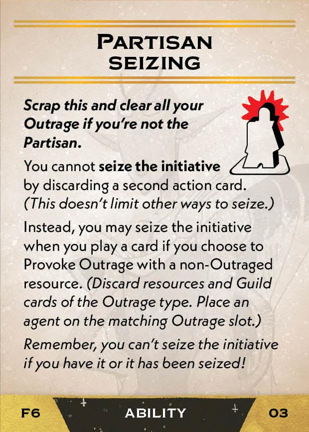

#Partisan
## Overview
<figure markdown="span">
{ width="300" }
</figure>

## Act I

[{ width="33%"}](6/piece_3_3.jpg){ data-lightbox="1" }[{ width="33%" }](6/back_3_3.jpg){ data-lightbox="1" }[{ width="33%" }](6/piece_3_0.jpg){ data-lightbox="1" }

??? info "Setup details"
    1. Gain Informants (02) and Partisan Seizing (03).
    
        [{ width="150" }](6/piece_3_2.jpg){ data-lightbox="1" } [{ width="150" }](6/piece_3_1.jpg){ data-lightbox="1" }

??? success "If successful"
    1. Add the 5 Loyal cards (05-09) to the Court deck. 
      
        [{ width="150" }](6/piece_2_6.jpg){ data-lightbox="1" } [{ width="150" }](6/piece_2_5.jpg){ data-lightbox="1" } [{ width="150" }](6/piece_2_4.jpg){ data-lightbox="1" } [{ width="150" }](6/piece_2_3.jpg){ data-lightbox="1" } [{ width="150" }](6/piece_2_2.jpg){ data-lightbox="1" }

    2. Gain Galactic Bards (10).

        [{ width="150" }](6/piece_2_1.jpg){ data-lightbox="1" }

    3. Scrap the Spacing Union (11), Arms Union (12), and 2 Outrage Spreads (13-14).

??? failure "If failed"
    1. Scrap the 5 Loyal cards (05-09).
    
    1. Add Galactic Bards (1), Spacing Union (11), Arms Union (12), and 2 Outrage Spreads (13-14) Court deck.
      
        [{ width="150" }](6/piece_2_1.jpg){ data-lightbox="1" } [{ width="150" }](6/piece_2_0.jpg){ data-lightbox="1" } [{ width="150" }](6/piece_1_6.jpg){ data-lightbox="1" } [{ width="150" }](6/piece_1_5.jpg){ data-lightbox="1" } [{ width="150" }](6/piece_1_4.jpg){ data-lightbox="1" } 
        
    2. Scrap your Partisan Seizing card and clear all your Outrage. *(Partisan Seizing was gained during this Act's Setup.)*

## Act II

[{ width="33%" }](6/piece_1_3.jpg){ data-lightbox="1" }[{ width="33%" }](6/back_1_3.jpg){ data-lightbox="1" }[{ width="33%" }](6/piece_1_0.jpg){ data-lightbox="1" }

??? info "Setup details"
    1. Add Partisan Seizing (16) to the rules booklet. **Explain it to everyone.**
        
        [{ width="150" }](6/piece_1_2.jpg){ data-lightbox="1" }

    2. As a reminder, tuck your copy of Partisan Seizing (04) under the map near the card play area, so only its title shows. *(Partisan Seizing was gained during Act I's Setup.)*
    
    3. Gain People's Hero (17).

        [{ width="150" }](6/piece_1_1.jpg){ data-lightbox="1" }

??? success "If successful"
    1. Add Guilds Decry Terror (19) to the rules booklet.
    
        [{ width="150" }](6/piece_0_6.jpg){ data-lightbox="1" }    
    
    2. Add 2 Terror Strikes (20-21) to the Court deck.

        [{ width="150" }](6/piece_0_5.jpg){ data-lightbox="1" } [{ width="150" }](6/piece_0_4.jpg){ data-lightbox="1" }    
    
    3. Scrap the Spacing Union (22) and Arms Union (23).

??? failure "If failed"
    1. Scrap Guild Decry Terror (19) and the 2 Terror Strikes (20-21).
    
    2. Add Spacing Union (22) and Arms Union (23) to the Court deck.

        [{ width="150" }](6/piece_0_3.jpg){ data-lightbox="1" } [{ width="150" }](6/piece_0_2.jpg){ data-lightbox="1" }   

## Act III

[{ width="33%" }](6/piece_0_1.jpg){ data-lightbox="1" }[{ width="33%" }](6/back_0_1.jpg){ data-lightbox="1" }

??? info "Setup details"

    1. Gain Sower of Division (25).

        [{ width="150" }](6/piece_0_0.jpg){ data-lightbox="1" }

## FAQ / Errata

??? question "Act I Objective - If I pass while not other player has cards, do I advance my objective?"
    No, in this scenario the initiative never passes to another player, so you are not considered to have lost it or gained it. To advance the objective, the initiative must be possessed by another player and then move into your possession.

??? question "Guilds Decry Terror - How is this resolved if another card is already attached to the Imperial Council?"
    It should be attached to a different card in court that does not already have an attachment, but it can be attached to another attachment, including the card attached to Imperial Council. The player with initiative should decide which one.

??? question "Partisan Seizing (Act I Ability) - How does this card function after it has been tucked under the player board?"
    Ignore all text on the card once it is tucked. It is meant to function only as a reminder for the Act II Law. This means that the card is not scrapped if Partisan changes fate in Act II interlude, and the Partisan does not get to clear their outrage either.