#Pathfinder
## Overview
<figure markdown="span">
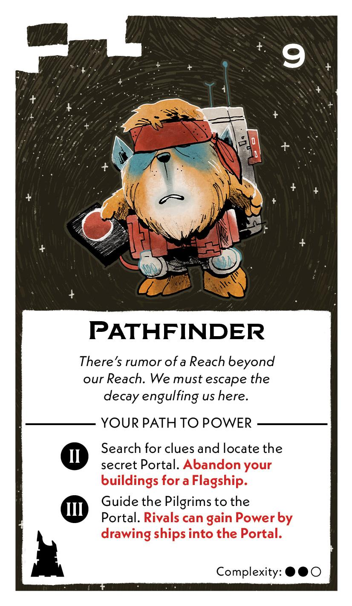{ width="300" }
</figure>

## Act II

[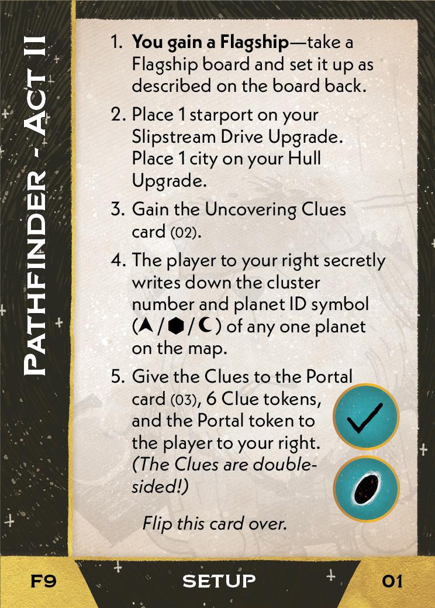{ width="33%" }](9/piece_1_3.jpg){ data-lightbox="1" }[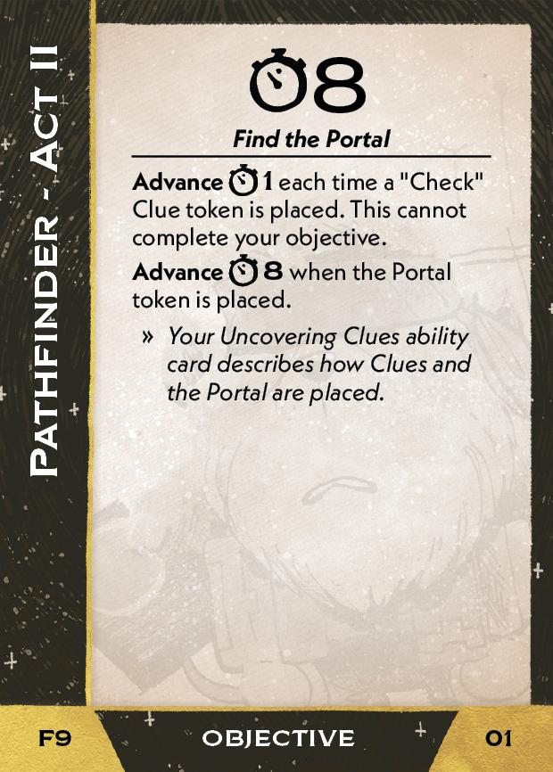{ width="33%" }](9/back_1_3.jpg){ data-lightbox="1" }[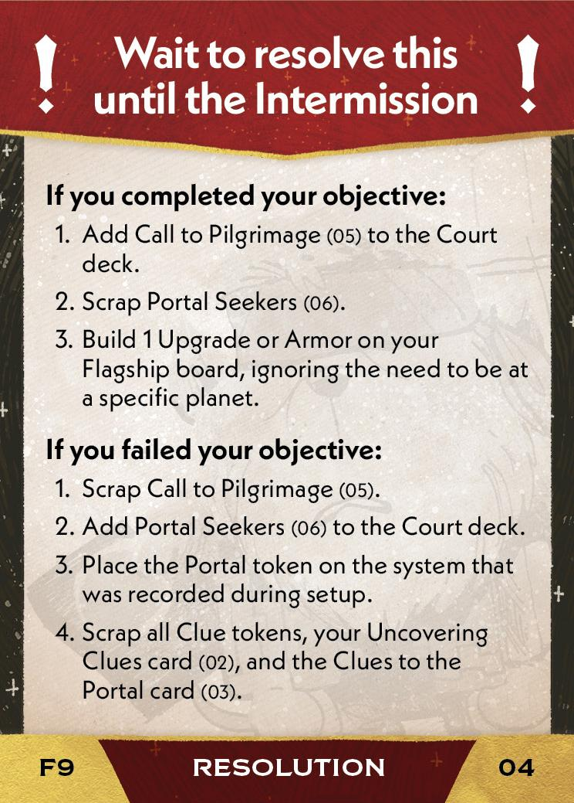{ width="33%px" }](9/piece_1_0.jpg){ data-lightbox="1" }

??? info "Setup details"
    1. **You gain a Flagship** --take a Flagship board and set it up as describe on the board back.
    
    2. Place 1 starport on your Slipstream Drive Upgrade. Place 1 city on your Hull Upgrade.
    
    3. Gain the Uncovering Clues (02).
    
        [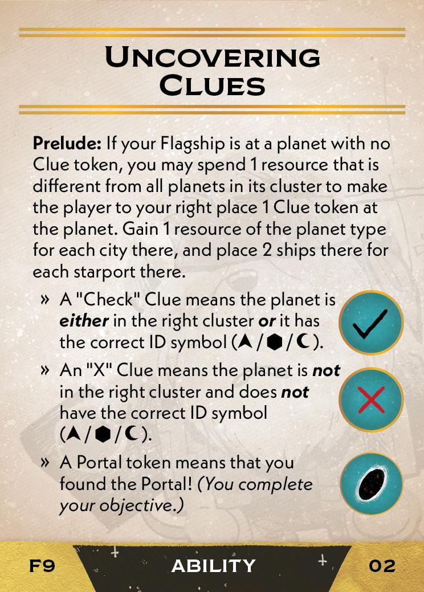{ width="150" }](9/piece_1_2.jpg){ data-lightbox="1" }
    
    4. The player to your right secretly writes down the cluster number and planet ID symbol of any one planet on the map.
    
    5. Give the Clues to the Portal card (03), 6 Clue tokens, and the Portal token to the player on your right. *(The Clues are double-sided!)*

        [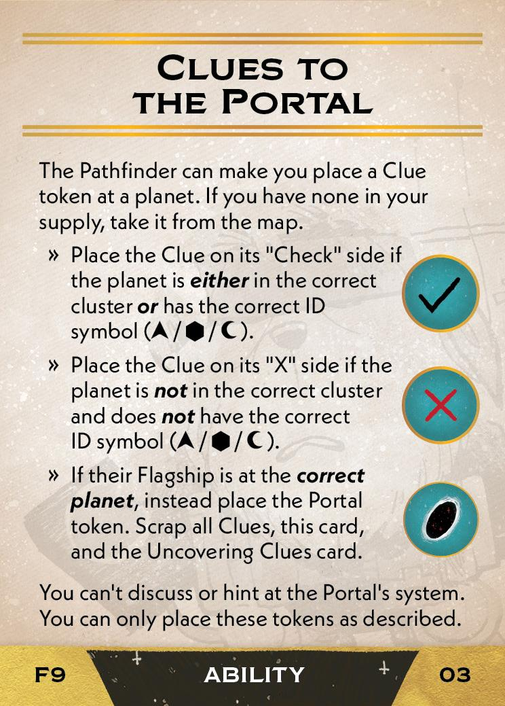{ width="150" }](9/piece_1_1.jpg){ data-lightbox="1" }

??? success "If successful"
    1. Add Call to Pilgrimage (05) to the Court deck.
    
        [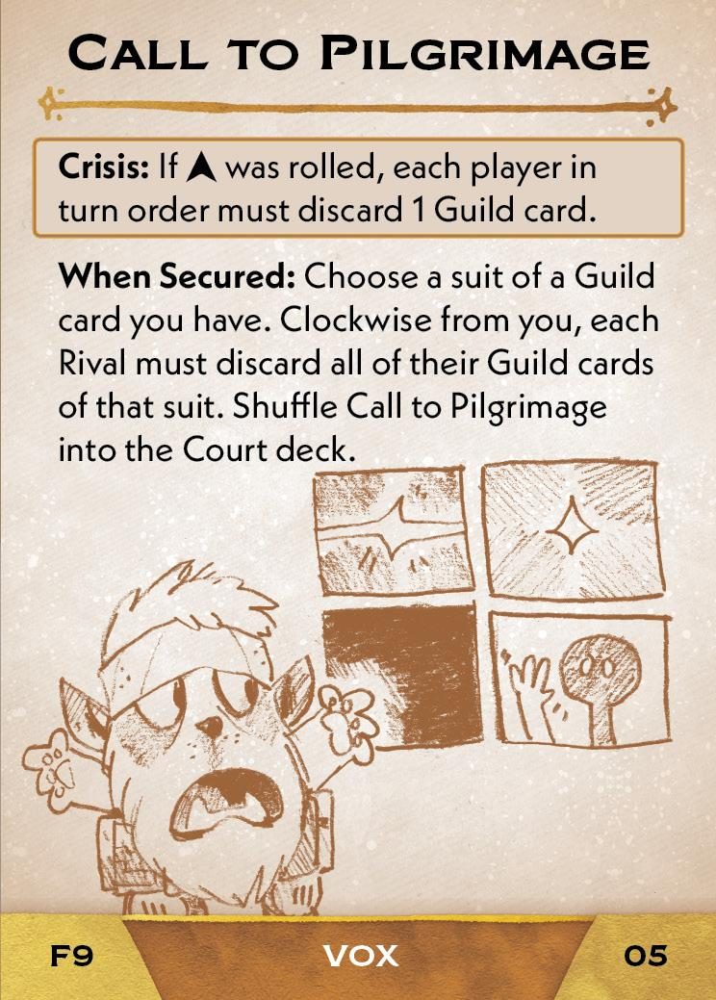{ width="150" }](9/piece_0_6.jpg){ data-lightbox="1" }
    
    2. Scrap Portal Seekers (06).
    
    3. Build 1 Upgrade or Armor on your Flagship board, ignoring the need to be at a specific planet.

??? failure "If failed"
    1. Scrap Call to Pilgrimage (05).
    
    2. Add Portal Seekers (06) to the Court deck.
    
        [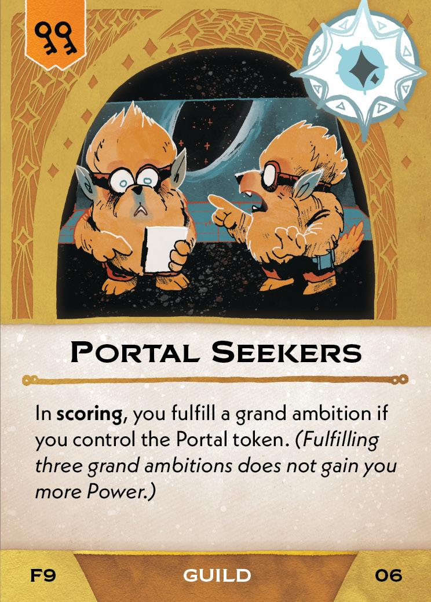{ width="150" }](9/piece_0_5.jpg){ data-lightbox="1" }

    3. Place the Portal token on the system that was recorded during setup.
    
    4. Scrap all Clue tokens, your Uncovering Clues card (02), and the Clues to the Portal card (03).

## Act III

[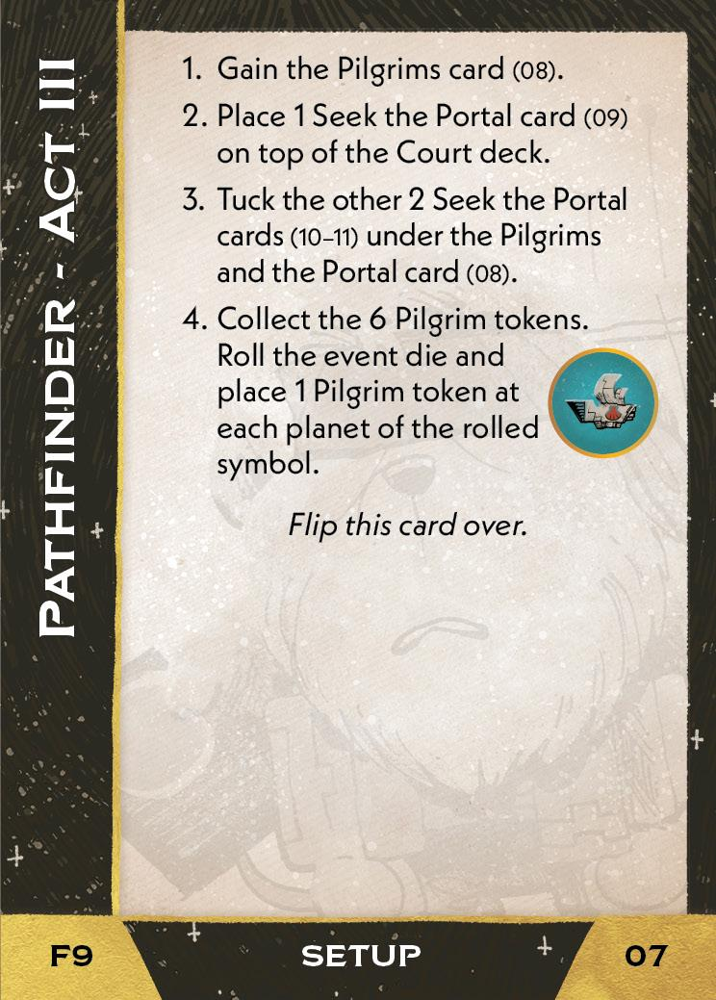{ width="33%" }](9/piece_0_4.jpg){ data-lightbox="1" }[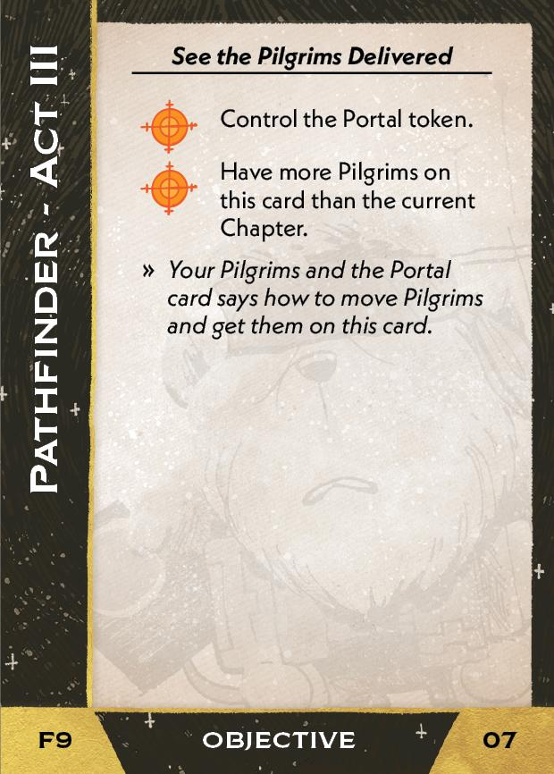{ width="33%" }](9/back_0_4.jpg){ data-lightbox="1" }

??? info "Setup details"
    1. Gain the Pilgrims card (08).

        [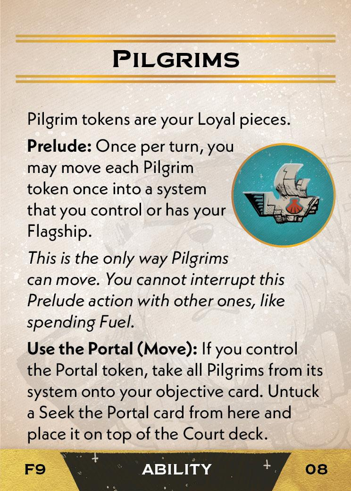{ width="150" }](9/piece_0_3.jpg){ data-lightbox="1" }
    
    2. Place 1 Seek the Portal card (09) on top of the Court deck.

        [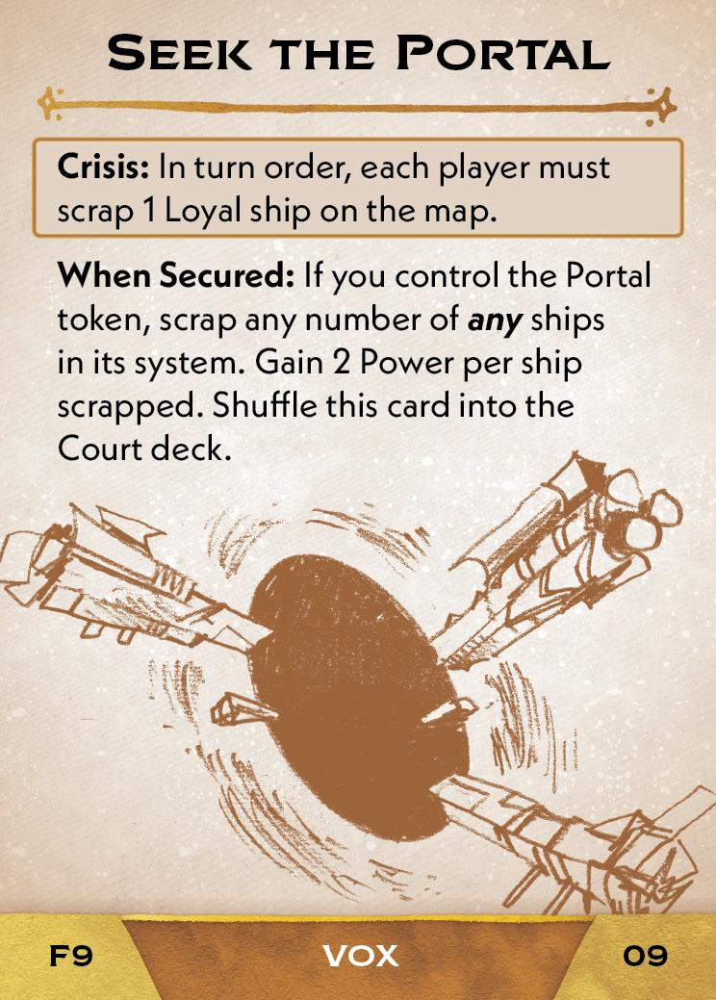{ width="150" }](9/piece_0_2.jpg){ data-lightbox="1" }
    
    3. Tuck the other 2 Seek the Portal cards (10-11) under the Pilgrims and the Portal card (08).

        [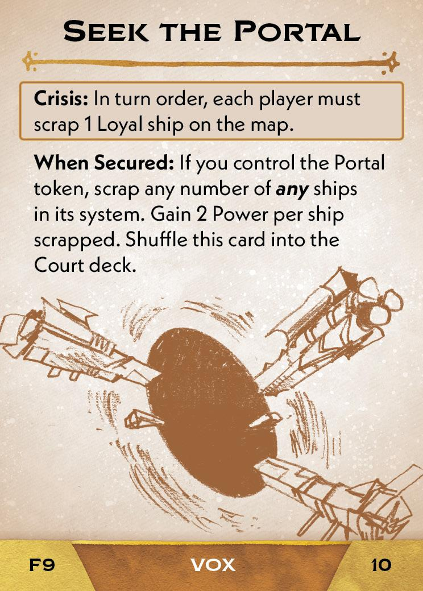{ width="150" }](9/piece_0_1.jpg){ data-lightbox="1" } [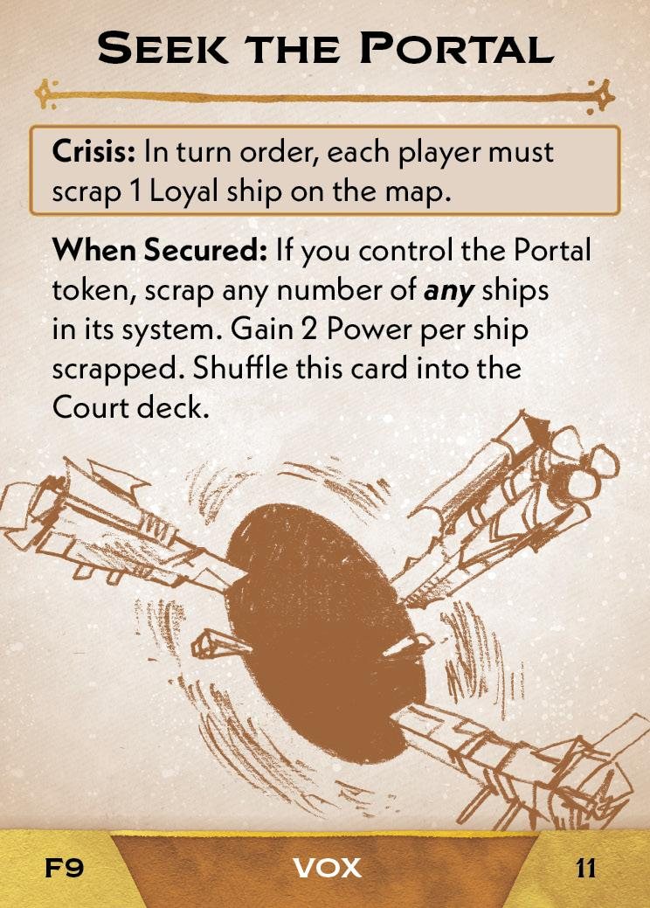{ width="150" }](9/piece_0_0.jpg){ data-lightbox="1" }
    
    4. Collect the 6 Pilgrim tokens. Roll the event die and place 1 Pilgrim token at each planet of the rolled symbol.

## FAQ / Errata

??? question "Uncovering Clues - How is this effect resolved if all of the Clues are on the board already, or if the Portal has already been found?"
    This action can still be done in order to gain resources and ships. In the case where all of the Clues are on the board, the player to your right removes a Clue token of their choice in order to place it in system.

??? question "Pilgrims - Does the prelude action require all Pilgrims to move into the same system?"
    No. While a strict reading of the card may lead to this interpretation, it is intended that each Pilgrim can independently move into any system. Otherwise, the word "once" would be unnecessary.