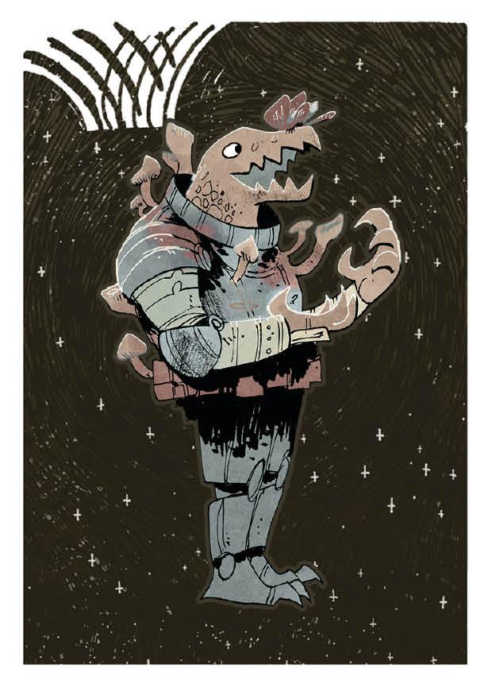

---
hide:
  - toc
---

# Contents

### Leaders, Lore, and Court

    

        <a href="Base/0-Leader.html">
        
Leaders
</a>
    

    

        <a href="Base/1-Lore.html">
        
Lore
</a>
    

    

        <a href="Base/2-Court.html">
        
Court
        (Base Game)
</a>
    

    

        <a href="Campaign/0-Court.html">
        
Court
        (Campaign)
</a>
    

### A Fates

    

        <a href="Campaign/1-Steward.html">
        
Steward
</a>
    

    

        <a href="Campaign/2-Founder.html">
        
Founder
</a>
    

    

        <a href="Campaign/3-Magnate.html">
        
Magnate
</a>
    

    

        <a href="Campaign/4-Advocate.html">
        
Advocate
</a>
    

    

        <a href="Campaign/5-Caretaker.html">
        
Caretaker
</a>
    

    

        <a href="Campaign/6-Partisan.html">
        
Partisan
</a>
    

    

        <a href="Campaign/7-Admiral.html">
        
Admiral
</a>
    

    

        <a href="Campaign/8-Believer.html">
        
Believer
</a>
    

### B Fates

    

        <a href="Campaign/9-Pathfinder.html">
        
Pathfinder
</a>
    

    

        <a href="Campaign/10-Hegemon.html">
        
Hegemon
</a>
    

    

        <a href="Campaign/11-Planet Breaker.html">
        
Planet Breaker
</a>
    

    

        <a href="Campaign/12-Pirate.html">
        
Pirate
</a>
    

    

        <a href="Campaign/13-Blight Speaker.html">
        
Blight Speaker
</a>
    

    

        <a href="Campaign/14-Pacifist.html">
        
Pacifist
</a>
    

    

        <a href="Campaign/15-Peacekeeper.html">
        
Peacekeeper
</a>
    

    

        <a href="Campaign/16-Warden.html">
        
Warden
</a>
    

### C Fates

    

        <a href="Campaign/17-Overlord.html">
        
Overlord
</a>
    

    

        <a href="Campaign/18-Survivalist.html">
        
Survivalist
</a>
    

    

        <a href="Campaign/19-Redeemer.html">
        
Redeemer
</a>
    

    

        <a href="Campaign/20-Guardian.html">
        
Guardian
</a>
    

    

        <a href="Campaign/21-Naturalist.html">
        
Naturalist
</a>
    

    

        <a href="Campaign/22-Gate Wraith.html">
        
Gate Wraith
</a>
    

    

        <a href="Campaign/23-Conspirator.html">
        
Conspirator
</a>
    

    

        <a href="Campaign/24-Judge.html">
        
Judge
</a>
    

