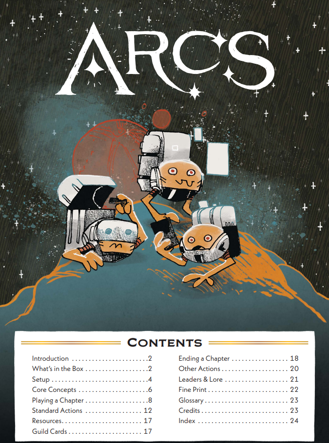
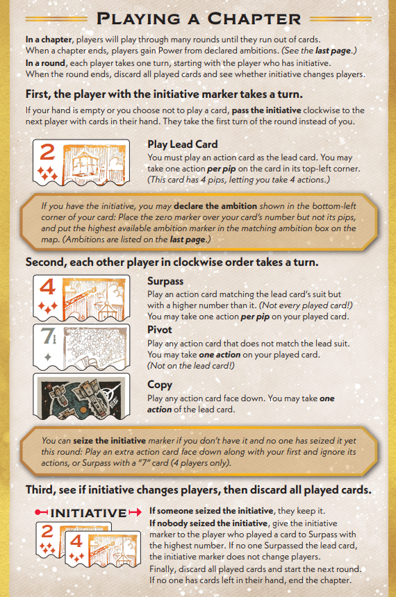
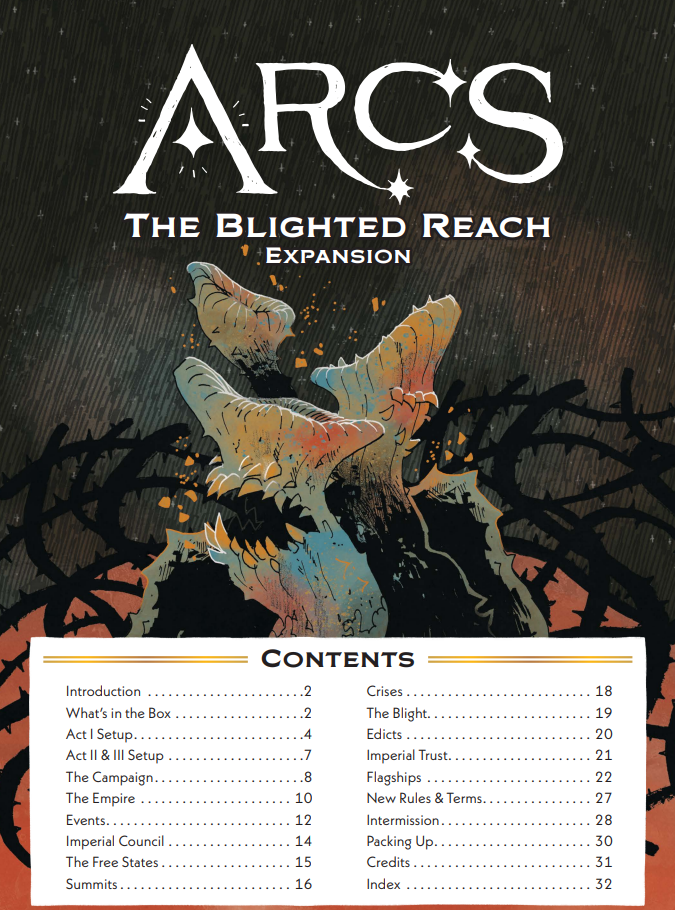
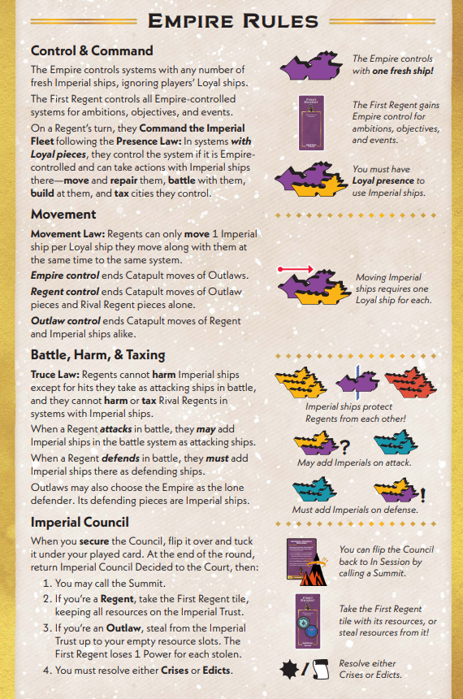
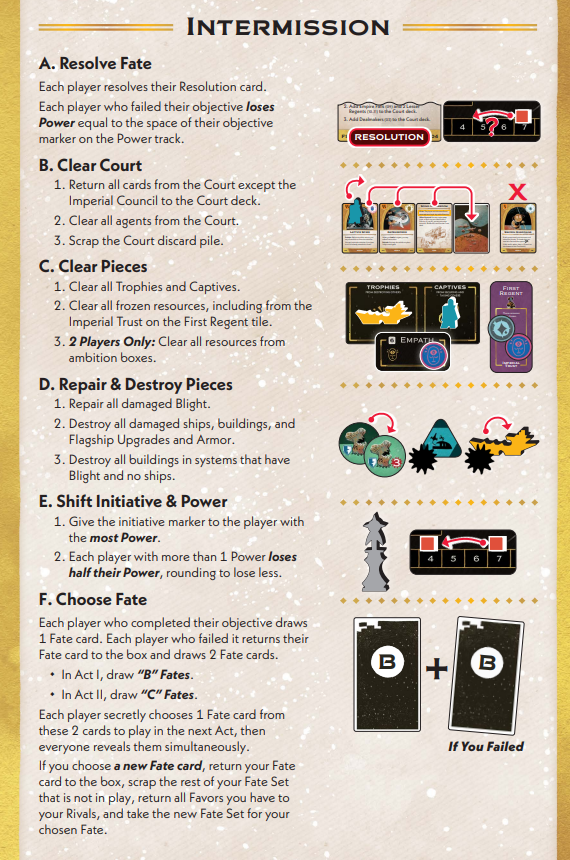

---
hide:
  - toc
---

# Books / Aids

    

        <a target="_blank" href="images/rules/Arcs Base Rulebook.pdf">
        
Rulebook
</a>
    

    

        <a target="_blank" href="images/rules/Arcs Aid Booklet.pdf">
        
Aid Sheet
</a>
    

    

        <a target="_blank" href="images/rules/Arcs Campaign Rulebook.pdf">
        
Campaign Rulebook
</a>
    

    

        <a target="_blank" href="images/rules/Arcs Campaign Aid Sheet Rules.pdf">
        
Campaign Aid
</a>
    

    

        <a target="_blank" href="images/rules/Arcs Campaign Aid Sheet Setup and Intermission.pdf">
        
Intermission Aid
</a>
    

